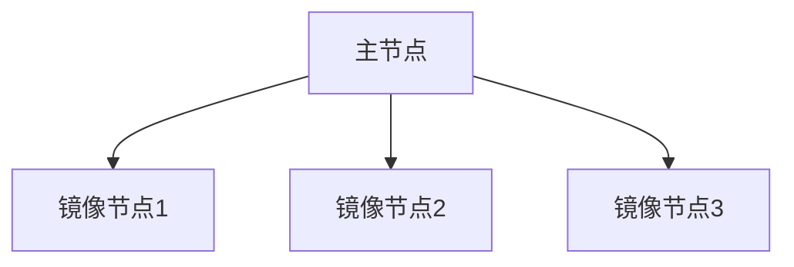

# RabbitMQ 镜像队列

RabbitMQ是一个广泛使用的消息队列系统，用于在分布式系统中传递消息。在高可用性（HA）场景中，确保消息的可靠性和系统的容错性至关重要。RabbitMQ镜像队列（Mirrored Queues）是实现高可用性的一种机制，它通过在集群中的多个节点上复制队列数据来确保即使某个节点发生故障，消息仍然可以被处理。

## 什么是镜像队列？

镜像队列是RabbitMQ中的一种队列类型，它允许队列的内容在集群中的多个节点上进行复制。这意味着，即使某个节点发生故障，其他节点仍然可以继续处理队列中的消息。镜像队列的主要目的是提高系统的可靠性和容错性。

### 镜像队列的工作原理

在RabbitMQ集群中，每个队列都有一个主节点（Master）和多个镜像节点（Mirrors）。主节点负责处理所有的读写操作，而镜像节点则同步主节点的数据。当主节点发生故障时，RabbitMQ会自动将其中一个镜像节点提升为新的主节点，从而确保队列的可用性。



## 如何配置镜像队列

要启用镜像队列，您需要在RabbitMQ中配置队列的策略。策略定义了队列的行为，包括是否启用镜像以及镜像的数量。

### 配置示例

以下是一个配置镜像队列的策略示例：

```bash
rabbitmqctl set_policy ha-all "^ha\." '{"ha-mode":"all"}'
```

在这个示例中，`ha-all` 是策略的名称，`"^ha\."` 是一个正则表达式，匹配所有以 `ha.` 开头的队列。`{"ha-mode":"all"}` 表示将所有匹配的队列在所有节点上进行镜像。

### 代码示例

假设我们有一个名为 `ha.queue` 的队列，我们可以通过以下代码来声明并发送消息到该队列：

```python
import pika

# 连接到RabbitMQ服务器
connection = pika.BlockingConnection(pika.ConnectionParameters('localhost'))
channel = connection.channel()

# 声明一个镜像队列
channel.queue_declare(queue='ha.queue', durable=True, arguments={'x-ha-policy': 'all'})

# 发送消息到队列
channel.basic_publish(exchange='',
                      routing_key='ha.queue',
                      body='Hello, RabbitMQ!')

print(" [x] Sent 'Hello, RabbitMQ!'")

# 关闭连接
connection.close()
```

在这个示例中，`x-ha-policy` 参数设置为 `all`，表示该队列将在所有节点上进行镜像。

## 实际应用场景

镜像队列在需要高可用性的系统中非常有用。例如，在金融交易系统中，确保消息的可靠传递至关重要。如果某个节点发生故障，镜像队列可以确保交易消息不会丢失，并且系统可以继续正常运行。

### 案例：金融交易系统

假设我们有一个金融交易系统，该系统使用RabbitMQ来处理交易消息。为了确保系统的高可用性，我们可以为交易队列配置镜像队列。这样，即使某个节点发生故障，交易消息仍然可以在其他节点上被处理，从而避免交易失败。

## 总结

RabbitMQ镜像队列是实现高可用性的重要机制。通过在集群中的多个节点上复制队列数据，镜像队列可以确保即使某个节点发生故障，消息仍然可以被处理。本文介绍了镜像队列的概念、工作原理、配置方法以及实际应用场景，希望对初学者有所帮助。

## 附加资源与练习

- **官方文档**: [RabbitMQ Mirroring Guide](https://www.rabbitmq.com/ha.html)
- **练习**: 尝试在本地搭建一个RabbitMQ集群，并配置一个镜像队列。观察当某个节点发生故障时，系统如何自动切换到其他节点。

:::tip
在配置镜像队列时，请确保集群中的节点数量足够，以避免单点故障。
:::