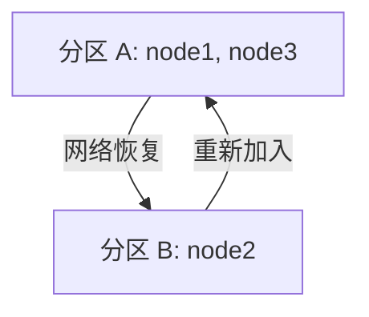

# RabbitMQ 集群分区处理

RabbitMQ 是一个广泛使用的消息队列系统，支持高可用性和分布式部署。在集群环境中，网络分区（Network Partition）是一个常见的问题，可能导致集群中的节点无法正常通信。本文将详细介绍 RabbitMQ 集群分区处理的概念、原因、影响以及解决方案。

## 什么是集群分区？

集群分区是指由于网络故障或其他原因，导致集群中的节点无法相互通信，从而将集群分割成多个独立的部分。每个分区内的节点可以正常工作，但无法与其他分区的节点同步数据或状态。这种情况可能会导致数据不一致、消息丢失或重复等问题。

:::note
**注意**：分区通常是由于网络问题（如网络延迟、丢包或断开）引起的，但也可能是由于硬件故障或配置错误导致的。
:::

## 分区的影响

当 RabbitMQ 集群发生分区时，可能会出现以下问题：

1. **数据不一致**：不同分区中的节点可能对队列、交换器或绑定的状态有不同的理解。
2. **消息丢失或重复**：由于分区，消息可能无法正确路由或确认，导致消息丢失或重复消费。
3. **服务中断**：客户端可能无法连接到某些节点，导致服务中断。

## 分区处理策略

RabbitMQ 提供了几种处理分区的策略，具体取决于您的业务需求和容忍度。以下是常见的处理方式：

### 1. 自动恢复（Autoheal）

RabbitMQ 支持自动恢复分区。当网络恢复后，RabbitMQ 会自动选择一个分区作为主分区，并关闭其他分区中的节点。这种方式适用于对数据一致性要求较高的场景。

```bash
# 启用自动恢复
rabbitmqctl set_cluster_partition_handling autoheal
```

:::caution
**警告**：自动恢复可能会导致部分节点被强制关闭，因此在生产环境中使用时要谨慎。
:::

### 2. 暂停最小分区（Pause Minority）

在这种策略下，RabbitMQ 会暂停较小分区中的节点，直到网络恢复。这种方式可以确保大多数节点继续工作，但可能会导致部分服务中断。

```bash
# 启用暂停最小分区
rabbitmqctl set_cluster_partition_handling pause_minority
```

### 3. 忽略分区（Ignore）

如果您的应用可以容忍数据不一致，可以选择忽略分区。RabbitMQ 不会采取任何措施，分区中的节点会继续独立运行。

```bash
# 启用忽略分区
rabbitmqctl set_cluster_partition_handling ignore
```

:::tip
**提示**：忽略分区适用于对数据一致性要求较低的场景，但可能会导致更复杂的数据恢复问题。
:::

## 实际案例

假设您有一个由三个节点组成的 RabbitMQ 集群：`node1`、`node2` 和 `node3`。由于网络故障，`node1` 和 `node2` 之间无法通信，但 `node1` 和 `node3` 之间仍然可以通信。此时，集群被分成了两个分区：

- 分区 A：`node1` 和 `node3`
- 分区 B：`node2`

如果启用了自动恢复策略，RabbitMQ 会选择分区 A 作为主分区，并关闭分区 B 中的 `node2`。当网络恢复后，`node2` 会重新加入集群并同步数据。



## 总结

RabbitMQ 集群分区处理是确保高可用性和数据一致性的重要环节。通过合理配置分区处理策略，可以有效减少分区对系统的影响。根据业务需求，您可以选择自动恢复、暂停最小分区或忽略分区等策略。

## 附加资源

- [RabbitMQ 官方文档 - 分区处理](https://www.rabbitmq.com/partitions.html)
- [RabbitMQ 集群配置指南](https://www.rabbitmq.com/clustering.html)

## 练习

1. 在一个三节点的 RabbitMQ 集群中，模拟网络分区并观察不同分区处理策略的效果。
2. 尝试配置自动恢复策略，并测试在网络恢复后集群的行为。
3. 思考在您的业务场景中，哪种分区处理策略最为合适，并解释原因。
