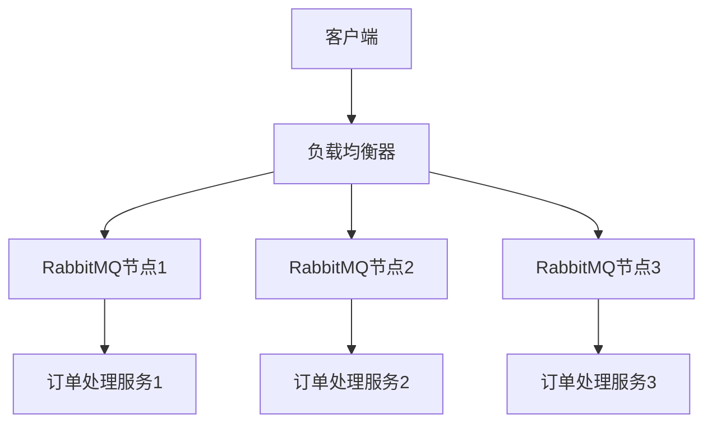

# RabbitMQ 负载均衡

在现代分布式系统中，消息队列（如RabbitMQ）是处理异步通信和任务分发的重要工具。随着系统规模的扩大，单个RabbitMQ节点可能无法满足高并发和高可用性的需求。因此，负载均衡成为了确保系统稳定性和性能的关键技术。

## 什么是负载均衡？

负载均衡是一种将工作负载分配到多个计算资源（如服务器、节点或进程）的技术，目的是优化资源使用、最大化吞吐量、最小化响应时间，并避免任何单一资源的过载。在RabbitMQ中，负载均衡通常用于将消息分发到多个队列或节点，以确保系统的高可用性和高性能。

## RabbitMQ 负载均衡的实现方式

### 1. 客户端负载均衡

客户端负载均衡是指在客户端（生产者或消费者）层面实现负载均衡。客户端可以根据一定的策略（如轮询、随机或基于权重）将消息发送到不同的RabbitMQ节点或队列。

#### 示例：轮询策略

```python
import pika

nodes = ['node1', 'node2', 'node3']
current_node = 0

def get_next_node():
    global current_node
    node = nodes[current_node]
    current_node = (current_node + 1) % len(nodes)
    return node

def send_message(message):
    node = get_next_node()
    connection = pika.BlockingConnection(pika.ConnectionParameters(node))
    channel = connection.channel()
    channel.queue_declare(queue='task_queue', durable=True)
    channel.basic_publish(exchange='',
                          routing_key='task_queue',
                          body=message,
                          properties=pika.BasicProperties(
                              delivery_mode=2,  # 使消息持久化
                          ))
    print(f" [x] Sent {message} to {node}")
    connection.close()

send_message("Task 1")
send_message("Task 2")
send_message("Task 3")
```

在这个示例中，`send_message`函数使用轮询策略将消息发送到不同的RabbitMQ节点。

### 2. 代理负载均衡

代理负载均衡是指在RabbitMQ集群前放置一个负载均衡器（如HAProxy或Nginx），由负载均衡器将客户端请求分发到不同的RabbitMQ节点。

#### 示例：HAProxy配置

```haproxy
frontend rabbitmq_frontend
    bind *:5672
    default_backend rabbitmq_backend

backend rabbitmq_backend
    balance roundrobin
    server node1 192.168.1.101:5672 check
    server node2 192.168.1.102:5672 check
    server node3 192.168.1.103:5672 check
```

在这个配置中，HAProxy使用轮询策略将客户端请求分发到三个RabbitMQ节点。

### 3. 集群负载均衡

RabbitMQ集群本身也支持负载均衡。通过将多个RabbitMQ节点组成一个集群，客户端可以连接到集群中的任意节点，集群会自动将消息路由到正确的队列。

#### 示例：RabbitMQ集群配置

```bash
# 在节点1上
rabbitmqctl stop_app
rabbitmqctl reset
rabbitmqctl join_cluster rabbit@node2
rabbitmqctl start_app

# 在节点2上
rabbitmqctl stop_app
rabbitmqctl reset
rabbitmqctl join_cluster rabbit@node1
rabbitmqctl start_app
```

在这个示例中，`node1`和`node2`组成了一个RabbitMQ集群。客户端可以连接到任意一个节点，集群会自动处理消息的路由。

## 实际应用场景

### 电商网站的订单处理

在一个电商网站中，订单处理系统需要处理大量的订单请求。通过使用RabbitMQ负载均衡，可以将订单请求分发到多个处理节点，确保系统的高可用性和高性能。



在这个场景中，负载均衡器将订单请求分发到多个RabbitMQ节点，每个节点再将消息路由到相应的订单处理服务。

## 总结

RabbitMQ负载均衡是确保分布式系统高可用性和高性能的关键技术。通过客户端负载均衡、代理负载均衡和集群负载均衡，可以有效地将消息分发到多个节点或队列，避免单点故障和资源过载。

## 附加资源与练习

- **练习1**：尝试在本地环境中配置一个RabbitMQ集群，并使用客户端负载均衡策略发送消息。
- **练习2**：使用HAProxy配置一个代理负载均衡器，将客户端请求分发到多个RabbitMQ节点。
- **附加资源**：
  - [RabbitMQ官方文档](https://www.rabbitmq.com/documentation.html)
  - [HAProxy官方文档](https://www.haproxy.org/documentation/)

通过以上内容，你应该对RabbitMQ负载均衡有了全面的了解。继续实践和探索，你将能够更好地应用这一技术来解决实际问题。