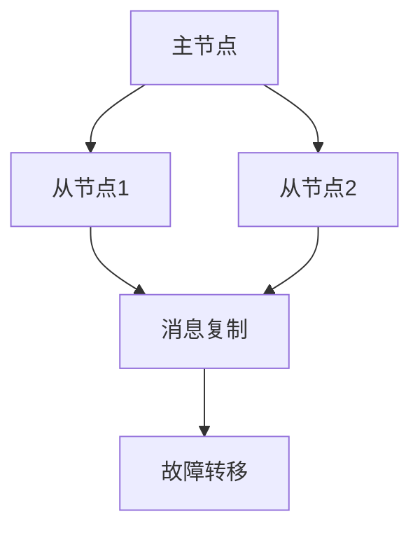

# RabbitMQ 故障转移

在现代分布式系统中，消息队列（如RabbitMQ）扮演着至关重要的角色，尤其是在需要高可用性和可靠性的场景中。RabbitMQ的故障转移机制是其高可用性架构的核心部分，它确保在节点发生故障时，系统能够自动恢复并继续运行。

## 什么是故障转移？

故障转移（Failover）是指在系统或服务发生故障时，自动将工作负载转移到备用系统或服务的过程。在RabbitMQ集群中，故障转移通常涉及将消息队列和交换器的状态从一个节点转移到另一个节点，以确保消息的持续传递。

## RabbitMQ 集群中的故障转移机制

RabbitMQ集群通过镜像队列（Mirrored Queues）实现故障转移。镜像队列允许队列在多个节点上复制，这样即使一个节点发生故障，其他节点仍然可以继续处理消息。

### 镜像队列的工作原理

当你在RabbitMQ集群中创建一个镜像队列时，队列的内容会在多个节点上进行复制。主节点（Master）负责处理所有的读写操作，而从节点（Slaves）则保持与主节点的同步。如果主节点发生故障，RabbitMQ会自动将其中一个从节点提升为新的主节点。



### 配置镜像队列

要启用镜像队列，你需要在RabbitMQ中配置策略。以下是一个示例配置：

```bash
rabbitmqctl set_policy ha-all "^ha\." '{"ha-mode":"all"}'
```

这个命令会将所有以 `ha.` 开头的队列配置为在所有节点上进行镜像。

### 故障转移的实际案例

假设你有一个三节点的RabbitMQ集群，节点分别为 `node1`、`node2` 和 `node3`。你创建了一个名为 `ha.queue` 的镜像队列，并将其配置为在所有节点上进行镜像。

```bash
rabbitmqctl set_policy ha-all "^ha\." '{"ha-mode":"all"}'
```

如果 `node1` 是主节点，并且它发生故障，RabbitMQ会自动将 `node2` 或 `node3` 提升为新的主节点，确保消息的持续传递。

## 故障转移的注意事项

1. **网络分区**：在网络分区的情况下，RabbitMQ可能会产生多个主节点，导致数据不一致。你需要配置适当的网络分区处理策略。
2. **性能开销**：镜像队列会增加系统的性能开销，因为消息需要在多个节点上进行复制。
3. **同步延迟**：在高负载情况下，从节点可能会滞后于主节点，导致短暂的同步延迟。

## 总结

RabbitMQ的故障转移机制通过镜像队列确保了系统的高可用性和消息的可靠传递。通过合理配置策略，你可以确保在节点发生故障时，系统能够自动恢复并继续运行。

## 附加资源与练习

- **官方文档**：[RabbitMQ高可用性指南](https://www.rabbitmq.com/ha.html)
- **练习**：尝试在一个三节点的RabbitMQ集群中配置镜像队列，并模拟节点故障，观察故障转移的过程。

:::tip
在实际生产环境中，建议定期测试故障转移机制，以确保系统在真正发生故障时能够正常工作。
:::