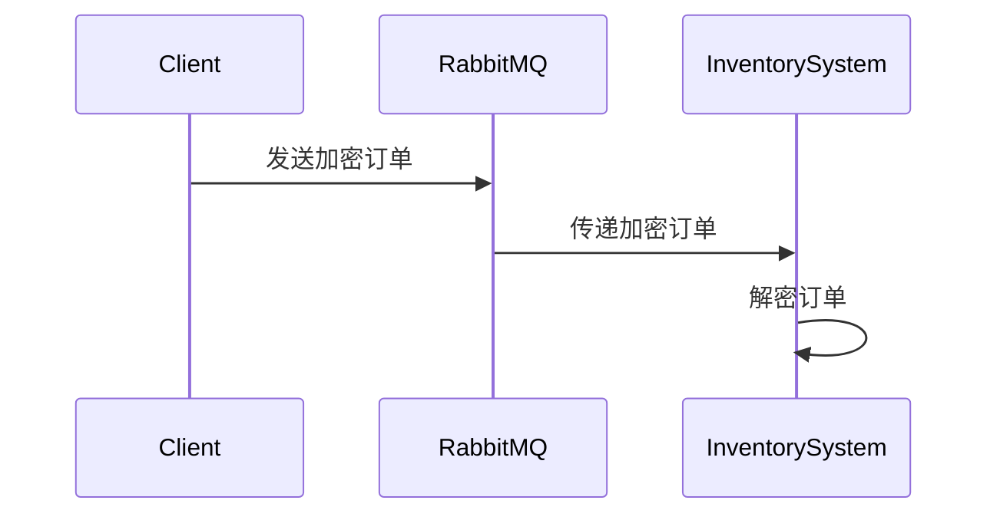

## 介绍

RabbitMQ 是一个广泛使用的消息代理，用于在分布式系统中传递消息。然而，消息在传输过程中可能会被截获或篡改，因此数据加密是确保消息安全的重要手段。本文将介绍如何在 RabbitMQ 中实现数据加密，确保消息在传输过程中的机密性和完整性。

## 为什么需要数据加密？

在分布式系统中，消息通常通过网络传输。如果消息未加密，攻击者可能会截获并读取敏感信息，甚至篡改消息内容。数据加密可以防止这种情况发生，确保只有授权的接收者能够解密和读取消息。

## RabbitMQ 中的数据加密

RabbitMQ 本身并不直接提供数据加密功能，但可以通过以下方式实现数据加密：

1. **TLS/SSL 加密**：通过配置 TLS/SSL，可以加密 RabbitMQ 客户端与服务器之间的通信。
2. **消息级加密**：在发送消息之前，对消息内容进行加密，然后在接收端解密。

### 1. 使用 TLS/SSL 加密

TLS/SSL 是一种广泛使用的加密协议，可以确保数据在传输过程中的安全性。以下是配置 RabbitMQ 使用 TLS/SSL 的步骤：

#### 步骤 1：生成证书

首先，需要生成 TLS/SSL 证书。可以使用 OpenSSL 工具生成自签名证书：

```bash
openssl req -x509 -newkey rsa:2048 -keyout key.pem -out cert.pem -days 365 -nodes
```

#### 步骤 2：配置 RabbitMQ

在 RabbitMQ 配置文件中启用 TLS/SSL：

```erlang
[
  {rabbit, [
    {ssl_listeners, [5671]},
    {ssl_options, [
      {cacertfile, "/path/to/ca_certificate.pem"},
      {certfile, "/path/to/server_certificate.pem"},
      {keyfile, "/path/to/server_key.pem"},
      {verify, verify_peer},
      {fail_if_no_peer_cert, false}
    ]}
  ]}
].
```

#### 步骤 3：客户端配置

客户端在连接 RabbitMQ 时，需要指定 TLS/SSL 配置：

```python
import pika

ssl_options = {
    "ca_certs": "/path/to/ca_certificate.pem",
    "certfile": "/path/to/client_certificate.pem",
    "keyfile": "/path/to/client_key.pem",
    "cert_reqs": ssl.CERT_REQUIRED
}

connection = pika.BlockingConnection(
    pika.ConnectionParameters(
        host='localhost',
        port=5671,
        ssl=True,
        ssl_options=ssl_options
    )
)
```

### 2. 消息级加密

除了 TLS/SSL，还可以在应用层对消息进行加密。以下是一个简单的示例，使用 Python 的 `cryptography` 库对消息进行加密和解密：

#### 加密消息

```python
from cryptography.fernet import Fernet

# 生成密钥
key = Fernet.generate_key()
cipher_suite = Fernet(key)

# 加密消息
message = b"Hello, RabbitMQ!"
encrypted_message = cipher_suite.encrypt(message)
```

#### 解密消息

```python
# 解密消息
decrypted_message = cipher_suite.decrypt(encrypted_message)
print(decrypted_message.decode())  # 输出: Hello, RabbitMQ!
```

## 实际应用场景

假设你正在开发一个电子商务平台，订单信息需要通过 RabbitMQ 传递给库存管理系统。为了保护订单信息，你可以使用 TLS/SSL 加密 RabbitMQ 的通信，并在应用层对订单信息进行加密。



## 总结

数据加密是确保 RabbitMQ 消息安全的重要手段。通过 TLS/SSL 加密通信，或在应用层对消息进行加密，可以有效防止消息被截获或篡改。本文介绍了如何在 RabbitMQ 中实现数据加密，并提供了代码示例和实际应用场景。

## 附加资源

- [RabbitMQ TLS/SSL 官方文档](https://www.rabbitmq.com/ssl.html)
- [Python cryptography 库文档](https://cryptography.io/en/latest/)

## 练习

1. 尝试在本地 RabbitMQ 实例中配置 TLS/SSL，并使用 Python 客户端连接。
2. 编写一个简单的消息加密和解密程序，确保消息在传输过程中的安全性。