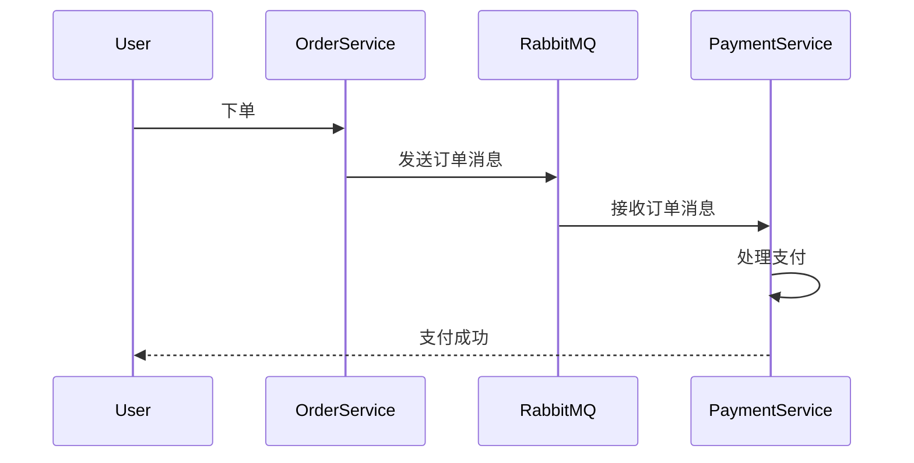

# RabbitMQ 微服务集成

在现代微服务架构中，服务之间的通信是一个关键问题。RabbitMQ 是一个强大的消息代理工具，能够帮助我们在微服务之间实现异步、解耦的通信。本文将详细介绍如何将 RabbitMQ 集成到微服务中，并通过实际案例展示其应用场景。

## 什么是 RabbitMQ？

RabbitMQ 是一个开源的消息代理软件，实现了高级消息队列协议（AMQP）。它允许应用程序通过消息队列进行通信，从而实现服务之间的解耦和异步处理。RabbitMQ 的主要特点包括：

- **消息持久化**：确保消息在系统崩溃时不会丢失。
- **消息路由**：支持多种消息路由策略，如直接交换、主题交换等。
- **高可用性**：通过集群和镜像队列实现高可用性。

## 为什么在微服务中使用 RabbitMQ？

在微服务架构中，服务通常需要与其他服务进行通信。传统的同步通信方式（如 HTTP 请求）可能会导致服务之间的紧耦合和性能瓶颈。RabbitMQ 提供了一种异步通信机制，能够有效解决这些问题：

- **解耦服务**：服务之间通过消息队列进行通信，减少了直接依赖。
- **提高性能**：异步处理允许服务在不等待响应的情况下继续执行其他任务。
- **增强可靠性**：消息队列可以确保消息的可靠传递，即使服务暂时不可用。

## RabbitMQ 微服务集成步骤

### 1. 安装 RabbitMQ

首先，你需要在本地或服务器上安装 RabbitMQ。可以通过以下命令在本地安装 RabbitMQ：

```bash
# 使用 Docker 安装 RabbitMQ
docker run -d --hostname my-rabbit --name some-rabbit -p 5672:5672 -p 15672:15672 rabbitmq:3-management
```

安装完成后，你可以通过 `http://localhost:15672` 访问 RabbitMQ 的管理界面，默认用户名和密码为 `guest`。

### 2. 创建消息生产者和消费者

在微服务中，通常会有消息生产者和消费者。生产者负责发送消息到队列，而消费者则从队列中接收并处理消息。

#### 生产者示例

以下是一个使用 Python 和 `pika` 库创建的生产者示例：

```python
import pika

# 连接到 RabbitMQ 服务器
connection = pika.BlockingConnection(pika.ConnectionParameters('localhost'))
channel = connection.channel()

# 声明一个队列
channel.queue_declare(queue='hello')

# 发送消息
channel.basic_publish(exchange='',
                      routing_key='hello',
                      body='Hello, RabbitMQ!')

print(" [x] Sent 'Hello, RabbitMQ!'")

# 关闭连接
connection.close()
```

#### 消费者示例

以下是一个使用 Python 和 `pika` 库创建的消费者示例：

```python
import pika

# 连接到 RabbitMQ 服务器
connection = pika.BlockingConnection(pika.ConnectionParameters('localhost'))
channel = connection.channel()

# 声明一个队列
channel.queue_declare(queue='hello')

# 定义回调函数
def callback(ch, method, properties, body):
    print(f" [x] Received {body}")

# 监听队列
channel.basic_consume(queue='hello',
                      auto_ack=True,
                      on_message_callback=callback)

print(' [*] Waiting for messages. To exit press CTRL+C')
channel.start_consuming()
```

### 3. 微服务集成

在微服务架构中，你可以将 RabbitMQ 作为服务之间的通信桥梁。例如，假设你有两个微服务：`OrderService` 和 `PaymentService`。当用户下单时，`OrderService` 会发送一个消息到 RabbitMQ 队列，`PaymentService` 则会从队列中接收消息并处理支付。



### 4. 实际案例：订单处理系统

假设我们有一个简单的订单处理系统，包含以下微服务：

- **OrderService**：负责接收用户订单并发送消息到 RabbitMQ。
- **PaymentService**：负责从 RabbitMQ 接收订单消息并处理支付。

#### OrderService 代码示例

```python
import pika

def create_order(order_details):
    # 连接到 RabbitMQ
    connection = pika.BlockingConnection(pika.ConnectionParameters('localhost'))
    channel = connection.channel()

    # 声明队列
    channel.queue_declare(queue='order_queue')

    # 发送订单消息
    channel.basic_publish(exchange='',
                          routing_key='order_queue',
                          body=order_details)

    print(f" [x] Sent order: {order_details}")
    connection.close()

# 模拟用户下单
create_order("Order #1234: 2 x iPhone 15")
```

#### PaymentService 代码示例

```python
import pika

def process_payment():
    # 连接到 RabbitMQ
    connection = pika.BlockingConnection(pika.ConnectionParameters('localhost'))
    channel = connection.channel()

    # 声明队列
    channel.queue_declare(queue='order_queue')

    # 定义回调函数
    def callback(ch, method, properties, body):
        print(f" [x] Processing payment for {body}")
        # 模拟支付处理
        print(" [x] Payment processed successfully")

    # 监听队列
    channel.basic_consume(queue='order_queue',
                          auto_ack=True,
                          on_message_callback=callback)

    print(' [*] Waiting for orders. To exit press CTRL+C')
    channel.start_consuming()

# 启动支付服务
process_payment()
```

## 总结

通过将 RabbitMQ 集成到微服务架构中，你可以实现服务之间的异步通信和解耦。本文介绍了 RabbitMQ 的基本概念、安装步骤，并通过实际案例展示了如何在微服务中使用 RabbitMQ 进行消息传递。

:::tip
在实际生产环境中，你可能需要配置 RabbitMQ 的高可用性和持久化策略，以确保消息的可靠传递。
:::

## 附加资源

- [RabbitMQ 官方文档](https://www.rabbitmq.com/documentation.html)
- [pika 库文档](https://pika.readthedocs.io/en/stable/)

## 练习

1. 尝试扩展上述订单处理系统，添加一个 `ShippingService`，负责从 RabbitMQ 接收订单消息并处理发货。
2. 研究 RabbitMQ 的交换类型（如直接交换、主题交换），并尝试在微服务中使用不同的交换类型进行消息路由。