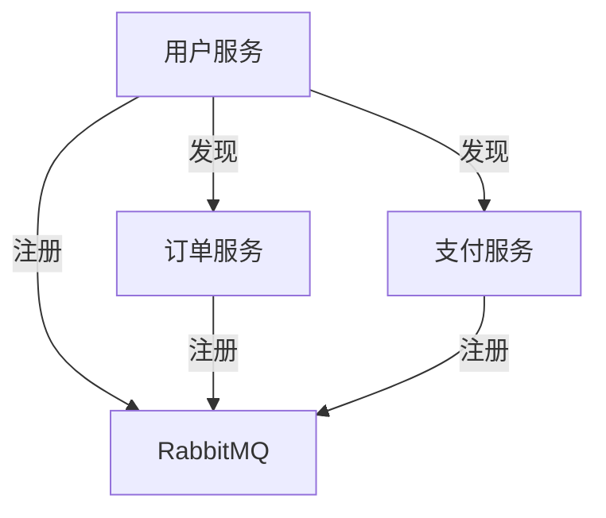

# RabbitMQ 服务发现

在现代微服务架构中，服务发现是一个至关重要的概念。它允许服务动态地找到彼此，而无需硬编码服务的位置信息。RabbitMQ作为一个流行的消息队列系统，也可以用于实现服务发现。本文将详细介绍RabbitMQ服务发现的概念、实现方式以及实际应用场景。

## 什么是服务发现？

服务发现是指在一个分布式系统中，服务能够自动发现并与其他服务通信的过程。在微服务架构中，服务通常分布在多个节点上，并且可能会动态扩展或缩减。服务发现机制使得服务能够动态地找到彼此，而不需要手动配置服务的位置。

## RabbitMQ 与服务发现

RabbitMQ本身并不是一个专门的服务发现工具，但它可以通过消息队列的机制来实现服务发现。具体来说，服务可以通过RabbitMQ的交换机和队列来发布和订阅消息，从而实现服务之间的动态发现和通信。

### 基本概念

1. **交换机（Exchange）**：RabbitMQ中的交换机用于接收消息并将其路由到一个或多个队列。交换机有几种类型，如直连交换机、主题交换机、扇出交换机等。
2. **队列（Queue）**：队列是存储消息的地方。服务可以从队列中消费消息。
3. **绑定（Binding）**：绑定是交换机和队列之间的连接规则，定义了消息如何从交换机路由到队列。

### 实现服务发现的步骤

1. **服务注册**：当一个服务启动时，它可以通过RabbitMQ发布一条注册消息，声明自己的存在。
2. **服务发现**：其他服务可以通过订阅特定的队列或交换机来接收这些注册消息，从而发现新服务。
3. **动态更新**：当服务下线或新服务上线时，RabbitMQ可以动态地更新服务列表。

### 代码示例

以下是一个简单的Python示例，展示了如何使用RabbitMQ实现服务发现。

```python
import pika

# 连接到RabbitMQ服务器
connection = pika.BlockingConnection(pika.ConnectionParameters('localhost'))
channel = connection.channel()

# 声明一个交换机
channel.exchange_declare(exchange='service_discovery', exchange_type='fanout')

# 服务注册
def register_service(service_name):
    channel.basic_publish(exchange='service_discovery', routing_key='', body=service_name)
    print(f"Service {service_name} registered.")

# 服务发现
def discover_services():
    result = channel.queue_declare(queue='', exclusive=True)
    queue_name = result.method.queue
    channel.queue_bind(exchange='service_discovery', queue=queue_name)

    def callback(ch, method, properties, body):
        print(f"Discovered service: {body.decode()}")

    channel.basic_consume(queue=queue_name, on_message_callback=callback, auto_ack=True)
    print('Waiting for service registrations...')
    channel.start_consuming()

# 示例：注册一个服务并发现其他服务
register_service('service_a')
discover_services()
```

### 实际应用场景

假设我们有一个微服务架构，其中包含多个服务，如用户服务、订单服务和支付服务。每个服务在启动时都会通过RabbitMQ注册自己，其他服务可以通过订阅注册消息来发现这些服务。这样，当用户服务需要调用订单服务时，它可以通过RabbitMQ动态地找到订单服务的位置，而不需要硬编码订单服务的地址。



## 总结

RabbitMQ服务发现是一种简单而有效的方式，可以在微服务架构中实现服务的动态发现和通信。通过使用RabbitMQ的交换机和队列，服务可以自动注册和发现彼此，从而实现灵活的微服务架构。

## 附加资源与练习

- **练习**：尝试扩展上述代码示例，使其支持服务的注销功能。
- **资源**：阅读RabbitMQ官方文档，了解更多关于交换机和队列的高级用法。

:::tip
在实际生产环境中，建议结合使用RabbitMQ和其他服务发现工具（如Consul或Eureka），以实现更强大的服务发现功能。
:::