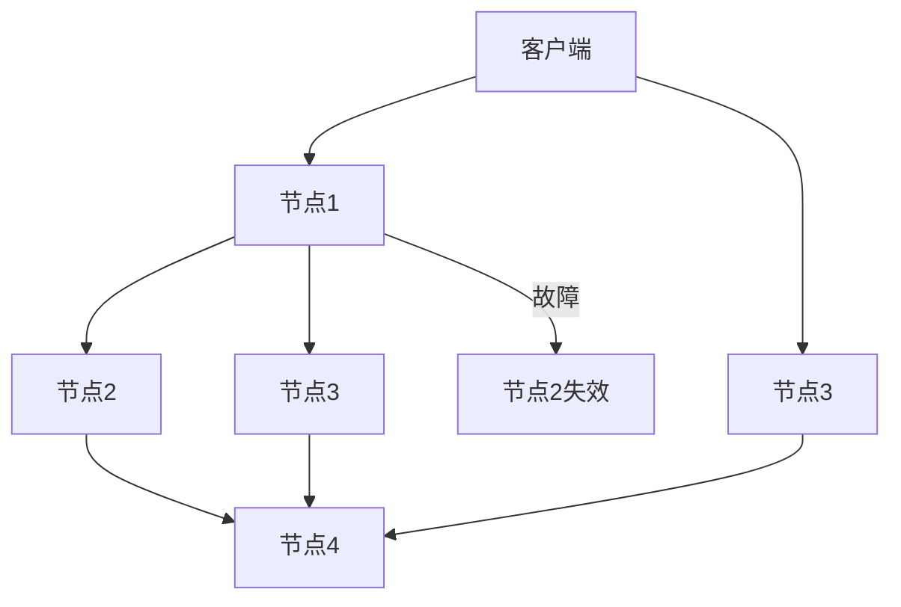

# RabbitMQ 服务弹性

在现代微服务架构中，消息队列（如RabbitMQ）扮演着至关重要的角色，用于解耦服务之间的通信。然而，随着系统规模的扩大，确保消息队列的高可用性和容错能力变得尤为重要。本文将深入探讨RabbitMQ的服务弹性，帮助初学者理解如何通过RabbitMQ实现可靠的消息传递。

## 什么是RabbitMQ服务弹性？

服务弹性是指系统在面对故障或异常情况时，能够继续正常运行或快速恢复的能力。对于RabbitMQ来说，服务弹性主要体现在以下几个方面：

1. **高可用性**：确保RabbitMQ服务在硬件或网络故障时仍能正常运行。
2. **容错能力**：在部分节点失效时，系统能够自动恢复或切换到备用节点。
3. **负载均衡**：通过分布式架构分担消息处理的压力，避免单点瓶颈。

## RabbitMQ 的高可用性

RabbitMQ通过**集群**和**镜像队列**来实现高可用性。集群允许多个RabbitMQ节点协同工作，而镜像队列则确保消息在多个节点之间复制，从而防止数据丢失。

### 集群配置

以下是一个简单的RabbitMQ集群配置示例：

```bash
# 在节点1上
rabbitmqctl stop_app
rabbitmqctl reset
rabbitmqctl join_cluster rabbit@node2
rabbitmqctl start_app

# 在节点2上
rabbitmqctl stop_app
rabbitmqctl reset
rabbitmqctl join_cluster rabbit@node1
rabbitmqctl start_app
```

:::note
确保所有节点的主机名和IP地址在集群配置中正确无误。
:::

### 镜像队列

镜像队列通过在多个节点上复制队列数据来提供冗余。以下是如何配置镜像队列的示例：

```bash
rabbitmqctl set_policy ha-all "^ha\." '{"ha-mode":"all"}'
```

:::tip
`ha-all`策略会将所有以`ha.`开头的队列在所有节点上进行镜像。
:::

## 容错能力

RabbitMQ的容错能力主要通过**自动故障转移**和**持久化**来实现。

### 自动故障转移

当集群中的某个节点失效时，RabbitMQ会自动将流量转移到其他可用节点。以下是一个故障转移的示例：



:::caution
确保客户端配置了多个节点地址，以便在故障时能够自动重连。
:::

### 持久化

通过将消息和队列标记为持久化，可以确保即使在RabbitMQ重启后，消息也不会丢失。以下是如何设置持久化的示例：

```python
channel.queue_declare(queue='task_queue', durable=True)
channel.basic_publish(exchange='',
                      routing_key='task_queue',
                      body='Hello World!',
                      properties=pika.BasicProperties(
                         delivery_mode = 2, # 使消息持久化
                      ))
```

:::warning
持久化会增加磁盘I/O，可能会影响性能，因此需要根据实际需求进行权衡。
:::

## 实际案例

假设我们有一个电商平台，订单服务需要将订单信息发送给库存服务进行处理。为了确保订单信息不会丢失，我们可以使用RabbitMQ的镜像队列和持久化功能。

1. **订单服务**将订单信息发送到RabbitMQ的`order_queue`。
2. **库存服务**从`order_queue`中消费消息并处理订单。
3. 如果RabbitMQ的某个节点失效，系统会自动切换到其他节点，确保订单处理不受影响。

## 总结

RabbitMQ的服务弹性是确保微服务架构中消息传递可靠性的关键。通过集群、镜像队列、自动故障转移和持久化等功能，RabbitMQ能够在面对故障时保持高可用性和容错能力。希望本文能帮助你更好地理解RabbitMQ的服务弹性，并在实际项目中应用这些技术。

## 附加资源

- [RabbitMQ官方文档](https://www.rabbitmq.com/documentation.html)
- [RabbitMQ高可用性指南](https://www.rabbitmq.com/ha.html)
- [RabbitMQ持久化配置](https://www.rabbitmq.com/persistence-conf.html)

## 练习

1. 配置一个简单的RabbitMQ集群，并测试其高可用性。
2. 创建一个镜像队列，并模拟节点失效，观察系统的行为。
3. 尝试在消息发送和队列声明中启用持久化，并测试其效果。
