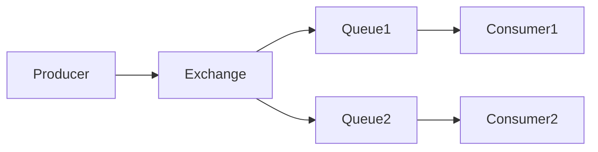

# RabbitMQ 服务解耦

在现代微服务架构中，服务之间的通信是一个关键问题。RabbitMQ 是一个强大的消息队列工具，能够帮助我们在微服务之间实现解耦，从而提高系统的可扩展性和灵活性。本文将详细介绍 RabbitMQ 如何实现服务解耦，并通过实际案例帮助你理解其应用场景。

## 什么是服务解耦？

服务解耦是指将系统中的各个服务分离，使它们能够独立运行和扩展，而不需要直接依赖其他服务。通过解耦，我们可以降低系统的复杂性，提高系统的可维护性和可扩展性。

在微服务架构中，服务解耦通常通过消息队列（如 RabbitMQ）来实现。消息队列允许服务通过异步消息进行通信，而不是直接调用对方的 API。

## RabbitMQ 如何实现服务解耦？

RabbitMQ 是一个开源的消息代理，它实现了高级消息队列协议（AMQP）。通过 RabbitMQ，我们可以将消息从一个服务发送到另一个服务，而不需要知道对方的具体实现细节。

### 基本概念

在 RabbitMQ 中，有几个关键概念需要理解：

- **Producer（生产者）**：负责发送消息的服务。
- **Consumer（消费者）**：负责接收和处理消息的服务。
- **Queue（队列）**：存储消息的缓冲区，消息会在这里等待被消费者处理。
- **Exchange（交换机）**：负责将消息路由到一个或多个队列。

### 消息传递流程

1. **生产者**将消息发送到 **交换机**。
2. **交换机**根据路由规则将消息分发到一个或多个 **队列**。
3. **消费者**从 **队列** 中获取消息并进行处理。



### 代码示例

以下是一个简单的 Python 示例，展示了如何使用 RabbitMQ 实现服务解耦。

#### 生产者代码

```python
import pika

# 连接到 RabbitMQ 服务器
connection = pika.BlockingConnection(pika.ConnectionParameters('localhost'))
channel = connection.channel()

# 声明一个交换机
channel.exchange_declare(exchange='logs', exchange_type='fanout')

# 发送消息
message = "Hello, RabbitMQ!"
channel.basic_publish(exchange='logs', routing_key='', body=message)
print(f" [x] Sent {message}")

# 关闭连接
connection.close()
```

#### 消费者代码

```python
import pika

# 连接到 RabbitMQ 服务器
connection = pika.BlockingConnection(pika.ConnectionParameters('localhost'))
channel = connection.channel()

# 声明一个交换机
channel.exchange_declare(exchange='logs', exchange_type='fanout')

# 声明一个临时队列
result = channel.queue_declare(queue='', exclusive=True)
queue_name = result.method.queue

# 将队列绑定到交换机
channel.queue_bind(exchange='logs', queue=queue_name)

# 定义回调函数
def callback(ch, method, properties, body):
    print(f" [x] Received {body}")

# 开始消费消息
channel.basic_consume(queue=queue_name, on_message_callback=callback, auto_ack=True)

print(' [*] Waiting for messages. To exit press CTRL+C')
channel.start_consuming()
```

### 实际应用场景

假设我们有一个电商系统，其中包含订单服务和库存服务。当用户下单时，订单服务需要通知库存服务减少库存。通过 RabbitMQ，我们可以实现这两个服务之间的解耦。

1. **订单服务**（生产者）将订单信息发送到 RabbitMQ。
2. **库存服务**（消费者）从 RabbitMQ 中获取订单信息并减少库存。

这样，订单服务和库存服务可以独立运行和扩展，而不需要直接依赖对方。

:::tip
在实际应用中，你还可以使用 RabbitMQ 的其他特性，如消息确认、持久化、优先级队列等，来进一步优化系统的可靠性和性能。
:::

## 总结

通过 RabbitMQ 实现服务解耦，我们可以构建更加灵活和可扩展的微服务系统。本文介绍了 RabbitMQ 的基本概念、消息传递流程，并通过代码示例和实际应用场景帮助你理解其工作原理。

### 附加资源

- [RabbitMQ 官方文档](https://www.rabbitmq.com/documentation.html)
- [RabbitMQ 教程](https://www.rabbitmq.com/getstarted.html)

### 练习

1. 修改上述代码示例，使生产者发送多条消息，并观察消费者的行为。
2. 尝试使用不同的交换机类型（如 direct、topic）来实现更复杂的消息路由。

希望本文能帮助你更好地理解 RabbitMQ 在微服务架构中的应用。如果你有任何问题或建议，欢迎在评论区留言！