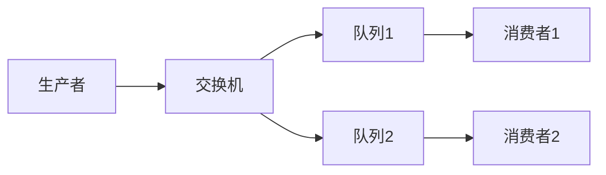
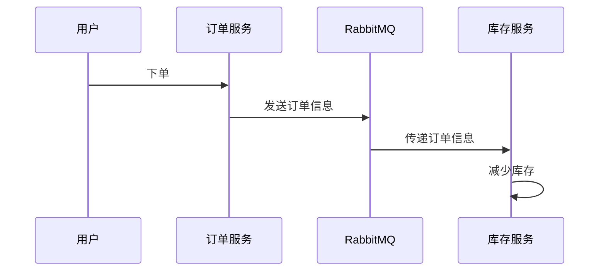

## 介绍

在现代微服务架构中，服务之间的通信是一个关键问题。传统的同步通信方式（如HTTP请求）可能会导致系统耦合性高、性能瓶颈和单点故障。为了解决这些问题，消息队列（如RabbitMQ）被广泛用于实现异步通信，从而提高系统的可扩展性和可靠性。

RabbitMQ是一个开源的消息代理，它实现了高级消息队列协议（AMQP），允许不同的微服务通过消息进行通信。本文将详细介绍如何使用RabbitMQ在微服务架构中实现消息传递。

## RabbitMQ 的基本概念

在深入探讨RabbitMQ的微服务通信之前，我们需要了解一些基本概念：

- **消息（Message）**：消息是RabbitMQ中传递的数据单元，通常包含一些元数据和实际数据。
- **队列（Queue）**：队列是存储消息的地方，消息会被发送到队列中，等待消费者处理。
- **交换机（Exchange）**：交换机负责接收生产者发送的消息，并根据路由规则将消息分发到相应的队列。
- **绑定（Binding）**：绑定是交换机和队列之间的连接，定义了消息如何从交换机路由到队列。

## RabbitMQ 微服务通信的工作原理

在微服务架构中，RabbitMQ通常用于解耦服务之间的通信。以下是RabbitMQ微服务通信的基本工作流程：

1. **生产者（Producer）**：生产者是发送消息的微服务。它将消息发送到RabbitMQ的交换机。
2. **交换机（Exchange）**：交换机根据路由规则将消息分发到一个或多个队列。
3. **队列（Queue）**：队列存储消息，直到消费者准备好处理它们。
4. **消费者（Consumer）**：消费者是接收消息的微服务。它从队列中获取消息并进行处理。



## 代码示例：使用RabbitMQ进行微服务通信

以下是一个简单的Python示例，展示了如何使用RabbitMQ在微服务之间发送和接收消息。

### 生产者代码

```python
import pika

# 连接到RabbitMQ服务器
connection = pika.BlockingConnection(pika.ConnectionParameters('localhost'))
channel = connection.channel()

# 声明一个交换机
channel.exchange_declare(exchange='my_exchange', exchange_type='direct')

# 发送消息
message = 'Hello, RabbitMQ!'
channel.basic_publish(exchange='my_exchange', routing_key='my_queue', body=message)
print(f" [x] Sent '{message}'")

# 关闭连接
connection.close()
```

### 消费者代码

```python
import pika

# 连接到RabbitMQ服务器
connection = pika.BlockingConnection(pika.ConnectionParameters('localhost'))
channel = connection.channel()

# 声明一个队列
channel.queue_declare(queue='my_queue')

# 定义回调函数
def callback(ch, method, properties, body):
    print(f" [x] Received {body}")

# 设置消费者
channel.basic_consume(queue='my_queue', on_message_callback=callback, auto_ack=True)

print(' [*] Waiting for messages. To exit press CTRL+C')
channel.start_consuming()
```

### 运行结果

1. 运行生产者代码后，消息 `Hello, RabbitMQ!` 将被发送到RabbitMQ的交换机。
2. 运行消费者代码后，消费者将从队列中接收并打印该消息。

## 实际案例：订单处理系统

假设我们有一个电子商务平台，其中包含两个微服务：`订单服务`和`库存服务`。当用户下单时，`订单服务`需要通知`库存服务`减少库存。

### 工作流程

1. **订单服务**：当用户下单时，`订单服务`将订单信息发送到RabbitMQ的交换机。
2. **库存服务**：`库存服务`从队列中获取订单信息，并减少相应的库存。



### 代码实现

#### 订单服务（生产者）

```python
import pika

# 连接到RabbitMQ服务器
connection = pika.BlockingConnection(pika.ConnectionParameters('localhost'))
channel = connection.channel()

# 声明一个交换机
channel.exchange_declare(exchange='order_exchange', exchange_type='direct')

# 发送订单信息
order_info = 'Order123: ProductA, Quantity: 2'
channel.basic_publish(exchange='order_exchange', routing_key='order_queue', body=order_info)
print(f" [x] Sent '{order_info}'")

# 关闭连接
connection.close()
```

#### 库存服务（消费者）

```python
import pika

# 连接到RabbitMQ服务器
connection = pika.BlockingConnection(pika.ConnectionParameters('localhost'))
channel = connection.channel()

# 声明一个队列
channel.queue_declare(queue='order_queue')

# 定义回调函数
def callback(ch, method, properties, body):
    print(f" [x] Received {body}")
    # 处理库存减少逻辑
    print(" [x] Updating inventory...")

# 设置消费者
channel.basic_consume(queue='order_queue', on_message_callback=callback, auto_ack=True)

print(' [*] Waiting for orders. To exit press CTRL+C')
channel.start_consuming()
```

## 总结

RabbitMQ是一个强大的工具，可以帮助我们在微服务架构中实现高效的消息传递和通信。通过使用RabbitMQ，我们可以解耦服务之间的依赖，提高系统的可扩展性和可靠性。本文介绍了RabbitMQ的基本概念、工作原理，并通过代码示例和实际案例展示了如何在微服务中使用RabbitMQ进行通信。

## 附加资源与练习

- **官方文档**：访问 [RabbitMQ官方文档](https://www.rabbitmq.com/documentation.html) 了解更多高级功能和配置选项。
- **练习**：尝试在本地环境中搭建一个RabbitMQ服务器，并使用不同的编程语言（如Java、Node.js）实现生产者和消费者。

:::tip
如果你在实践过程中遇到问题，可以参考RabbitMQ的社区论坛或Stack Overflow上的相关讨论。
:::