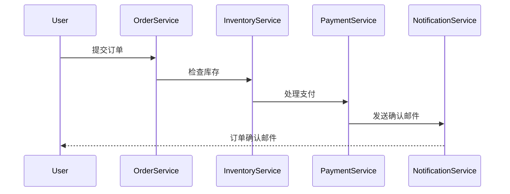

# RabbitMQ 服务编排

在现代微服务架构中，服务之间的通信和协调是一个关键问题。RabbitMQ作为一个强大的消息代理，可以帮助我们实现服务编排（Service Orchestration），即通过消息传递来协调多个服务的执行流程。本文将详细介绍如何使用RabbitMQ进行服务编排，并通过实际案例展示其应用场景。

## 什么是服务编排？

服务编排是指通过协调多个服务的执行顺序和逻辑，来完成一个复杂的业务流程。与**服务编排**相对的是**服务编排**（Service Choreography），后者强调服务之间的自主协作，而前者则依赖于一个中央协调器来管理流程。

在微服务架构中，服务编排通常用于处理跨服务的业务流程，例如订单处理、支付流程等。RabbitMQ通过其消息队列机制，可以很好地支持这种场景。

## RabbitMQ 的基本概念

在深入服务编排之前，我们需要了解RabbitMQ的一些基本概念：

- **消息队列（Queue）**：用于存储消息的缓冲区，生产者将消息发送到队列，消费者从队列中接收消息。
- **交换机（Exchange）**：负责将消息路由到一个或多个队列。常见的交换机类型有直连交换机（Direct）、主题交换机（Topic）和扇出交换机（Fanout）。
- **绑定（Binding）**：定义了交换机和队列之间的关系，决定了消息如何从交换机路由到队列。

## 服务编排的实现

### 1. 定义业务流程

假设我们有一个简单的订单处理流程，包含以下步骤：

1. 用户提交订单。
2. 订单服务验证订单信息。
3. 库存服务检查库存。
4. 支付服务处理支付。
5. 通知服务发送订单确认邮件。

### 2. 使用RabbitMQ进行服务编排

我们可以使用RabbitMQ的消息队列来协调这些服务的执行。以下是实现步骤：

#### 2.1 创建队列

首先，我们需要为每个服务创建一个队列：

```bash
# 创建订单队列
rabbitmqadmin declare queue name=order_queue durable=true

# 创建库存队列
rabbitmqadmin declare queue name=inventory_queue durable=true

# 创建支付队列
rabbitmqadmin declare queue name=payment_queue durable=true

# 创建通知队列
rabbitmqadmin declare queue name=notification_queue durable=true
```

#### 2.2 定义交换机

接下来，我们定义一个直连交换机（Direct Exchange），用于将消息路由到相应的队列：

```bash
# 创建直连交换机
rabbitmqadmin declare exchange name=order_exchange type=direct durable=true
```

#### 2.3 绑定队列到交换机

将每个队列绑定到交换机，并指定路由键（Routing Key）：

```bash
# 绑定订单队列
rabbitmqadmin declare binding source=order_exchange destination=order_queue routing_key=order

# 绑定库存队列
rabbitmqadmin declare binding source=order_exchange destination=inventory_queue routing_key=inventory

# 绑定支付队列
rabbitmqadmin declare binding source=order_exchange destination=payment_queue routing_key=payment

# 绑定通知队列
rabbitmqadmin declare binding source=order_exchange destination=notification_queue routing_key=notification
```

#### 2.4 发送和接收消息

现在，我们可以通过RabbitMQ发送和接收消息来协调服务的执行。以下是一个简单的Python示例：

```python
import pika

# 连接到RabbitMQ服务器
connection = pika.BlockingConnection(pika.ConnectionParameters('localhost'))
channel = connection.channel()

# 发送订单消息
channel.basic_publish(exchange='order_exchange',
                      routing_key='order',
                      body='Order placed')

print(" [x] Sent 'Order placed'")

# 关闭连接
connection.close()
```

在订单服务中，我们可以监听`order_queue`并处理订单：

```python
import pika

def callback(ch, method, properties, body):
    print(f" [x] Received {body}")
    # 处理订单逻辑
    # 发送库存检查消息
    channel.basic_publish(exchange='order_exchange',
                          routing_key='inventory',
                          body='Check inventory')

# 连接到RabbitMQ服务器
connection = pika.BlockingConnection(pika.ConnectionParameters('localhost'))
channel = connection.channel()

# 监听订单队列
channel.basic_consume(queue='order_queue',
                      on_message_callback=callback,
                      auto_ack=True)

print(' [*] Waiting for messages. To exit press CTRL+C')
channel.start_consuming()
```

类似地，库存服务、支付服务和通知服务可以分别监听各自的队列，并执行相应的逻辑。

### 3. 实际案例：订单处理流程

让我们通过一个完整的订单处理流程来展示RabbitMQ服务编排的实际应用。



在这个流程中，每个服务都通过RabbitMQ接收消息并执行相应的任务，最终完成订单处理。

## 总结

RabbitMQ的服务编排功能使得在微服务架构中协调多个服务的执行变得简单而高效。通过定义队列、交换机和绑定，我们可以轻松地实现复杂的业务流程。本文通过一个订单处理的实际案例，展示了如何使用RabbitMQ进行服务编排。

## 附加资源

- [RabbitMQ官方文档](https://www.rabbitmq.com/documentation.html)
- [微服务架构设计模式](https://microservices.io/patterns/microservices.html)
- [RabbitMQ与Python实战](https://www.rabbitmq.com/tutorials/tutorial-one-python.html)

## 练习

1. 尝试扩展订单处理流程，添加更多的服务（如物流服务）。
2. 使用不同的交换机类型（如主题交换机）来实现更复杂的消息路由。
3. 编写一个完整的Python程序，模拟订单处理流程中的各个服务。

通过以上练习，你将更深入地理解RabbitMQ在微服务架构中的应用。