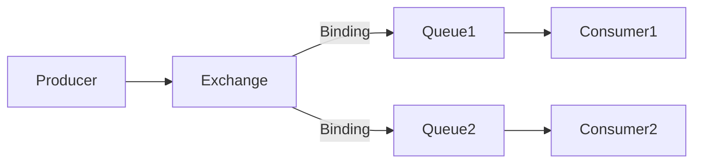
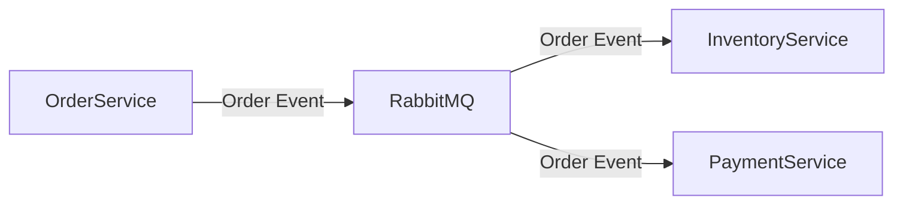

# RabbitMQ 事件驱动架构

## 介绍

事件驱动架构（Event-Driven Architecture, EDA）是一种软件设计模式，其中系统的行为由事件触发。事件可以是用户操作、系统状态变化或其他外部输入。RabbitMQ 是一个广泛使用的消息代理，它支持事件驱动架构，允许不同的微服务通过消息进行通信。

在微服务架构中，服务之间的通信通常通过 HTTP 请求或消息队列实现。RabbitMQ 提供了一种异步通信机制，使得服务可以在不直接依赖彼此的情况下进行通信。这种松耦合的设计使得系统更加灵活和可扩展。

## RabbitMQ 的基本概念

在深入探讨事件驱动架构之前，我们需要了解 RabbitMQ 的一些基本概念：

- **生产者（Producer）**：发送消息的应用程序。
- **消费者（Consumer）**：接收消息的应用程序。
- **队列（Queue）**：存储消息的缓冲区。
- **交换机（Exchange）**：接收来自生产者的消息，并根据规则将消息路由到队列。
- **绑定（Binding）**：连接交换机和队列的规则。

## 事件驱动架构的工作原理

在事件驱动架构中，生产者将事件（消息）发送到 RabbitMQ 的交换机，交换机根据绑定规则将消息路由到一个或多个队列。消费者从队列中获取消息并处理它们。这种模式允许系统在事件发生时立即响应，而不需要轮询或等待。



## 代码示例

以下是一个简单的 Python 示例，展示了如何使用 RabbitMQ 实现事件驱动架构。

### 生产者代码

```python
import pika

# 连接到 RabbitMQ 服务器
connection = pika.BlockingConnection(pika.ConnectionParameters('localhost'))
channel = connection.channel()

# 声明一个交换机
channel.exchange_declare(exchange='logs', exchange_type='fanout')

# 发送消息
message = "Hello, RabbitMQ!"
channel.basic_publish(exchange='logs', routing_key='', body=message)
print(f" [x] Sent {message}")

# 关闭连接
connection.close()
```

### 消费者代码

```python
import pika

# 连接到 RabbitMQ 服务器
connection = pika.BlockingConnection(pika.ConnectionParameters('localhost'))
channel = connection.channel()

# 声明一个交换机
channel.exchange_declare(exchange='logs', exchange_type='fanout')

# 声明一个临时队列
result = channel.queue_declare(queue='', exclusive=True)
queue_name = result.method.queue

# 绑定队列到交换机
channel.queue_bind(exchange='logs', queue=queue_name)

# 定义回调函数
def callback(ch, method, properties, body):
    print(f" [x] Received {body}")

# 开始消费消息
channel.basic_consume(queue=queue_name, on_message_callback=callback, auto_ack=True)

print(' [*] Waiting for messages. To exit press CTRL+C')
channel.start_consuming()
```

### 运行结果

运行生产者代码后，消费者将接收到消息并打印出来：

```
 [x] Sent Hello, RabbitMQ!
 [*] Waiting for messages. To exit press CTRL+C
 [x] Received b'Hello, RabbitMQ!'
```

## 实际应用场景

### 订单处理系统

假设我们有一个电子商务平台，订单处理系统由多个微服务组成，包括订单服务、库存服务和支付服务。当用户下单时，订单服务会生成一个订单事件，并将其发送到 RabbitMQ。库存服务和支付服务分别监听相关队列，处理库存扣减和支付操作。



这种设计使得各个服务可以独立扩展和部署，而不需要直接依赖彼此。

## 总结

RabbitMQ 事件驱动架构提供了一种高效、灵活的方式来处理微服务之间的通信。通过使用消息队列，服务可以异步处理事件，从而提高系统的响应性和可扩展性。本文介绍了 RabbitMQ 的基本概念、事件驱动架构的工作原理，并通过代码示例和实际应用场景展示了其强大功能。

## 附加资源与练习

- **官方文档**：[RabbitMQ 官方文档](https://www.rabbitmq.com/documentation.html)
- **练习**：尝试实现一个简单的聊天应用，使用 RabbitMQ 作为消息代理，允许多个用户通过消息进行通信。

:::tip
提示：在实现聊天应用时，可以考虑使用 `fanout` 类型的交换机，以便所有用户都能接收到消息。
:::