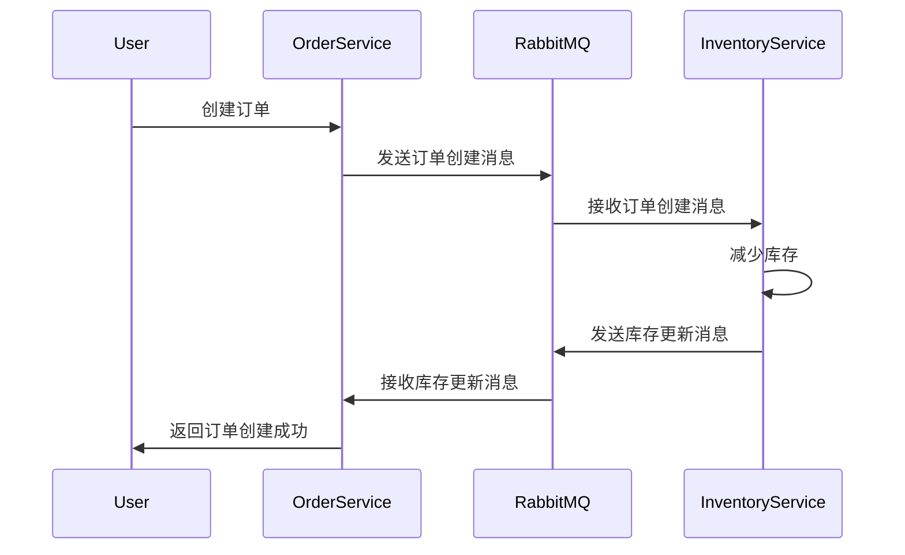

# RabbitMQ 分布式事务

在微服务架构中，分布式事务是一个常见的挑战。由于每个服务都有自己的数据库，如何确保跨服务的事务一致性变得尤为重要。RabbitMQ作为一款流行的消息队列工具，可以帮助我们实现分布式事务的最终一致性。本文将详细介绍RabbitMQ在分布式事务中的应用，并通过代码示例和实际案例帮助你理解其工作原理。

## 什么是分布式事务？

分布式事务是指涉及多个独立服务或数据库的事务操作。在微服务架构中，每个服务通常都有自己的数据库，因此无法通过传统的单数据库事务来保证一致性。分布式事务的目标是确保所有参与的服务要么全部成功提交，要么全部回滚。

## RabbitMQ 在分布式事务中的作用

RabbitMQ本身并不直接支持分布式事务，但它可以通过消息队列的机制来实现最终一致性。具体来说，RabbitMQ可以帮助我们在不同的服务之间传递消息，并通过消息的确认机制来确保事务的最终一致性。

### 消息确认机制

RabbitMQ提供了消息确认机制（Message Acknowledgment），消费者在处理完消息后可以向RabbitMQ发送确认信号。如果消费者未能成功处理消息，RabbitMQ会将消息重新放回队列，等待其他消费者处理。这种机制确保了消息不会丢失，从而实现了最终一致性。

### 事务性消息

在某些场景下，我们需要确保消息的发送和业务操作是原子性的。RabbitMQ支持事务性消息，即在发送消息的同时，可以将消息的发送和业务操作放在同一个事务中。如果业务操作失败，消息也不会被发送。

## 代码示例

以下是一个使用RabbitMQ实现分布式事务的简单示例。假设我们有两个服务：订单服务和库存服务。当用户下单时，订单服务需要创建订单，并通知库存服务减少库存。

### 订单服务

```python
import pika

def create_order(order_details):
    # 创建订单
    order_id = save_order_to_db(order_details)
    
    # 发送消息到RabbitMQ
    connection = pika.BlockingConnection(pika.ConnectionParameters('localhost'))
    channel = connection.channel()
    channel.queue_declare(queue='order_created')
    
    channel.basic_publish(exchange='',
                          routing_key='order_created',
                          body=str(order_id))
    
    connection.close()
    return order_id
```

### 库存服务

```python
import pika

def reduce_stock(order_id):
    # 减少库存
    success = update_stock_in_db(order_id)
    
    if success:
        # 发送确认消息
        connection = pika.BlockingConnection(pika.ConnectionParameters('localhost'))
        channel = connection.channel()
        channel.queue_declare(queue='stock_updated')
        
        channel.basic_publish(exchange='',
                              routing_key='stock_updated',
                              body=str(order_id))
        
        connection.close()
    else:
        # 处理失败情况
        handle_failure(order_id)
```

### 消息确认

在库存服务中，我们可以使用RabbitMQ的消息确认机制来确保消息被正确处理：

```python
def callback(ch, method, properties, body):
    order_id = int(body)
    if reduce_stock(order_id):
        ch.basic_ack(delivery_tag=method.delivery_tag)
    else:
        ch.basic_nack(delivery_tag=method.delivery_tag)

connection = pika.BlockingConnection(pika.ConnectionParameters('localhost'))
channel = connection.channel()
channel.queue_declare(queue='order_created')

channel.basic_consume(queue='order_created',
                      on_message_callback=callback)

channel.start_consuming()
```

## 实际案例

假设我们有一个电商平台，用户下单后需要同时创建订单和减少库存。如果订单创建成功但库存减少失败，我们需要回滚订单创建操作。通过RabbitMQ的消息确认机制，我们可以确保订单和库存操作的一致性。

### 流程图



## 总结

RabbitMQ通过消息队列和消息确认机制，可以帮助我们在微服务架构中实现分布式事务的最终一致性。虽然RabbitMQ本身不直接支持分布式事务，但通过合理的设计和实现，我们可以利用其强大的消息传递能力来确保事务的一致性。

## 附加资源

- [RabbitMQ官方文档](https://www.rabbitmq.com/documentation.html)
- [微服务架构中的分布式事务](https://microservices.io/patterns/data/saga.html)
- [RabbitMQ与Spring Boot集成](https://spring.io/guides/gs/messaging-rabbitmq/)

## 练习

1. 尝试在本地搭建一个RabbitMQ环境，并实现上述订单服务和库存服务的示例。
2. 修改代码，使得在库存减少失败时，订单服务能够回滚订单创建操作。
3. 研究RabbitMQ的事务性消息，并尝试在代码中使用事务性消息来确保消息的原子性。

通过以上学习和实践，你将能够更好地理解RabbitMQ在分布式事务中的应用，并能够在实际项目中灵活运用。