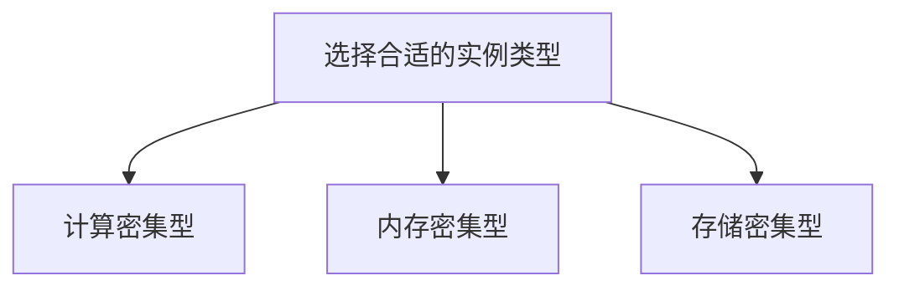

# RabbitMQ 云成本管理

在现代云环境中，消息队列系统如RabbitMQ被广泛用于解耦应用程序组件、提高系统的可扩展性和可靠性。然而，随着使用规模的扩大，RabbitMQ在云平台上的成本可能会迅速增加。因此，了解如何有效管理RabbitMQ的云成本变得至关重要。

## 什么是RabbitMQ云成本管理？

RabbitMQ云成本管理是指通过优化资源配置、监控使用情况和实施成本控制策略，来降低RabbitMQ在云平台上的运行费用。这包括选择合适的实例类型、调整队列和交换机的配置、以及利用云服务提供商的成本管理工具。

## 为什么需要管理RabbitMQ的云成本？

1. **资源浪费**：未优化的配置可能导致资源浪费，例如过度分配的计算资源或未使用的存储空间。
2. **费用失控**：随着业务增长，RabbitMQ的使用量可能会迅速增加，导致费用失控。
3. **性能瓶颈**：不合理的资源配置可能导致性能瓶颈，影响系统的整体性能。

## 如何管理RabbitMQ的云成本？

### 1. 选择合适的实例类型

云服务提供商通常提供多种实例类型，每种类型都有不同的计算、内存和存储配置。选择合适的实例类型可以显著降低成本。



### 2. 优化队列和交换机的配置

通过调整队列和交换机的配置，可以减少不必要的资源消耗。例如，设置合理的消息TTL（Time-To-Live）和队列长度限制。

```bash
# 设置消息TTL
rabbitmqctl set_policy TTL ".*" '{"message-ttl":60000}' --apply-to queues
```

### 3. 监控和警报

利用云服务提供商的监控工具，实时监控RabbitMQ的资源使用情况，并设置警报以在资源使用超出预期时及时采取措施。

```bash
# 使用AWS CloudWatch监控RabbitMQ
aws cloudwatch put-metric-alarm --alarm-name "HighCPUUsage" --metric-name CPUUtilization \
--namespace AWS/EC2 --statistic Average --period 300 --threshold 80 \
--comparison-operator GreaterThanOrEqualToThreshold --dimensions Name=InstanceId,Value=i-1234567890abcdef0 \
--evaluation-periods 2 --alarm-actions arn:aws:sns:us-east-1:123456789012:my-sns-topic
```

### 4. 自动扩展

根据负载情况自动扩展RabbitMQ实例，可以在高峰期保证性能，在低峰期降低成本。

```bash
# 使用AWS Auto Scaling配置自动扩展
aws autoscaling put-scaling-policy --policy-name "ScaleOutPolicy" \
--auto-scaling-group-name "my-asg" --scaling-adjustment 2 --adjustment-type ChangeInCapacity
```

## 实际案例

假设你有一个电子商务网站，使用RabbitMQ处理订单消息。在促销活动期间，订单量激增，导致RabbitMQ实例的CPU使用率持续高于80%。通过以下步骤，你可以有效管理成本：

1. **选择合适的实例类型**：将实例类型从`t2.micro`升级到`t2.medium`，以应对更高的计算需求。
2. **优化队列配置**：设置消息TTL为60秒，避免过期的消息占用资源。
3. **监控和警报**：设置CloudWatch警报，当CPU使用率超过80%时发送通知。
4. **自动扩展**：配置自动扩展策略，在CPU使用率持续高于80%时自动增加实例数量。

## 总结

通过选择合适的实例类型、优化队列和交换机的配置、监控资源使用情况以及实施自动扩展策略，你可以有效管理RabbitMQ在云平台上的成本。这不仅有助于降低费用，还能提高系统的整体性能和可靠性。

## 附加资源

- [RabbitMQ官方文档](https://www.rabbitmq.com/documentation.html)
- [AWS CloudWatch文档](https://docs.aws.amazon.com/cloudwatch/index.html)
- [AWS Auto Scaling文档](https://docs.aws.amazon.com/autoscaling/index.html)

## 练习

1. 在你的云平台上创建一个RabbitMQ实例，并尝试设置消息TTL。
2. 使用云服务提供商的监控工具，监控RabbitMQ的资源使用情况，并设置警报。
3. 配置自动扩展策略，模拟高峰期和低峰期的负载变化，观察实例数量的变化。
