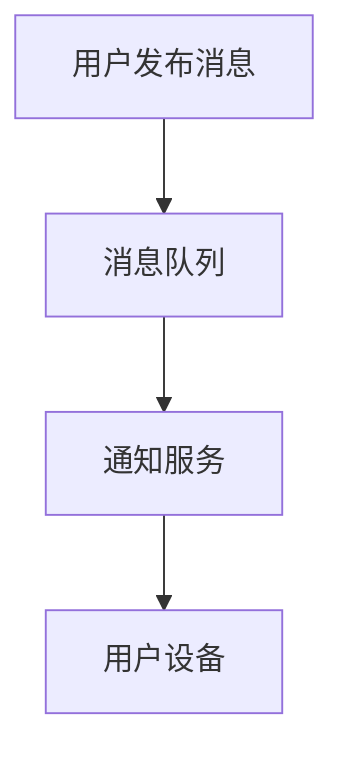

# RabbitMQ 云服务提供商

RabbitMQ是一个广泛使用的开源消息代理，用于在分布式系统中传递消息。随着云计算的普及，许多云服务提供商开始提供托管的RabbitMQ服务，使得开发者可以更轻松地在云平台上部署和管理RabbitMQ。本文将介绍RabbitMQ云服务提供商的概念、优势以及如何在云平台上使用它们。

## 什么是RabbitMQ云服务提供商？

RabbitMQ云服务提供商是指那些提供托管RabbitMQ服务的云平台。这些服务通常包括自动化的部署、监控、扩展和备份功能，使得开发者无需自己管理RabbitMQ的底层基础设施。常见的RabbitMQ云服务提供商包括AWS、Google Cloud、Microsoft Azure等。

## 为什么选择RabbitMQ云服务？

使用RabbitMQ云服务有以下几个优势：

1. **简化部署**：云服务提供商通常提供一键部署功能，使得RabbitMQ的安装和配置变得非常简单。
2. **自动扩展**：云服务可以根据负载自动扩展RabbitMQ的实例，确保系统的高可用性和性能。
3. **监控和维护**：云服务提供商通常会提供详细的监控工具和自动维护功能，帮助开发者更好地管理和优化RabbitMQ。
4. **成本效益**：通过按需付费的模式，开发者可以根据实际使用情况支付费用，避免资源浪费。

## 实际应用场景

### 场景1：电商平台的订单处理系统

假设你正在开发一个电商平台，需要处理大量的订单。你可以使用RabbitMQ来异步处理订单，确保系统的高效运行。通过使用云服务提供商的RabbitMQ服务，你可以轻松地部署和管理RabbitMQ，而无需担心底层基础设施的维护。

```python
# 示例代码：发送订单消息到RabbitMQ
import pika

connection = pika.BlockingConnection(pika.ConnectionParameters('your_cloud_provider_url'))
channel = connection.channel()

channel.queue_declare(queue='order_queue')

channel.basic_publish(exchange='',
                      routing_key='order_queue',
                      body='Order #12345')

print(" [x] Sent 'Order #12345'")
connection.close()
```

```python
# 示例代码：从RabbitMQ接收订单消息
import pika

connection = pika.BlockingConnection(pika.ConnectionParameters('your_cloud_provider_url'))
channel = connection.channel()

channel.queue_declare(queue='order_queue')

def callback(ch, method, properties, body):
    print(" [x] Received %r" % body)

channel.basic_consume(queue='order_queue',
                      on_message_callback=callback,
                      auto_ack=True)

print(' [*] Waiting for messages. To exit press CTRL+C')
channel.start_consuming()
```

### 场景2：社交媒体平台的消息通知系统

在社交媒体平台中，用户可能会收到大量的消息通知。通过使用RabbitMQ云服务，你可以确保这些通知能够高效地传递到用户手中，同时保持系统的稳定性和可扩展性。



## 总结

RabbitMQ云服务提供商为开发者提供了便捷的RabbitMQ托管服务，使得在云平台上部署和管理RabbitMQ变得更加简单和高效。通过使用这些服务，开发者可以专注于业务逻辑的实现，而无需担心底层基础设施的维护。

## 附加资源

- [RabbitMQ官方文档](https://www.rabbitmq.com/documentation.html)
- [AWS RabbitMQ服务](https://aws.amazon.com/rabbitmq/)
- [Google Cloud RabbitMQ服务](https://cloud.google.com/rabbitmq)
- [Microsoft Azure RabbitMQ服务](https://azure.microsoft.com/en-us/services/rabbitmq/)

## 练习

1. 尝试在AWS、Google Cloud或Microsoft Azure上创建一个RabbitMQ实例，并部署一个简单的消息队列应用。
2. 使用云服务提供商的监控工具，观察RabbitMQ的性能指标，并尝试进行扩展操作。

:::tip
在练习过程中，如果遇到问题，可以参考云服务提供商的官方文档或社区论坛，获取帮助和支持。
:::