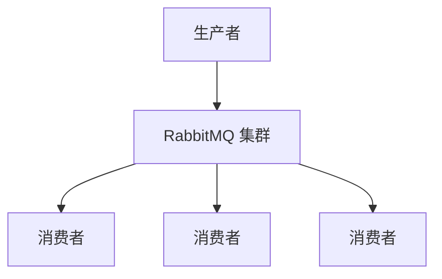
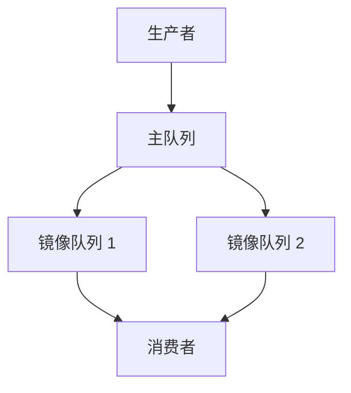
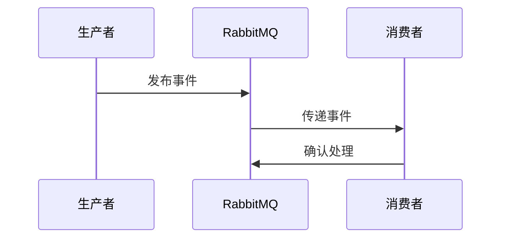

# RabbitMQ 云原生设计

## 介绍

RabbitMQ 是一个开源的消息代理软件，广泛用于分布式系统中的消息传递。随着云原生技术的兴起，RabbitMQ 也逐渐被设计为适应云原生环境。云原生设计意味着 RabbitMQ 能够充分利用云计算的优势，如弹性扩展、高可用性和自动化管理。

本文将介绍 RabbitMQ 在云原生环境中的设计原则、最佳实践以及实际应用场景，帮助初学者理解如何将 RabbitbitMQ 与云平台结合使用。

## RabbitMQ 云原生设计原则

### 1. 弹性扩展

在云原生环境中，应用程序需要能够根据负载动态扩展。RabbitMQ 支持通过集群和队列镜像来实现弹性扩展。



:::note
**注意**：RabbitMQ 集群中的节点可以动态添加或移除，以适应负载变化。
:::

### 2. 高可用性

高可用性是云原生应用的关键需求之一。RabbitMQ 通过队列镜像和持久化消息来确保高可用性。



:::tip
**提示**：通过配置队列镜像，即使某个节点失效，消息仍然可以从其他节点获取。
:::

### 3. 自动化管理

云原生环境强调自动化管理。RabbitMQ 提供了丰富的 API 和插件，可以与 Kubernetes 等云原生平台集成，实现自动化部署、监控和扩展。

```bash
# 使用 Kubernetes 部署 RabbitMQ 集群
kubectl apply -f rabbitmq-cluster.yaml
```

## 实际应用场景

### 场景 1：微服务架构中的消息传递

在微服务架构中，服务之间通常通过消息队列进行通信。RabbitMQ 可以作为消息代理，确保消息的可靠传递。

```python
# 生产者示例
import pika

connection = pika.BlockingConnection(pika.ConnectionParameters('localhost'))
channel = connection.channel()
channel.queue_declare(queue='hello')

channel.basic_publish(exchange='', routing_key='hello', body='Hello World!')
print(" [x] Sent 'Hello World!'")
connection.close()
```

```python
# 消费者示例
import pika

connection = pika.BlockingConnection(pika.ConnectionParameters('localhost'))
channel = connection.channel()
channel.queue_declare(queue='hello')

def callback(ch, method, properties, body):
    print(" [x] Received %r" % body)

channel.basic_consume(queue='hello', on_message_callback=callback, auto_ack=True)
print(' [*] Waiting for messages. To exit press CTRL+C')
channel.start_consuming()
```

### 场景 2：事件驱动架构

在事件驱动架构中，RabbitMQ 可以用于处理事件流，确保事件的可靠传递和处理。



## 总结

RabbitMQ 的云原生设计使其能够充分利用云计算的优势，如弹性扩展、高可用性和自动化管理。通过本文的介绍，初学者可以了解如何将 RabbitMQ 与云平台结合使用，并在实际应用场景中应用这些知识。

## 附加资源

- [RabbitMQ 官方文档](https://www.rabbitmq.com/documentation.html)
- [Kubernetes 官方文档](https://kubernetes.io/docs/home/)
- [云原生计算基金会](https://www.cncf.io/)

## 练习

1. 使用 Kubernetes 部署一个 RabbitMQ 集群。
2. 编写一个简单的生产者和消费者程序，通过 RabbitMQ 进行消息传递。
3. 配置 RabbitMQ 的队列镜像，测试高可用性。

:::caution
**注意**：在进行练习时，请确保你已经正确配置了环境，并备份重要数据。
:::