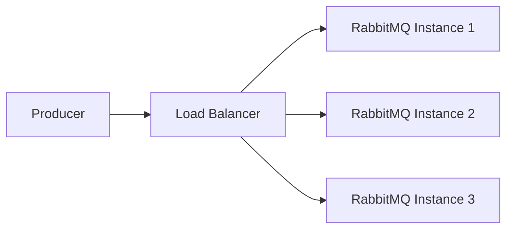

## 介绍

RabbitMQ 是一个广泛使用的消息队列系统，用于在分布式系统中传递消息。随着应用程序的负载增加，消息队列的规模也需要动态调整，以确保系统的高可用性和性能。RabbitMQ 的自动扩展功能允许系统根据当前的负载情况自动增加或减少资源，从而优化资源利用率并减少人工干预。

在本教程中，我们将深入探讨 RabbitMQ 的自动扩展机制，并通过实际案例展示如何实现这一功能。

## RabbitMQ 自动扩展的基本概念

RabbitMQ 的自动扩展主要依赖于以下几个关键概念：

1. **队列长度监控**：通过监控队列中的消息数量，系统可以判断是否需要扩展资源。
2. **资源动态分配**：根据监控数据，系统可以自动增加或减少队列的实例数量。
3. **负载均衡**：在扩展资源后，系统需要确保消息能够均匀分配到各个队列实例中。

## 实现 RabbitMQ 自动扩展的步骤

### 1. 监控队列长度

首先，我们需要监控 RabbitMQ 队列中的消息数量。这可以通过 RabbitMQ 的管理插件或自定义脚本实现。

```bash
rabbitmqctl list_queues name messages
```

上述命令将列出所有队列及其当前的消息数量。

### 2. 设置自动扩展策略

接下来，我们需要设置自动扩展策略。这可以通过编写脚本或使用现有的自动化工具（如 Kubernetes 的 Horizontal Pod Autoscaler）来实现。

```bash
if [ $(rabbitmqctl list_queues name messages | grep -c "my_queue") -gt 100 ]; then
    kubectl scale deployment rabbitmq --replicas=3
fi
```

上述脚本检查 `my_queue` 中的消息数量是否超过 100，如果是，则将 RabbitMQ 的实例数量扩展到 3 个。

### 3. 负载均衡

在扩展 RabbitMQ 实例后，我们需要确保消息能够均匀分配到各个实例中。这可以通过配置 RabbitMQ 的负载均衡器来实现。



## 实际案例

假设我们有一个电子商务网站，用户在高峰期会大量下单。为了确保订单处理系统的高可用性，我们需要根据订单队列的长度动态调整 RabbitMQ 的实例数量。

1. **监控订单队列**：我们使用 RabbitMQ 的管理插件监控 `order_queue` 中的消息数量。
2. **设置扩展策略**：当 `order_queue` 中的消息数量超过 500 时，自动将 RabbitMQ 实例数量从 2 个扩展到 4 个。
3. **负载均衡**：通过配置负载均衡器，确保订单消息均匀分配到各个 RabbitMQ 实例中。

## 总结

RabbitMQ 的自动扩展功能可以帮助我们根据系统负载动态调整资源，从而确保系统的高可用性和性能。通过监控队列长度、设置自动扩展策略和配置负载均衡器，我们可以轻松实现这一功能。

## 附加资源

- [RabbitMQ 官方文档](https://www.rabbitmq.com/documentation.html)
- [Kubernetes Horizontal Pod Autoscaler](https://kubernetes.io/docs/tasks/run-application/horizontal-pod-autoscale/)

## 练习

1. 尝试在本地环境中设置 RabbitMQ 的自动扩展功能。
2. 编写一个脚本，监控队列长度并根据负载动态调整 RabbitMQ 实例数量。
3. 研究如何在高可用性环境中实现 RabbitMQ 的自动扩展。

:::tip
在实际生产环境中，建议使用成熟的自动化工具（如 Kubernetes）来实现 RabbitMQ 的自动扩展，以减少人工干预并提高系统的稳定性。
:::