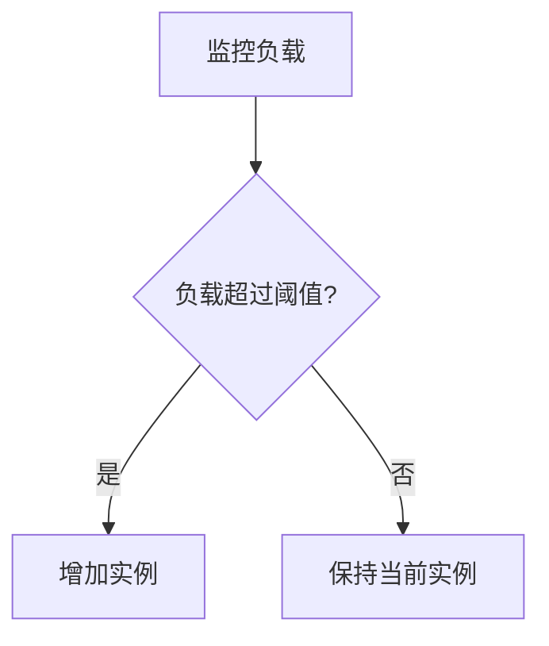

# RabbitMQ 云资源优化

RabbitMQ是一个广泛使用的消息队列系统，用于在分布式系统中传递消息。在云平台上运行RabbitMQ时，资源优化是确保高性能和成本效益的关键。本文将介绍如何优化RabbitMQ的云资源，包括队列管理、连接优化和实例配置。

## 什么是RabbitMQ云资源优化？

RabbitMQ云资源优化是指通过合理配置和管理RabbitMQ在云平台上的资源，以提高系统性能、降低延迟并减少成本。这包括优化队列、连接、实例大小以及网络配置等方面。

## 为什么需要优化RabbitMQ云资源？

在云平台上运行RabbitMQ时，资源的使用直接影响系统的性能和成本。未经优化的配置可能导致资源浪费、性能瓶颈或高昂的云服务费用。通过优化，您可以确保RabbitMQ在满足业务需求的同时，以最低的成本运行。

---

## 优化RabbitMQ云资源的步骤

### 1. 队列管理

队列是RabbitMQ的核心组件，优化队列管理可以显著提升性能。

#### 1.1 队列持久化

将队列设置为持久化可以确保消息在RabbitMQ重启后不会丢失。这对于关键业务数据非常重要。

```bash
# 创建持久化队列
channel.queue_declare(queue='my_queue', durable=True)
```

#### 1.2 队列长度限制

设置队列的最大长度可以防止队列无限增长，避免资源耗尽。

```bash
# 设置队列最大长度为1000
channel.queue_declare(queue='my_queue', arguments={'x-max-length': 1000})
```

### 2. 连接优化

连接是RabbitMQ与客户端之间的桥梁，优化连接可以减少资源消耗。

#### 2.1 连接池

使用连接池可以减少频繁创建和销毁连接的开销。

```python
import pika
from pika import BlockingConnection, ConnectionParameters

# 创建连接池
connection_pool = BlockingConnection(ConnectionParameters('localhost'))
```

#### 2.2 心跳机制

启用心跳机制可以检测并关闭不活跃的连接，释放资源。

```bash
# 设置心跳时间为60秒
connection = pika.BlockingConnection(pika.ConnectionParameters(heartbeat=60))
```

### 3. 实例配置

选择合适的云实例类型和配置可以显著影响RabbitMQ的性能和成本。

#### 3.1 实例类型

根据负载需求选择合适的实例类型。例如，对于高吞吐量场景，选择计算优化型实例。

#### 3.2 自动扩展

配置自动扩展策略，以应对流量高峰。



### 4. 网络优化

网络配置对RabbitMQ的性能至关重要。

#### 4.1 使用私有网络

将RabbitMQ部署在私有网络中，可以减少公网延迟并提高安全性。

#### 4.2 启用TLS加密

启用TLS加密可以保护消息传输的安全性。

```bash
# 配置TLS加密
context = ssl.create_default_context(cafile="ca_certificate.pem")
connection = pika.BlockingConnection(pika.ConnectionParameters(
    host='localhost',
    port=5671,
    ssl_options=pika.SSLOptions(context)
))
```

---

## 实际案例

### 案例：电商平台的订单处理系统

某电商平台使用RabbitMQ处理订单消息。在高流量时段，系统出现性能瓶颈。通过以下优化措施，问题得到解决：

1. **队列持久化**：确保订单消息不会丢失。
2. **连接池**：减少连接创建的开销。
3. **自动扩展**：在高流量时段自动增加实例。

优化后，系统处理订单的速度提升了30%，同时云服务成本降低了20%。

---

## 总结

RabbitMQ云资源优化是确保系统高性能和成本效益的关键。通过优化队列管理、连接、实例配置和网络设置，您可以显著提升RabbitMQ的性能并降低云服务成本。

## 附加资源

- [RabbitMQ官方文档](https://www.rabbitmq.com/documentation.html)
- [云平台资源优化指南](https://cloud-provider.com/optimization-guide)

## 练习

1. 尝试在本地环境中配置一个持久化队列，并测试其重启后的消息保留情况。
2. 使用连接池实现一个简单的消息生产者，并观察连接创建的开销。
3. 在云平台上配置自动扩展策略，模拟高流量场景并观察实例的变化。