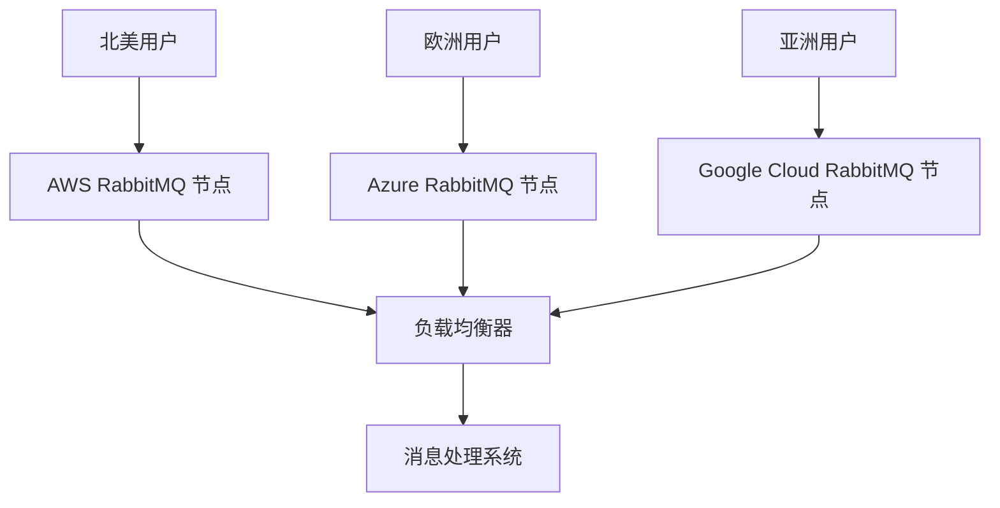
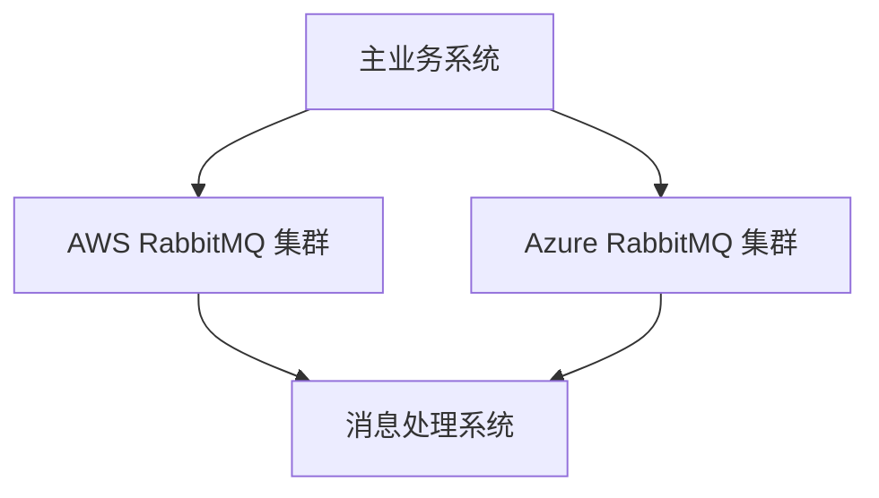

# RabbitMQ 多云策略

在现代云计算环境中，多云策略已成为许多企业的首选方案。通过在多云环境中部署 RabbitMQ，可以实现更高的可用性、容错性和负载均衡。本文将详细介绍 RabbitMQ 多云策略的概念、实现方法以及实际应用场景。

## 什么是 RabbitMQ 多云策略？

RabbitMQ 是一个开源的消息代理软件，广泛用于实现消息队列和异步通信。多云策略指的是将 RabbitMQ 部署在多个云服务提供商的环境中，以提高系统的可靠性和灵活性。

通过在多云环境中部署 RabbitMQ，企业可以避免单一云服务提供商的故障风险，同时还可以根据不同的云服务提供商的优势进行负载均衡和成本优化。

## 为什么需要 RabbitMQ 多云策略？

1. **高可用性**：通过在多云环境中部署 RabbitMQ，即使一个云服务提供商出现故障，其他云服务提供商仍然可以继续提供服务。
2. **负载均衡**：可以根据不同云服务提供商的性能和成本进行负载均衡，优化资源使用。
3. **容错性**：多云环境可以提供更好的容错性，避免单点故障。
4. **灵活性**：企业可以根据业务需求灵活选择不同的云服务提供商，避免被单一供应商锁定。

## 实现 RabbitMQ 多云策略的步骤

### 1. 选择云服务提供商

首先，选择适合的云服务提供商。常见的云服务提供商包括 AWS、Azure、Google Cloud 等。每个云服务提供商都有其独特的优势和特点，企业可以根据自身需求进行选择。

### 2. 部署 RabbitMQ 集群

在每个云服务提供商的环境中部署 RabbitMQ 集群。RabbitMQ 支持集群模式，可以通过网络将多个 RabbitMQ 节点连接在一起，形成一个高可用的消息队列系统。

```bash
# 在 AWS 上部署 RabbitMQ 节点
rabbitmq-server -detached

# 在 Azure 上部署 RabbitMQ 节点
rabbitmq-server -detached
```

### 3. 配置集群

将不同云服务提供商中的 RabbitMQ 节点配置为同一个集群。RabbitMQ 使用 Erlang 分布式协议来实现节点之间的通信。

```bash
# 在 AWS 节点上加入 Azure 节点
rabbitmqctl join_cluster rabbit@azure-node
```

### 4. 配置负载均衡

在多云环境中，可以使用负载均衡器将消息分发到不同的 RabbitMQ 节点。常见的负载均衡器包括 HAProxy、Nginx 等。

```bash
# 使用 HAProxy 配置负载均衡
frontend rabbitmq_frontend
    bind *:5672
    default_backend rabbitmq_backend

backend rabbitmq_backend
    balance roundrobin
    server aws_node aws-node:5672 check
    server azure_node azure-node:5672 check
```

### 5. 监控和维护

在多云环境中，监控和维护 RabbitMQ 集群非常重要。可以使用 Prometheus、Grafana 等工具来监控 RabbitMQ 的性能和健康状况。

```bash
# 使用 Prometheus 监控 RabbitMQ
scrape_configs:
  - job_name: 'rabbitmq'
    static_configs:
      - targets: ['aws-node:15672', 'azure-node:15672']
```

## 实际应用场景

### 场景 1：跨区域消息传递

假设一家跨国公司在多个地区（如北美、欧洲、亚洲）都有业务。为了确保消息的可靠传递，该公司可以在每个地区的不同云服务提供商中部署 RabbitMQ 集群，并通过负载均衡器将消息分发到最近的 RabbitMQ 节点。



### 场景 2：灾难恢复

假设一家公司的主要业务运行在 AWS 上，但为了应对 AWS 可能出现的故障，该公司在 Azure 上部署了备份 RabbitMQ 集群。当 AWS 出现故障时，系统可以自动切换到 Azure 上的 RabbitMQ 集群，确保业务的连续性。



## 总结

RabbitMQ 多云策略是一种有效的方法，可以提高消息队列系统的可用性、容错性和负载均衡能力。通过在多云环境中部署 RabbitMQ 集群，企业可以避免单一云服务提供商的故障风险，同时还可以根据不同的云服务提供商的优势进行资源优化。

## 附加资源

- [RabbitMQ 官方文档](https://www.rabbitmq.com/documentation.html)
- [HAProxy 配置指南](https://www.haproxy.com/documentation/hapee/latest/configuration/config-sections/)
- [Prometheus 监控指南](https://prometheus.io/docs/introduction/overview/)

## 练习

1. 尝试在 AWS 和 Azure 上分别部署 RabbitMQ 节点，并将它们配置为同一个集群。
2. 使用 HAProxy 配置负载均衡，将消息分发到不同的 RabbitMQ 节点。
3. 使用 Prometheus 监控 RabbitMQ 集群的性能和健康状况。

通过以上练习，你将更深入地理解 RabbitMQ 多云策略的实现和应用。