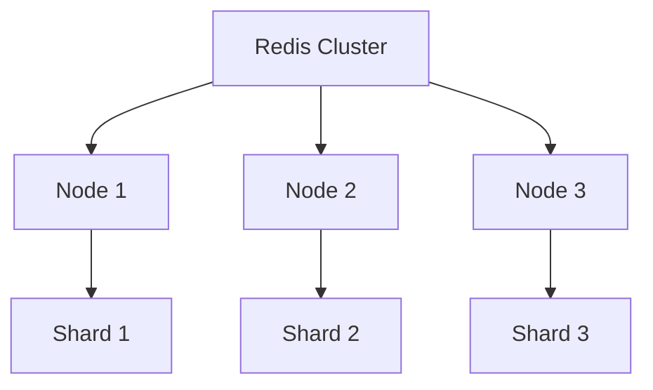

# Redis 历史发展

Redis（Remote Dictionary Server）是一个开源的内存数据结构存储系统，广泛用于缓存、消息队列和实时分析等场景。它的高性能和灵活性使其成为现代应用开发中的重要工具。本文将带你了解Redis的历史发展，从它的诞生到成为当今最流行的内存数据库之一。

## Redis 的诞生

Redis由Salvatore Sanfilippo（网名antirez）于2009年开发。最初，Redis是为了解决其公司LLOOGG的实时日志分析问题而设计的。LLOOGG需要一种能够快速存储和检索大量日志数据的工具，而传统的关系型数据库无法满足这一需求。

:::note
**Salvatore Sanfilippo** 是Redis的创始人和主要开发者。他的设计理念是“简单而强大”，这一理念贯穿了Redis的整个发展历程。
:::

## 早期版本

2009年，Redis的第一个版本发布。这个版本非常简单，只支持字符串数据类型和基本的操作，如`SET`和`GET`。然而，它的性能非常出色，迅速吸引了开发者的注意。

```bash
# 示例：Redis 1.0 的基本操作
SET mykey "Hello, Redis!"
GET mykey
```

**输出：**
```
"Hello, Redis!"
```

## 数据类型的扩展

随着Redis的流行，开发者们开始提出更多的需求。为了满足这些需求，Redis逐渐增加了对多种数据类型的支持，包括列表（List）、集合（Set）、有序集合（Sorted Set）和哈希（Hash）。这些数据类型的引入使得Redis能够处理更复杂的应用场景。

```bash
# 示例：使用列表数据类型
LPUSH mylist "world"
LPUSH mylist "hello"
LRANGE mylist 0 -1
```

**输出：**
```
1) "hello"
2) "world"
```

## Redis 2.0：持久化和主从复制

2010年，Redis 2.0发布，引入了持久化和主从复制功能。持久化允许Redis将数据保存到磁盘，从而在重启后恢复数据。主从复制则使得Redis能够实现高可用性和负载均衡。

:::tip
**持久化** 是Redis的一个重要特性，它通过RDB（快照）和AOF（追加日志）两种方式实现数据持久化。
:::

## Redis 3.0：集群支持

2015年，Redis 3.0发布，引入了集群支持。Redis集群允许数据分布在多个节点上，从而实现了水平扩展和高可用性。这一功能的引入使得Redis能够处理更大规模的数据和更高的并发请求。



## Redis 4.0：模块化

2017年，Redis 4.0发布，引入了模块化架构。开发者可以通过编写模块来扩展Redis的功能，而无需修改Redis的核心代码。这一特性极大地增强了Redis的灵活性和可扩展性。

## Redis 5.0：流数据类型

2018年，Redis 5.0发布，引入了流（Stream）数据类型。流数据类型使得Redis能够处理实时数据流，非常适合用于消息队列和事件驱动的应用场景。

```bash
# 示例：使用流数据类型
XADD mystream * name "Alice" age 30
XREAD COUNT 1 STREAMS mystream 0
```

**输出：**
```
1) 1) "mystream"
   2) 1) 1) "1591234567890-0"
         2) 1) "name"
            2) "Alice"
            3) "age"
            4) "30"
```

## Redis 6.0：多线程和ACL

2020年，Redis 6.0发布，引入了多线程I/O和访问控制列表（ACL）。多线程I/O显著提高了Redis的性能，特别是在高并发场景下。ACL则增强了Redis的安全性，允许管理员更精细地控制用户权限。

:::caution
**多线程I/O** 仅用于处理网络I/O，Redis的核心操作仍然是单线程的，以确保数据的一致性。
:::

## Redis 的实际应用

Redis在现代应用中有广泛的应用场景，包括但不限于：

- **缓存**：Redis常被用作缓存层，加速数据访问。
- **消息队列**：通过流数据类型，Redis可以作为消息队列使用。
- **实时分析**：Redis的高性能使其非常适合实时数据分析。
- **会话存储**：Redis可以存储用户会话数据，支持分布式应用。

## 总结

Redis从2009年诞生至今，经历了多次重大更新，逐渐发展成为一个功能强大、性能卓越的内存数据库。它的简单性和灵活性使其成为开发者的首选工具之一。通过了解Redis的历史发展，我们可以更好地理解其设计理念和应用场景。

## 附加资源

- [Redis官方文档](https://redis.io/documentation)
- [Redis GitHub仓库](https://github.com/redis/redis)
- [Redis模块开发指南](https://redis.io/topics/modules-intro)

## 练习

1. 尝试在本地安装Redis，并使用`SET`和`GET`命令进行基本操作。
2. 探索Redis的流数据类型，并尝试创建一个简单的消息队列。
3. 阅读Redis的持久化机制，并比较RDB和AOF的优缺点。

通过以上内容，希望你能够对Redis的历史发展有一个全面的了解，并能够在实际项目中灵活运用Redis。