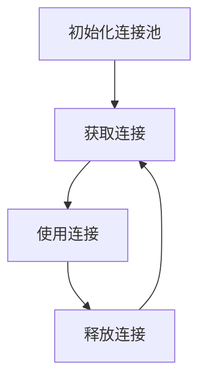

# Redis 连接池

在现代应用程序中，Redis作为一种高性能的键值存储数据库，被广泛用于缓存、会话存储和消息队列等场景。然而，频繁地创建和关闭Redis连接会导致性能瓶颈。为了解决这个问题，**Redis连接池**应运而生。本文将详细介绍Redis连接池的概念、工作原理及其在实际编程中的应用。

## 什么是Redis连接池？

Redis连接池是一种管理Redis连接的技术，它通过预先创建一定数量的连接并将其保存在池中，供应用程序在需要时快速获取和复用。这种方式避免了频繁创建和关闭连接的开销，从而提高了应用程序的性能。

:::note
连接池的核心思想是**复用连接**，而不是每次请求都创建新的连接。
:::

## 为什么需要Redis连接池？

1. **性能优化**：创建和关闭Redis连接是一个相对耗时的操作。使用连接池可以减少这些操作的开销。
2. **资源管理**：连接池可以限制应用程序同时使用的连接数量，防止资源耗尽。
3. **连接复用**：通过复用连接，可以减少网络延迟和系统负载。

## Redis 连接池的工作原理

连接池的工作原理可以简单概括为以下几个步骤：

1. **初始化连接池**：在应用程序启动时，创建一定数量的Redis连接并放入池中。
2. **获取连接**：当应用程序需要与Redis交互时，从连接池中获取一个可用的连接。
3. **使用连接**：应用程序使用获取到的连接执行Redis命令。
4. **释放连接**：使用完毕后，将连接返回到连接池中，供其他请求复用。



## 实际应用场景

### 1. 缓存系统

在缓存系统中，Redis连接池可以显著提高缓存的读写性能。例如，在一个高并发的Web应用中，每次请求都需要从Redis中读取缓存数据。使用连接池可以避免频繁创建和关闭连接，从而提升系统的响应速度。

### 2. 会话存储

在分布式系统中，Redis常用于存储用户会话信息。使用连接池可以确保会话数据的快速读取和写入，同时避免连接资源的浪费。

## 代码示例

以下是一个使用Python的`redis-py`库实现Redis连接池的示例：

```python
import redis

# 创建连接池
pool = redis.ConnectionPool(host='localhost', port=6379, db=0)

# 从连接池中获取连接
r = redis.Redis(connection_pool=pool)

# 使用连接执行Redis命令
r.set('foo', 'bar')
value = r.get('foo')
print(value)  # 输出: b'bar'

# 释放连接（连接池会自动管理连接的释放）
```

:::tip
在实际应用中，建议将连接池的创建和管理封装在一个单独的模块中，以便于复用和维护。
:::

## 总结

Redis连接池是一种高效管理Redis连接的技术，它通过复用连接来提升应用程序的性能和资源利用率。通过本文的介绍，你应该已经了解了Redis连接池的基本概念、工作原理以及在实际应用中的使用场景。

## 附加资源

- [Redis官方文档](https://redis.io/documentation)
- [redis-py库文档](https://redis-py.readthedocs.io/en/stable/)

## 练习

1. 尝试在你的项目中实现一个Redis连接池，并观察其对性能的影响。
2. 修改连接池的大小，测试不同连接数对系统性能的影响。
3. 探索其他编程语言（如Java、Node.js）中的Redis连接池实现。

:::caution
在使用连接池时，务必注意连接泄漏问题。确保每次使用完连接后都将其正确释放回池中。
:::