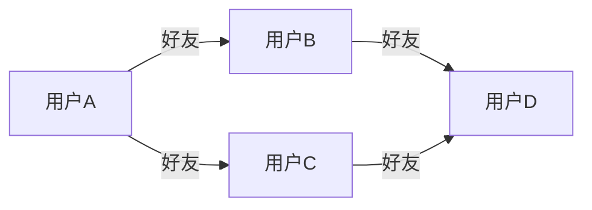

# Redis 图模块

Redis图模块（RedisGraph）是Redis的一个扩展模块，专门用于处理图数据。图数据是一种以节点和边表示关系的数据结构，广泛应用于社交网络、推荐系统、知识图谱等领域。RedisGraph通过高效的图算法和查询语言，使得开发者能够轻松地在Redis中存储和查询图数据。

## 什么是图数据？

图数据由**节点（Node）**和**边（Edge）**组成。节点代表实体（如用户、商品等），边代表实体之间的关系（如用户之间的好友关系、商品之间的购买关系等）。图数据非常适合表示复杂的关系网络。



在上面的示例中，用户A、B、C、D是节点，他们之间的好友关系是边。

## Redis Graph的基本概念

### 1. 节点（Node）
节点是图数据中的基本单位，通常表示一个实体。每个节点可以包含多个属性，例如用户的姓名、年龄等。

### 2. 边（Edge）
边表示节点之间的关系。边可以是有向的或无向的，并且也可以包含属性，例如关系的类型、权重等。

### 3. 查询语言（Cypher）
RedisGraph使用Cypher作为查询语言。Cypher是一种专门为图数据库设计的查询语言，语法简洁且易于理解。

## 安装RedisGraph

在开始使用RedisGraph之前，需要确保Redis已经安装了RedisGraph模块。可以通过以下命令安装：

```bash
redis-server --loadmodule /path/to/redisgraph.so
```

## 基本操作

### 1. 创建节点

使用Cypher语句可以轻松创建节点。以下是一个创建用户的示例：

```cypher
GRAPH.QUERY my_graph "CREATE (:User {name: 'Alice', age: 30})"
```

这条语句创建了一个名为`Alice`的用户节点，并设置了`name`和`age`属性。

### 2. 创建边

接下来，我们可以创建边来表示用户之间的关系：

```cypher
GRAPH.QUERY my_graph "MATCH (a:User {name: 'Alice'}), (b:User {name: 'Bob'}) CREATE (a)-[:FRIEND]->(b)"
```

这条语句创建了一条从`Alice`到`Bob`的`FRIEND`边。

### 3. 查询图数据

我们可以使用Cypher查询图数据。例如，查询`Alice`的所有好友：

```cypher
GRAPH.QUERY my_graph "MATCH (a:User {name: 'Alice'})-[:FRIEND]->(b:User) RETURN b.name"
```

输出结果可能如下：

```plaintext
1) 1) "b.name"
2) 1) "Bob"
```

## 实际应用场景

### 社交网络分析

在社交网络中，用户之间的关系可以用图数据表示。通过RedisGraph，我们可以轻松地分析用户的好友关系、推荐新朋友等。

### 推荐系统

在电商平台中，用户与商品之间的关系可以用图数据表示。通过分析用户的购买历史，可以推荐相关商品。

### 知识图谱

知识图谱是一种结构化的知识表示方式，广泛应用于搜索引擎、智能问答等领域。RedisGraph可以高效地存储和查询知识图谱数据。

## 总结

RedisGraph是一个强大的图数据存储和查询工具，适用于各种需要处理复杂关系的场景。通过本文的介绍，你应该已经掌握了RedisGraph的基本概念和操作方法。接下来，你可以尝试在自己的项目中应用RedisGraph，探索更多可能性。

## 附加资源

- [RedisGraph官方文档](https://oss.redislabs.com/redisgraph/)
- [Cypher查询语言参考](https://neo4j.com/docs/cypher-manual/current/)

## 练习

1. 创建一个包含5个用户节点的图，并为他们添加好友关系。
2. 编写一个Cypher查询，找出某个用户的所有间接好友（即好友的好友）。
3. 尝试在RedisGraph中实现一个简单的推荐系统，根据用户的购买历史推荐商品。

:::tip
在练习过程中，如果遇到问题，可以参考RedisGraph的官方文档或社区论坛，获取更多帮助。
:::