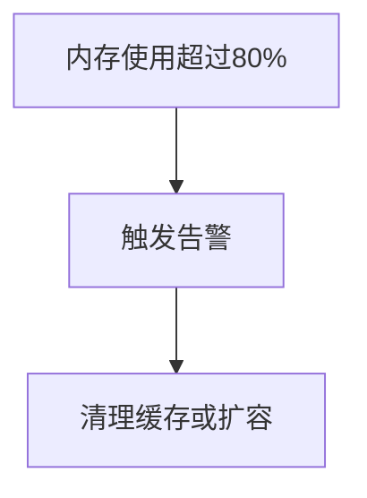
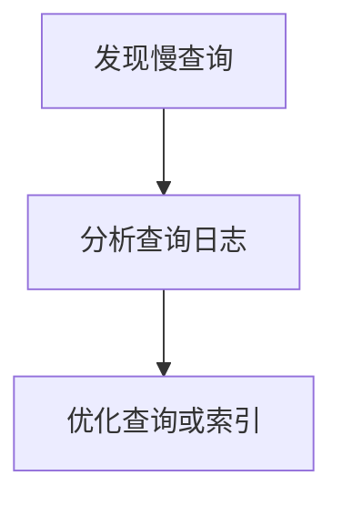

# Redis 状态监控

Redis是一个高性能的键值存储系统，广泛应用于缓存、消息队列和实时数据处理等场景。为了确保Redis的高效运行，监控其状态是至关重要的。本文将详细介绍如何监控Redis的状态，包括关键指标、工具和实际应用场景。

## 什么是Redis状态监控？

Redis状态监控是指通过收集和分析Redis实例的运行数据，了解其当前的健康状况和性能表现。通过监控，我们可以及时发现潜在问题，如内存不足、连接数过多或响应时间过长等，从而采取相应的措施。

## 关键监控指标

在监控Redis时，以下几个关键指标需要特别关注：

1. **内存使用情况**：Redis是一个内存数据库，内存使用情况直接影响其性能。可以通过`INFO memory`命令查看内存使用情况。
2. **连接数**：连接数过多可能导致Redis性能下降。可以通过`INFO clients`命令查看当前连接数。
3. **命中率**：命中率反映了Redis缓存的效率。可以通过`INFO stats`命令查看命中率。
4. **响应时间**：响应时间是衡量Redis性能的重要指标。可以通过`SLOWLOG`命令查看慢查询日志。

## 使用`INFO`命令监控Redis状态

Redis提供了`INFO`命令，可以获取Redis实例的详细信息。以下是一个简单的示例：

```bash
$ redis-cli INFO memory
# Memory
used_memory: 1048576
used_memory_human: 1.00M
used_memory_rss: 2097152
used_memory_peak: 1048576
used_memory_peak_human: 1.00M
```

在这个示例中，`INFO memory`命令返回了Redis的内存使用情况，包括已用内存、内存峰值等信息。

## 使用`SLOWLOG`命令监控慢查询

慢查询可能会影响Redis的性能。通过`SLOWLOG`命令，可以查看执行时间超过指定阈值的命令：

```bash
$ redis-cli SLOWLOG GET 1
1) 1) (integer) 1
   2) (integer) 1633024800
   3) (integer) 1000
   4) 1) "GET"
      2) "mykey"
```

在这个示例中，`SLOWLOG GET 1`命令返回了最近的一个慢查询记录，包括命令的执行时间和具体命令。

## 实际应用场景

### 场景1：内存不足告警

假设我们有一个Redis实例用于缓存用户会话数据。通过监控内存使用情况，我们可以设置一个阈值，当内存使用超过80%时触发告警，提醒管理员及时清理缓存或扩容。



### 场景2：慢查询分析

在一个高并发的Web应用中，某些Redis查询可能会变慢。通过`SLOWLOG`命令，我们可以分析这些慢查询，找出性能瓶颈并进行优化。



## 总结

Redis状态监控是确保Redis高效运行的重要手段。通过监控关键指标，如内存使用情况、连接数、命中率和响应时间，我们可以及时发现并解决潜在问题。本文介绍了如何使用`INFO`和`SLOWLOG`命令进行监控，并通过实际场景展示了监控的重要性。

## 附加资源与练习

- **练习1**：使用`INFO`命令查看Redis的连接数，并分析连接数是否在合理范围内。
- **练习2**：使用`SLOWLOG`命令查看Redis的慢查询日志，并尝试优化这些查询。

通过以上练习，你将更深入地理解Redis状态监控的实际应用，并能够更好地管理和优化你的Redis实例。