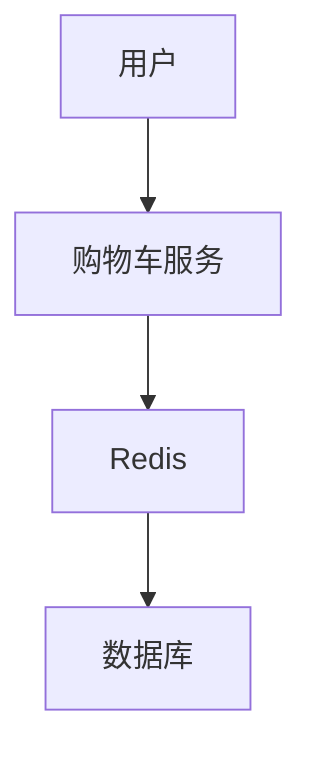

## 介绍

在现代微服务架构中，Redis 作为一种高性能的内存数据存储，扮演着至关重要的角色。它不仅可以作为缓存层来加速数据访问，还可以用于实现分布式锁、消息队列、会话存储等功能。本文将深入探讨 Redis 在微服务架构中的应用，并通过实际案例展示其强大的功能。

## Redis 在微服务架构中的作用

### 1. 缓存层

Redis 最常见的用途是作为缓存层。通过将频繁访问的数据存储在内存中，Redis 可以显著减少数据库的负载，从而提高系统的响应速度。

```javascript
// 示例：使用 Redis 作为缓存层
const redis = require('redis');
const client = redis.createClient();

client.on('connect', function() {
    console.log('Redis client connected');
});

client.set('key', 'value', redis.print);
client.get('key', function (error, result) {
    if (error) {
        console.log(error);
        throw error;
    }
    console.log('GET result ->', result);
});
```

**输入：**
- `key`: `'key'`
- `value`: `'value'`

**输出：**
- `GET result -> value`

### 2. 分布式锁

在微服务架构中，分布式锁是确保多个服务实例之间协调一致的重要机制。Redis 提供了 `SETNX` 命令，可以用来实现分布式锁。

```javascript
// 示例：使用 Redis 实现分布式锁
const redis = require('redis');
const client = redis.createClient();

function acquireLock(lockKey, timeout) {
    return new Promise((resolve, reject) => {
        client.set(lockKey, 'locked', 'NX', 'EX', timeout, (err, reply) => {
            if (err) return reject(err);
            resolve(reply === 'OK');
        });
    });
}

async function main() {
    const lockKey = 'myLock';
    const timeout = 10; // 10秒
    const lockAcquired = await acquireLock(lockKey, timeout);
    if (lockAcquired) {
        console.log('Lock acquired');
        // 执行关键操作
    } else {
        console.log('Failed to acquire lock');
    }
}

main();
```

**输入：**
- `lockKey`: `'myLock'`
- `timeout`: `10`

**输出：**
- `Lock acquired` 或 `Failed to acquire lock`

### 3. 消息队列

Redis 的 `LIST` 数据结构可以用来实现简单的消息队列。生产者将消息推入队列，消费者从队列中取出消息进行处理。

```javascript
// 示例：使用 Redis 实现消息队列
const redis = require('redis');
const client = redis.createClient();

function produceMessage(queueName, message) {
    client.rpush(queueName, message, (err, reply) => {
        if (err) throw err;
        console.log('Message produced:', message);
    });
}

function consumeMessage(queueName) {
    client.lpop(queueName, (err, reply) => {
        if (err) throw err;
        console.log('Message consumed:', reply);
    });
}

produceMessage('myQueue', 'Hello, Redis!');
consumeMessage('myQueue');
```

**输入：**
- `queueName`: `'myQueue'`
- `message`: `'Hello, Redis!'`

**输出：**
- `Message produced: Hello, Redis!`
- `Message consumed: Hello, Redis!`

## 实际案例：电商平台的购物车服务

假设我们正在构建一个电商平台的购物车服务。每个用户的购物车数据需要频繁访问和更新，因此我们可以使用 Redis 来存储购物车数据。



在这个案例中，购物车服务首先会尝试从 Redis 中获取用户的购物车数据。如果数据不存在，则从数据库中加载并缓存到 Redis 中。这样可以大大减少数据库的访问次数，提高系统的性能。

```javascript
// 示例：电商平台的购物车服务
const redis = require('redis');
const client = redis.createClient();

async function getCart(userId) {
    return new Promise((resolve, reject) => {
        client.get(`cart:${userId}`, (err, data) => {
            if (err) return reject(err);
            if (data) {
                resolve(JSON.parse(data));
            } else {
                // 从数据库加载购物车数据
                const cartData = loadCartFromDatabase(userId);
                client.set(`cart:${userId}`, JSON.stringify(cartData), 'EX', 3600, (err) => {
                    if (err) return reject(err);
                    resolve(cartData);
                });
            }
        });
    });
}

async function loadCartFromDatabase(userId) {
    // 模拟从数据库加载购物车数据
    return { userId, items: ['item1', 'item2'] };
}

async function main() {
    const userId = 'user123';
    const cart = await getCart(userId);
    console.log('Cart data:', cart);
}

main();
```

**输入：**
- `userId`: `'user123'`

**输出：**
- `Cart data: { userId: 'user123', items: ['item1', 'item2'] }`

## 总结

Redis 在微服务架构中扮演着多重角色，从缓存层到分布式锁，再到消息队列，它的灵活性和高性能使其成为构建现代分布式系统的理想选择。通过本文的学习，你应该已经掌握了 Redis 在微服务架构中的基本应用，并能够将其应用到实际项目中。

## 附加资源

- [Redis 官方文档](https://redis.io/documentation)
- [Node.js Redis 客户端](https://github.com/NodeRedis/node-redis)
- [微服务架构设计模式](https://microservices.io/)

## 练习

1. 尝试在你的本地环境中运行本文中的代码示例。
2. 修改购物车服务的示例代码，使其支持删除购物车中的商品。
3. 研究 Redis 的其他数据结构（如 `SET` 和 `HASH`），并尝试在微服务架构中应用它们。

:::tip
如果你在练习中遇到问题，可以参考 Redis 官方文档或社区论坛，那里有丰富的资源和解决方案。
:::