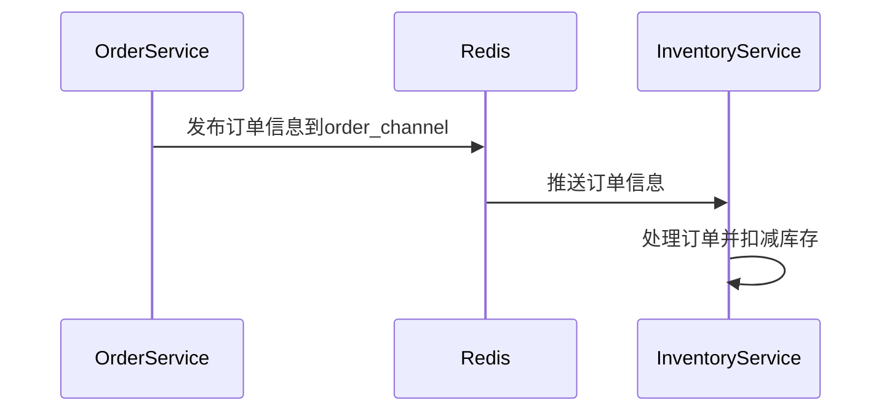
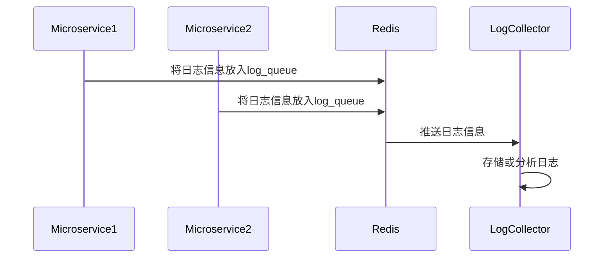

# Redis 微服务通信

在现代微服务架构中，服务之间的通信是一个关键问题。Redis作为一个高性能的内存数据存储，不仅可以用于缓存，还可以作为微服务之间的通信桥梁。本文将介绍如何使用Redis实现微服务之间的通信，并通过代码示例和实际案例帮助你理解这一概念。

## 什么是Redis微服务通信？

Redis微服务通信是指利用Redis的特性（如发布/订阅模式、消息队列等）来实现微服务之间的异步通信。与传统的HTTP请求相比，Redis通信具有更高的性能和更低的延迟，特别适合需要快速响应的场景。

### 为什么选择Redis？

- **高性能**：Redis基于内存操作，读写速度极快。
- **灵活性**：支持多种数据结构，如字符串、列表、集合、哈希等。
- **发布/订阅模式**：允许服务之间通过频道（channel）进行消息传递。
- **持久化**：支持数据持久化，确保数据不会丢失。

## Redis 发布/订阅模式

Redis的发布/订阅模式（Pub/Sub）是一种消息传递模式，允许服务之间通过频道进行通信。发布者（Publisher）将消息发送到特定的频道，订阅者（Subscriber）则监听这些频道以接收消息。

### 基本概念

- **发布者（Publisher）**：负责向频道发送消息。
- **订阅者（Subscriber）**：负责监听频道并接收消息。
- **频道（Channel）**：消息传递的通道。

### 代码示例

以下是一个简单的Redis发布/订阅模式的代码示例，使用Node.js和`ioredis`库。

```javascript
// 发布者
const Redis = require('ioredis');
const publisher = new Redis();

publisher.publish('my_channel', 'Hello, Redis!');
console.log('Message published to my_channel');

// 订阅者
const subscriber = new Redis();

subscriber.subscribe('my_channel', (err, count) => {
  if (err) {
    console.error('Failed to subscribe:', err);
  } else {
    console.log(`Subscribed to ${count} channels.`);
  }
});

subscriber.on('message', (channel, message) => {
  console.log(`Received message from ${channel}: ${message}`);
});
```

### 输入与输出

- **发布者**：向频道`my_channel`发送消息`Hello, Redis!`。
- **订阅者**：监听频道`my_channel`并接收消息。

输出结果：

```
Message published to my_channel
Subscribed to 1 channels.
Received message from my_channel: Hello, Redis!
```

## Redis 消息队列

除了发布/订阅模式，Redis还可以用作消息队列（Message Queue），实现微服务之间的异步通信。消息队列允许服务将任务放入队列中，其他服务可以从队列中取出任务并处理。

### 基本概念

- **生产者（Producer）**：负责将任务放入队列。
- **消费者（Consumer）**：负责从队列中取出任务并处理。
- **队列（Queue）**：存储任务的列表。

### 代码示例

以下是一个简单的Redis消息队列的代码示例，使用Node.js和`ioredis`库。

```javascript
// 生产者
const Redis = require('ioredis');
const producer = new Redis();

producer.rpush('my_queue', 'Task 1');
producer.rpush('my_queue', 'Task 2');
console.log('Tasks added to my_queue');

// 消费者
const consumer = new Redis();

const processTask = async () => {
  const task = await consumer.lpop('my_queue');
  if (task) {
    console.log(`Processing task: ${task}`);
  } else {
    console.log('No tasks in the queue.');
  }
};

setInterval(processTask, 1000); // 每秒处理一个任务
```

### 输入与输出

- **生产者**：向队列`my_queue`中添加任务`Task 1`和`Task 2`。
- **消费者**：从队列`my_queue`中取出任务并处理。

输出结果：

```
Tasks added to my_queue
Processing task: Task 1
Processing task: Task 2
No tasks in the queue.
```

## 实际应用场景

### 场景1：订单处理系统

在一个电商平台的订单处理系统中，订单服务（Order Service）需要将订单信息传递给库存服务（Inventory Service）进行库存扣减。使用Redis的发布/订阅模式，订单服务可以将订单信息发布到`order_channel`，库存服务则订阅该频道以接收订单信息并进行处理。



### 场景2：日志收集系统

在一个分布式系统中，多个微服务需要将日志信息发送到中央日志收集系统。使用Redis消息队列，每个微服务可以将日志信息放入`log_queue`，日志收集服务则从队列中取出日志信息并进行存储或分析。



## 总结

Redis在微服务通信中扮演着重要角色，通过发布/订阅模式和消息队列，可以实现高效、异步的服务间通信。本文介绍了Redis的基本概念、代码示例以及实际应用场景，帮助你理解如何在实际项目中使用Redis进行微服务通信。

## 附加资源与练习

- **练习1**：尝试使用Redis实现一个简单的聊天应用，其中多个用户可以订阅同一个频道并发送消息。
- **练习2**：使用Redis消息队列实现一个任务调度系统，生产者将任务放入队列，消费者从队列中取出任务并执行。
- **资源**：
  - [Redis官方文档](https://redis.io/documentation)
  - [ioredis库文档](https://github.com/luin/ioredis)
  - [微服务架构设计模式](https://microservices.io/)

:::tip
在实际项目中，确保对Redis进行适当的配置和监控，以保证系统的稳定性和性能。
:::