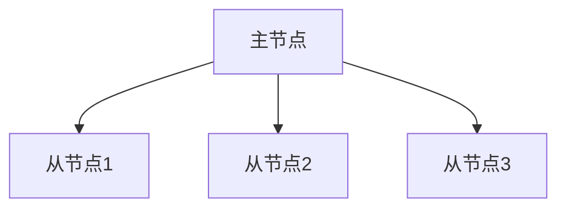

# Redis 数据一致性

在现代微服务架构中，Redis作为一种高性能的内存数据库，被广泛用于缓存、会话存储和消息队列等场景。然而，随着系统规模的扩大，数据一致性问题变得尤为重要。本文将深入探讨Redis中的数据一致性，帮助初学者理解其重要性以及如何在实际应用中确保数据一致性。

## 什么是数据一致性？

数据一致性是指在分布式系统中，多个节点或服务之间的数据保持一致的状态。在Redis中，数据一致性通常涉及以下几个方面：

1. **强一致性**：所有节点在任何时刻都能看到相同的数据。
2. **最终一致性**：系统保证在没有新的更新操作时，最终所有节点都能看到相同的数据。

在微服务架构中，由于服务之间的独立性，数据一致性往往是一个挑战。Redis通过多种机制来确保数据一致性，包括持久化、复制和事务等。

## Redis 中的数据一致性机制

### 1. 持久化

Redis提供了两种持久化机制：RDB（Redis Database）和AOF（Append-Only File）。

- **RDB**：定期将内存中的数据快照保存到磁盘。
- **AOF**：记录每个写操作，并在重启时重放这些操作以恢复数据。

:::tip
AOF通常比RDB更安全，因为它可以记录每个写操作，但可能会影响性能。
:::

### 2. 复制

Redis支持主从复制，主节点将数据同步到从节点。从节点可以处理读请求，从而分担主节点的负载。



:::caution
主从复制是异步的，因此在主节点写入数据后，从节点可能会有短暂的延迟。
:::

### 3. 事务

Redis通过`MULTI`和`EXEC`命令支持事务。事务中的所有命令会按顺序执行，确保原子性。

```redis
MULTI
SET key1 value1
SET key2 value2
EXEC
```

:::note
Redis事务不支持回滚，因此在事务中执行失败的命令不会影响其他命令。
:::

## 实际案例

假设我们有一个电商系统，用户下单后需要更新库存和订单信息。为了确保数据一致性，我们可以使用Redis事务来同时更新库存和订单信息。

```redis
MULTI
DECRBY inventory:item1 1
HSET order:1234 item1 1
EXEC
```

在这个例子中，`DECRBY`命令减少库存，`HSET`命令更新订单信息。如果其中一个命令失败，整个事务将不会执行，从而确保数据一致性。

## 总结

Redis通过持久化、复制和事务等机制，提供了多种方式来确保数据一致性。在微服务架构中，合理使用这些机制可以有效避免数据不一致的问题。

## 附加资源

- [Redis官方文档](https://redis.io/documentation)
- [微服务架构中的数据一致性](https://microservices.io/patterns/data/event-sourcing.html)

## 练习

1. 尝试在本地Redis实例中配置主从复制，并观察数据同步的延迟。
2. 编写一个Redis事务，确保多个命令的原子性执行。

通过本文的学习，你应该对Redis中的数据一致性有了初步的了解。继续探索和实践，你将能够更好地应用这些概念到实际项目中。