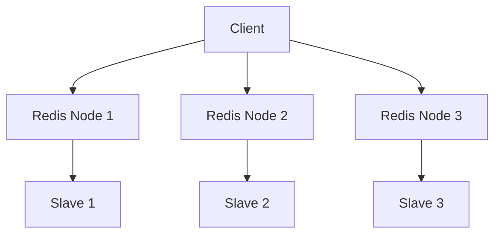

# Redis 微服务部署

在现代微服务架构中，Redis因其高性能、低延迟和灵活的数据结构，成为了缓存和状态管理的首选工具。本文将详细介绍如何在微服务中部署Redis，并通过实际案例展示其应用场景。

## 什么是Redis？

Redis（Remote Dictionary Server）是一个开源的、基于内存的键值存储系统。它支持多种数据结构，如字符串、哈希、列表、集合和有序集合。Redis通常用于缓存、会话存储、消息队列等场景。

## 为什么在微服务中使用Redis？

微服务架构通常由多个独立的服务组成，这些服务需要共享状态或缓存数据。Redis的高性能和低延迟使其成为微服务架构中理想的缓存和数据存储解决方案。

## Redis 部署步骤

### 1. 安装Redis

首先，你需要在服务器上安装Redis。以下是在Ubuntu系统上安装Redis的步骤：

```bash
sudo apt update
sudo apt install redis-server
```

安装完成后，启动Redis服务：

```bash
sudo systemctl start redis-server
```

### 2. 配置Redis

Redis的配置文件通常位于`/etc/redis/redis.conf`。你可以根据需要修改配置文件，例如设置密码、调整内存限制等。

```bash
sudo nano /etc/redis/redis.conf
```

### 3. 连接到Redis

你可以使用Redis命令行工具`redis-cli`连接到Redis服务器：

```bash
redis-cli
```

在命令行中，你可以执行各种Redis命令，例如设置和获取键值对：

```bash
127.0.0.1:6379> SET mykey "Hello Redis"
OK
127.0.0.1:6379> GET mykey
"Hello Redis"
```

### 4. 在微服务中使用Redis

在微服务中，你可以使用Redis客户端库来连接和操作Redis。以下是一个使用Python的`redis-py`库的示例：

```python
import redis

# 连接到Redis服务器
r = redis.Redis(host='localhost', port=6379, db=0)

# 设置键值对
r.set('mykey', 'Hello Redis')

# 获取键值对
value = r.get('mykey')
print(value.decode('utf-8'))  # 输出: Hello Redis
```

### 5. 部署Redis集群

对于高可用性和扩展性，你可以部署Redis集群。Redis集群通过分片（sharding）将数据分布在多个节点上，并提供自动故障转移功能。

以下是一个简单的Redis集群部署示例：



## 实际案例：电商网站的购物车服务

假设你正在开发一个电商网站的购物车服务。购物车的数据需要快速访问和更新，因此你可以使用Redis来存储购物车信息。

### 场景描述

- 用户将商品添加到购物车。
- 购物车数据需要快速读取和更新。
- 购物车数据在用户会话期间有效。

### 实现步骤

1. **用户添加商品到购物车**：

```python
import redis

# 连接到Redis服务器
r = redis.Redis(host='localhost', port=6379, db=0)

# 用户ID
user_id = 'user123'

# 商品ID和数量
product_id = 'product456'
quantity = 2

# 将商品添加到购物车
r.hset(f'cart:{user_id}', product_id, quantity)
```

2. **获取购物车内容**：

```python
# 获取购物车中的所有商品
cart_items = r.hgetall(f'cart:{user_id}')

# 打印购物车内容
for product_id, quantity in cart_items.items():
    print(f'Product ID: {product_id.decode("utf-8")}, Quantity: {int(quantity)}')
```

3. **更新购物车中的商品数量**：

```python
# 更新商品数量
r.hset(f'cart:{user_id}', product_id, 3)
```

4. **删除购物车中的商品**：

```python
# 删除商品
r.hdel(f'cart:{user_id}', product_id)
```

## 总结

Redis在微服务架构中扮演着重要的角色，特别是在缓存和状态管理方面。通过本文，你学习了如何安装、配置和使用Redis，并通过实际案例了解了Redis在电商网站购物车服务中的应用。

## 附加资源

- [Redis官方文档](https://redis.io/documentation)
- [Redis-py GitHub仓库](https://github.com/redis/redis-py)
- [微服务架构设计模式](https://microservices.io/)

## 练习

1. 在你的本地环境中安装并配置Redis。
2. 使用Redis存储和检索用户会话数据。
3. 尝试部署一个简单的Redis集群，并测试其高可用性。

:::tip
在实际生产环境中，建议使用Redis Sentinel或Redis Cluster来实现高可用性和扩展性。
:::