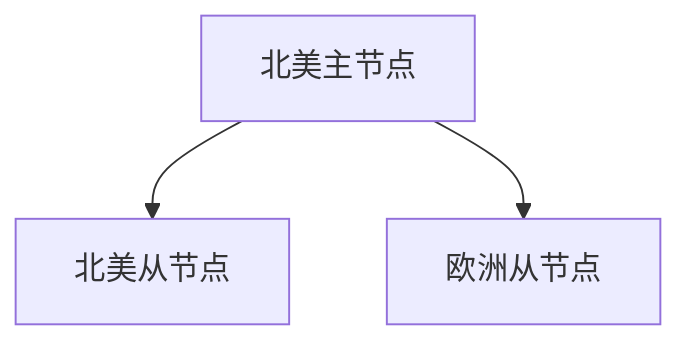

# Redis 云网络

Redis是一个高性能的键值存储系统，广泛应用于缓存、消息队列和实时数据处理等场景。在云原生环境中，Redis的网络配置和管理变得尤为重要。本文将详细介绍Redis云网络的概念、配置方法以及实际应用场景，帮助初学者快速掌握相关知识。

## 什么是Redis云网络？

Redis云网络是指在云原生环境中，Redis实例通过网络进行通信和数据传输的配置与管理。在云环境中，Redis实例可能分布在不同的节点或区域，因此网络性能直接影响到Redis的响应速度和数据一致性。

### 关键概念

- **网络延迟**：数据从客户端传输到Redis服务器所需的时间。
- **带宽**：网络传输数据的能力，影响Redis的吞吐量。
- **安全性**：确保Redis通信的加密和访问控制。

## Redis 网络配置

### 1. 绑定IP地址

在Redis配置文件中，可以通过`bind`指令指定Redis实例监听的IP地址。默认情况下，Redis监听所有可用网络接口。

```bash
bind 127.0.0.1
```

### 2. 端口配置

Redis默认使用6379端口，可以通过`port`指令修改。

```bash
port 6380
```

### 3. 安全配置

为了增强安全性，可以配置Redis使用密码认证。

```bash
requirepass yourpassword
```

## 实际案例

### 案例1：跨区域Redis集群

假设我们有一个跨区域的Redis集群，分布在北美和欧洲。为了减少网络延迟，我们可以使用Redis的复制功能，在每个区域部署一个从节点。



### 案例2：使用Redis Sentinel进行高可用性配置

Redis Sentinel可以监控Redis实例的健康状态，并在主节点故障时自动切换到从节点。

```bash
sentinel monitor mymaster 127.0.0.1 6379 2
sentinel down-after-milliseconds mymaster 5000
sentinel failover-timeout mymaster 10000
```

## 总结

Redis云网络是云原生环境中Redis性能优化的关键。通过合理的网络配置和管理，可以显著提高Redis的响应速度和数据一致性。希望本文能帮助初学者更好地理解和应用Redis云网络。

## 附加资源

- [Redis官方文档](https://redis.io/documentation)
- [Redis Sentinel配置指南](https://redis.io/topics/sentinel)
- [云原生网络优化技巧](https://cloud.google.com/solutions/optimizing-network-performance)

## 练习

1. 尝试在本地配置一个Redis实例，并绑定到特定的IP地址和端口。
2. 使用Redis Sentinel配置一个高可用的Redis集群。
3. 测试不同网络延迟下Redis的性能表现，并记录结果。

:::tip
在实际生产环境中，建议使用专业的云服务提供商（如AWS、Azure、GCP）提供的托管Redis服务，以获得更好的网络性能和安全性。
:::