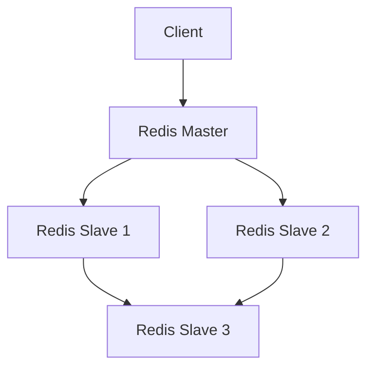

# Redis 云性能优化

Redis是一个高性能的键值存储系统，广泛应用于缓存、消息队列和实时数据处理等场景。在云原生环境中，Redis的性能优化尤为重要，因为云环境的动态性和资源分配方式可能会对Redis的性能产生显著影响。本文将逐步介绍如何在云原生环境中优化Redis的性能，并提供实际案例和代码示例。

## 1. 介绍

在云原生环境中，Redis的性能优化主要涉及以下几个方面：

- **资源配置**：合理分配CPU、内存和网络资源。
- **配置调整**：优化Redis的配置文件以适应当前工作负载。
- **持久化策略**：选择合适的持久化方式以平衡性能和数据安全。
- **集群管理**：在分布式环境中有效管理Redis集群。

## 2. 资源配置优化

### 2.1 CPU和内存分配

在云环境中，CPU和内存的分配对Redis的性能至关重要。Redis是单线程的，因此单个Redis实例的性能主要受限于CPU的单核性能。建议为Redis实例分配足够的CPU资源，并确保内存足够大以容纳所有数据。

```yaml
resources:
  requests:
    memory: "4Gi"
    cpu: "2"
  limits:
    memory: "8Gi"
    cpu: "4"
```

### 2.2 网络优化

Redis的性能也受网络延迟和带宽的影响。在云环境中，建议将Redis实例部署在与应用程序相同的区域和可用区，以减少网络延迟。

## 3. 配置调整

### 3.1 最大内存限制

为了防止Redis占用过多内存，可以设置`maxmemory`参数。当内存使用达到该限制时，Redis会根据配置的淘汰策略删除旧数据。

```bash
maxmemory 4gb
maxmemory-policy allkeys-lru
```

### 3.2 持久化策略

Redis支持两种持久化方式：RDB和AOF。RDB适合用于备份和恢复，而AOF则提供了更高的数据安全性。在云环境中，可以根据需求选择合适的持久化策略。

```bash
save 900 1
save 300 10
save 60 10000

appendonly yes
appendfsync everysec
```

## 4. 集群管理

在分布式环境中，Redis集群的管理尤为重要。通过分片和复制，可以提高Redis的可用性和性能。



## 5. 实际案例

### 5.1 电商网站的缓存优化

某电商网站在大促期间遇到了性能瓶颈，通过优化Redis的配置和资源分配，成功将响应时间从500ms降低到50ms。

```bash
# 优化前
maxmemory 2gb
maxmemory-policy volatile-lru

# 优化后
maxmemory 4gb
maxmemory-policy allkeys-lru
```

### 5.2 社交媒体的消息队列

某社交媒体平台使用Redis作为消息队列，通过调整持久化策略和集群配置，提高了消息处理的吞吐量。

```bash
# 优化前
appendonly no

# 优化后
appendonly yes
appendfsync everysec
```

## 6. 总结

在云原生环境中，Redis的性能优化需要综合考虑资源配置、配置调整和集群管理等多个方面。通过合理的优化，可以显著提高Redis的性能和稳定性。

## 7. 附加资源

- [Redis官方文档](https://redis.io/documentation)
- [云原生Redis最佳实践](https://cloud.google.com/redis/docs/best-practices)
- [Redis性能调优指南](https://redis.io/topics/benchmarks)

## 8. 练习

1. 尝试在本地环境中配置Redis的`maxmemory`和`maxmemory-policy`，并观察内存使用情况。
2. 在云环境中部署一个Redis集群，并测试其性能和可用性。

:::tip
在优化Redis性能时，建议定期监控Redis的各项指标，如内存使用率、命中率和延迟等，以便及时发现和解决问题。
:::