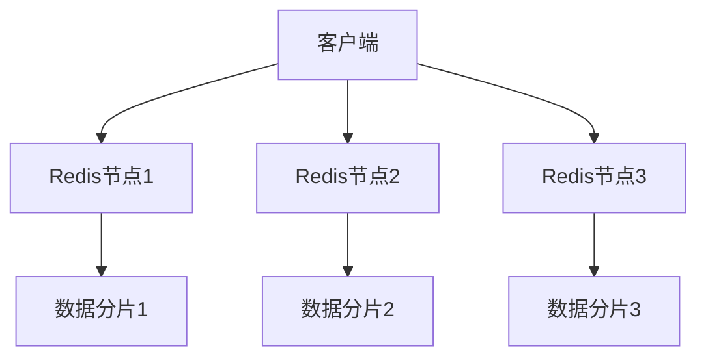

# Redis 弹性伸缩

在现代云原生环境中，弹性伸缩（Elastic Scaling）是一个关键特性，它允许系统根据负载动态调整资源。Redis作为一种高性能的内存数据库，也支持弹性伸缩，以满足不断变化的工作负载需求。本文将详细介绍Redis的弹性伸缩机制，并通过实际案例展示其应用场景。

## 什么是Redis弹性伸缩？

弹性伸缩是指系统能够根据当前的负载情况自动增加或减少资源的能力。对于Redis来说，弹性伸缩通常涉及以下几个方面：

1. **水平扩展**：通过增加或减少Redis实例的数量来应对负载变化。
2. **垂直扩展**：通过增加或减少单个Redis实例的资源（如内存、CPU）来应对负载变化。

### 水平扩展

水平扩展通常通过Redis集群（Redis Cluster）来实现。Redis集群允许你将数据分布在多个节点上，从而分散负载并提高系统的整体性能。



### 垂直扩展

垂直扩展则通过调整单个Redis实例的资源来实现。例如，你可以增加Redis实例的内存大小，以存储更多的数据。

## 如何实现Redis弹性伸缩？

### 1. 使用Redis集群进行水平扩展

Redis集群通过分片（Sharding）将数据分布在多个节点上。每个节点负责一部分数据，客户端可以通过集群的API访问这些数据。

```bash
# 启动Redis集群
redis-cli --cluster create 127.0.0.1:7000 127.0.0.1:7001 \
127.0.0.1:7002 127.0.0.1:7003 127.0.0.1:7004 127.0.0.1:7005 \
--cluster-replicas 1
```

### 2. 使用Redis Sentinel进行自动故障转移

Redis Sentinel是一个高可用性解决方案，它可以监控Redis主从实例的健康状态，并在主节点故障时自动进行故障转移。

```bash
# 启动Redis Sentinel
redis-sentinel /path/to/sentinel.conf
```

### 3. 使用云服务提供商的自动伸缩功能

许多云服务提供商（如AWS、Azure、GCP）提供了自动伸缩功能，可以根据负载自动调整Redis实例的数量和资源。

```bash
# AWS Elasticache自动伸缩配置示例
aws elasticache modify-replication-group \
--replication-group-id my-replication-group \
--apply-immediately \
--auto-scaling-enabled \
--minimum-engine-version 6.x \
--maximum-engine-version 6.x
```

## 实际案例

### 案例1：电商网站的购物车系统

在一个电商网站中，购物车系统通常需要处理大量的并发请求。使用Redis集群可以将购物车数据分布在多个节点上，从而提高系统的并发处理能力。

```bash
# 将购物车数据存储在不同的Redis节点上
SET cart:user1 "{...}"
SET cart:user2 "{...}"
```

### 案例2：社交媒体平台的实时消息系统

社交媒体平台需要处理大量的实时消息。使用Redis Sentinel可以确保在主节点故障时，系统能够自动切换到备用节点，从而保证消息的实时性和可靠性。

```bash
# 使用Redis Sentinel监控主从节点
SENTINEL get-master-addr-by-name mymaster
```

## 总结

Redis的弹性伸缩能力使其成为云原生环境中的理想选择。通过水平扩展和垂直扩展，Redis能够根据负载动态调整资源，确保系统的高性能和高可用性。无论是电商网站的购物车系统，还是社交媒体平台的实时消息系统，Redis都能提供强大的支持。

## 附加资源

- [Redis官方文档](https://redis.io/documentation)
- [Redis集群指南](https://redis.io/topics/cluster-tutorial)
- [Redis Sentinel指南](https://redis.io/topics/sentinel)

## 练习

1. 尝试在本地环境中搭建一个Redis集群，并测试其水平扩展能力。
2. 使用Redis Sentinel配置一个高可用的Redis主从架构，并模拟主节点故障，观察故障转移过程。
