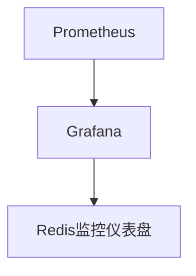

# Redis 云监控

在现代云原生环境中，Redis作为高性能的内存数据库，被广泛应用于缓存、消息队列和实时数据处理等场景。为了确保Redis实例的高性能和可用性，监控是至关重要的。本文将介绍Redis云监控的基本概念、工具和实际应用场景，帮助你更好地管理和优化Redis实例。

## 什么是Redis云监控？

Redis云监控是指通过一系列工具和技术手段，实时监控Redis实例的运行状态、性能指标和资源使用情况。通过监控，你可以及时发现潜在问题，优化性能，并确保Redis实例的稳定运行。

## 为什么需要Redis云监控？

1. **性能优化**：通过监控Redis的性能指标，如内存使用率、命中率和响应时间，你可以识别性能瓶颈并进行优化。
2. **故障排查**：当Redis实例出现问题时，监控数据可以帮助你快速定位问题原因。
3. **资源管理**：监控Redis的资源使用情况，如内存和CPU，可以帮助你合理分配资源，避免资源浪费。

## Redis 监控的关键指标

以下是一些常见的Redis监控指标：

- **内存使用率**：Redis是一个内存数据库，内存使用率是一个关键指标。
- **命中率**：缓存命中率反映了Redis的缓存效果。
- **响应时间**：Redis的响应时间直接影响应用程序的性能。
- **连接数**：当前的客户端连接数可以帮助你了解Redis的负载情况。
- **命令执行次数**：通过监控命令的执行次数，你可以了解Redis的使用模式。

## 使用Redis自带的监控工具

Redis自带了一些简单的监控工具，如`INFO`命令和`MONITOR`命令。

### 使用`INFO`命令

`INFO`命令可以返回Redis实例的详细信息，包括内存使用、客户端连接、持久化状态等。

```bash
redis-cli INFO
```

输出示例：

```
# Memory
used_memory: 1048576
used_memory_human: 1.00M
...

# Clients
connected_clients: 10
...

# Stats
total_connections_received: 100
total_commands_processed: 1000
...
```

### 使用`MONITOR`命令

`MONITOR`命令可以实时监控Redis实例执行的所有命令。

```bash
redis-cli MONITOR
```

输出示例：

```
1651234567.123456 [0 127.0.0.1:12345] "SET" "key" "value"
1651234567.123457 [0 127.0.0.1:12345] "GET" "key"
...
```

:::caution
`MONITOR`命令会对性能产生较大影响，建议仅在调试时使用。
:::

## 使用Prometheus和Grafana进行监控

在云原生环境中，Prometheus和Grafana是常用的监控工具组合。Prometheus负责收集和存储监控数据，Grafana则用于可视化展示。

### 配置Prometheus监控Redis

首先，你需要在Redis中启用Prometheus的监控接口。可以通过安装`redis_exporter`来实现。

```bash
# 安装redis_exporter
wget https://github.com/oliver006/redis_exporter/releases/download/v1.0.0/redis_exporter-v1.0.0.linux-amd64.tar.gz
tar -xzf redis_exporter-v1.0.0.linux-amd64.tar.gz
./redis_exporter
```

然后，在Prometheus的配置文件中添加Redis的监控目标。

```yaml
scrape_configs:
  - job_name: 'redis'
    static_configs:
      - targets: ['localhost:9121']
```

### 配置Grafana展示Redis监控数据

在Grafana中，你可以导入Redis的监控仪表盘模板，实时查看Redis的各项指标。



## 实际应用场景

### 场景1：缓存命中率下降

假设你发现Redis的缓存命中率突然下降，通过监控数据，你发现是因为缓存键的过期时间设置不合理。通过调整过期时间，你成功提高了缓存命中率。

### 场景2：内存使用率过高

通过监控，你发现Redis的内存使用率接近上限。通过分析，你发现是因为某些大键占用了过多内存。通过优化数据结构，你成功降低了内存使用率。

## 总结

Redis云监控是确保Redis实例高性能和可用性的重要手段。通过监控关键指标，你可以及时发现和解决问题，优化性能。本文介绍了Redis自带的监控工具以及如何使用Prometheus和Grafana进行更高级的监控。希望这些内容能帮助你更好地管理和优化Redis实例。

## 附加资源

- [Redis官方文档](https://redis.io/documentation)
- [Prometheus官方文档](https://prometheus.io/docs/)
- [Grafana官方文档](https://grafana.com/docs/)

## 练习

1. 使用`INFO`命令查看你的Redis实例的内存使用情况。
2. 配置Prometheus和Grafana，监控你的Redis实例，并创建一个仪表盘展示关键指标。