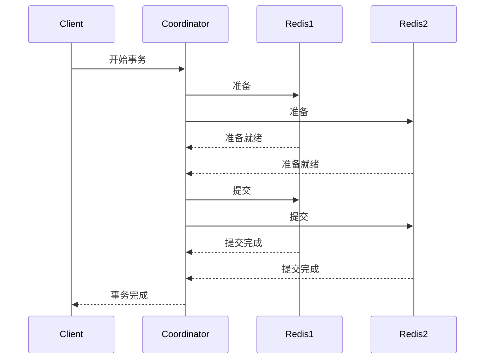
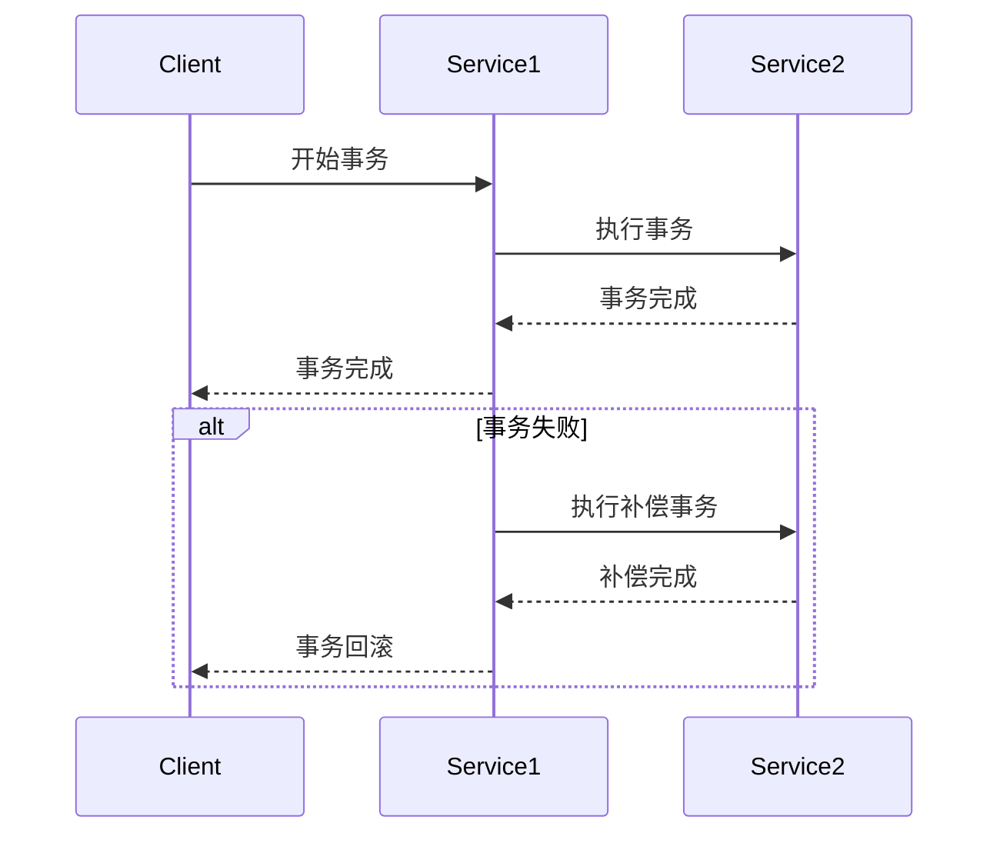

# Redis 分布式事务模式

在现代分布式系统中，事务管理是一个关键问题。Redis作为一个高性能的内存数据库，提供了多种机制来支持分布式事务。本文将详细介绍Redis分布式事务模式，帮助初学者理解其工作原理和实际应用。

## 什么是分布式事务？

分布式事务是指跨越多个数据库或服务的事务操作。在分布式系统中，事务需要保证ACID（原子性、一致性、隔离性、持久性）特性，但由于系统的分布式特性，实现这些特性变得更加复杂。

## Redis 事务的基本概念

Redis通过`MULTI`、`EXEC`、`DISCARD`和`WATCH`命令来支持事务。这些命令允许你将多个操作打包成一个原子操作。

### 基本事务操作

1. **MULTI**：标记事务的开始。
2. **EXEC**：执行事务中的所有命令。
3. **DISCARD**：取消事务，放弃所有命令。
4. **WATCH**：监视一个或多个键，如果在事务执行之前这些键被其他客户端修改，则事务将失败。

```redis
MULTI
SET key1 value1
SET key2 value2
EXEC
```

### 事务的原子性

Redis事务是原子性的，这意味着事务中的所有命令要么全部执行，要么全部不执行。如果在执行`EXEC`之前发生错误，事务将被取消。

## 分布式事务的实现

在分布式环境中，Redis事务需要与其他系统或服务协同工作。以下是实现分布式事务的几种常见模式：

### 1. 两阶段提交（2PC）

两阶段提交是一种经典的分布式事务协议，分为准备阶段和提交阶段。



### 2. 补偿事务（Saga）

Saga模式通过一系列本地事务来实现分布式事务。每个本地事务都有一个对应的补偿事务，用于在失败时回滚。



## 实际应用场景

### 电商系统中的订单处理

在电商系统中，订单处理通常涉及多个服务，如库存服务、支付服务和订单服务。使用Redis分布式事务可以确保这些服务之间的操作一致性。

```redis
WATCH inventory:item1
MULTI
DECR inventory:item1
INCR orders:total
EXEC
```

如果`inventory:item1`在事务执行前被修改，事务将失败并重试。

## 总结

Redis分布式事务模式为分布式系统提供了一种有效的事务管理机制。通过理解基本的事务操作和分布式事务的实现模式，开发者可以在实际应用中更好地利用Redis来保证数据的一致性和完整性。

## 附加资源与练习

- **练习**：尝试在一个分布式系统中实现一个简单的订单处理流程，使用Redis事务来保证一致性。
- **资源**：
  - [Redis官方文档](https://redis.io/documentation)
  - [分布式系统设计模式](https://microservices.io/patterns/data/saga.html)

:::tip
在实际应用中，分布式事务的实现可能会面临性能瓶颈和复杂性挑战。建议在设计系统时充分考虑这些因素，并选择合适的分布式事务模式。
:::