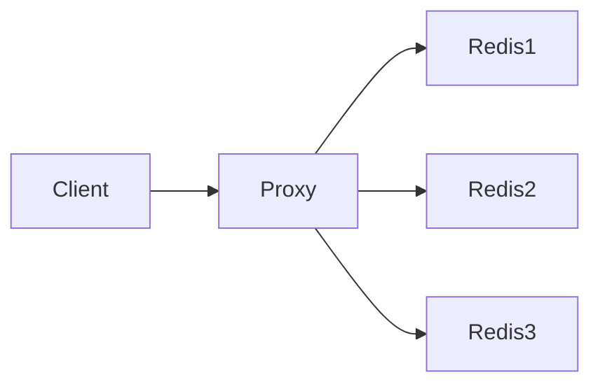

# Redis 分片模式

Redis分片模式（Sharding）是一种将数据分布到多个Redis实例中的技术，用于解决单机Redis实例的内存和性能瓶颈问题。通过分片，可以将数据分散到多个节点上，从而提高系统的扩展性和吞吐量。

## 什么是Redis分片模式？

Redis分片模式是一种水平扩展技术，它将数据集分割成多个部分，并将这些部分存储在不同的Redis实例中。每个实例只负责处理一部分数据，从而减轻单个实例的负载压力。

分片的核心思想是通过某种规则（如哈希函数）将数据分配到不同的Redis实例中。这样，即使数据量非常大，也可以通过增加Redis实例的数量来扩展系统的容量和性能。

## 分片的实现方式

### 1. 客户端分片

客户端分片是指在客户端代码中实现分片逻辑。客户端根据某种规则（如键的哈希值）决定将数据存储到哪个Redis实例中。

```python
import redis

# 假设我们有3个Redis实例
redis_instances = [
    redis.Redis(host='127.0.0.1', port=6379),
    redis.Redis(host='127.0.0.1', port=6380),
    redis.Redis(host='127.0.0.1', port=6381)
]

def get_shard(key):
    # 使用简单的哈希函数进行分片
    return redis_instances[hash(key) % len(redis_instances)]

# 存储数据
key = "user:1001"
value = "John Doe"
shard = get_shard(key)
shard.set(key, value)

# 读取数据
shard = get_shard(key)
print(shard.get(key))  # 输出: b'John Doe'
```

:::note
客户端分片的优点是实现简单，但缺点是需要客户端维护分片逻辑，且在实例数量变化时需要手动调整分片规则。
:::

### 2. 代理分片

代理分片是指通过一个中间代理层来实现分片逻辑。客户端将所有请求发送到代理，代理根据分片规则将请求转发到相应的Redis实例。

常见的代理工具包括 [Twemproxy](https://github.com/twitter/twemproxy) 和 [Redis Cluster](https://redis.io/topics/cluster-tutorial)。



:::tip
代理分片的优点是对客户端透明，且可以动态调整分片规则。缺点是引入了额外的网络开销和单点故障风险。
:::

## 实际应用场景

### 1. 大规模数据存储

当数据量超过单个Redis实例的内存容量时，可以通过分片将数据分布到多个实例中，从而扩展存储容量。

### 2. 高并发访问

在高并发场景下，单个Redis实例可能无法处理所有的请求。通过分片，可以将请求分散到多个实例中，从而提高系统的吞吐量。

### 3. 分布式缓存

在分布式系统中，缓存数据通常需要分布在多个节点上。通过分片，可以实现缓存的分布式存储和访问。

## 总结

Redis分片模式是一种有效的水平扩展技术，适用于大规模数据存储和高并发访问场景。通过客户端分片或代理分片，可以将数据分布到多个Redis实例中，从而提高系统的扩展性和性能。

:::caution
在实际应用中，分片模式可能会带来一些复杂性，如数据迁移、实例故障处理等。因此，在选择分片方案时，需要根据具体需求进行权衡。
:::

## 附加资源

- [Redis官方文档](https://redis.io/documentation)
- [Twemproxy GitHub仓库](https://github.com/twitter/twemproxy)
- [Redis Cluster教程](https://redis.io/topics/cluster-tutorial)

## 练习

1. 尝试在本地搭建一个包含3个Redis实例的分片环境，并使用客户端分片的方式存储和读取数据。
2. 研究Redis Cluster的工作原理，并尝试在分布式环境中使用Redis Cluster进行数据分片。