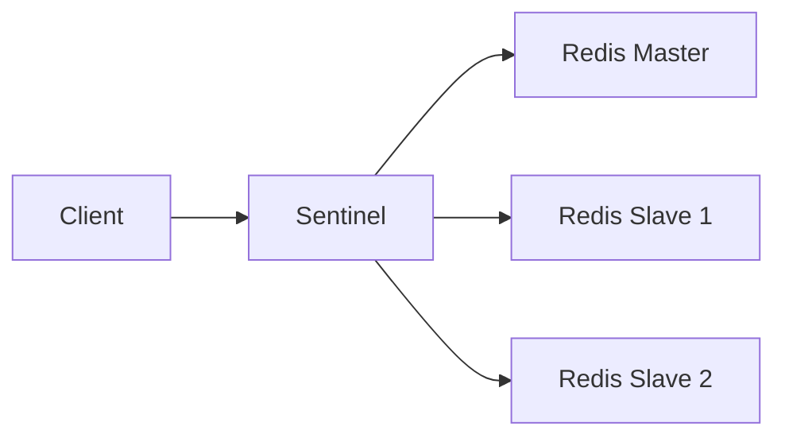
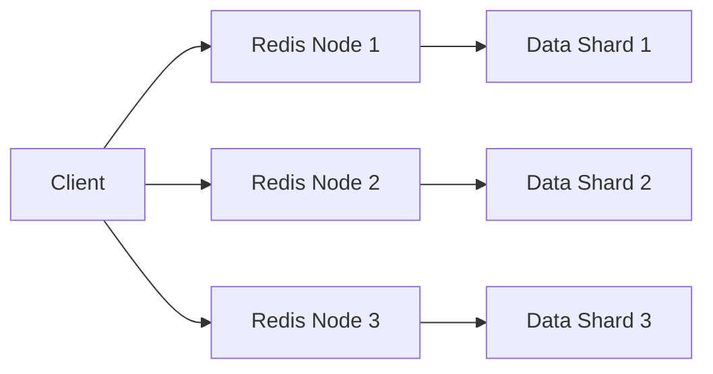
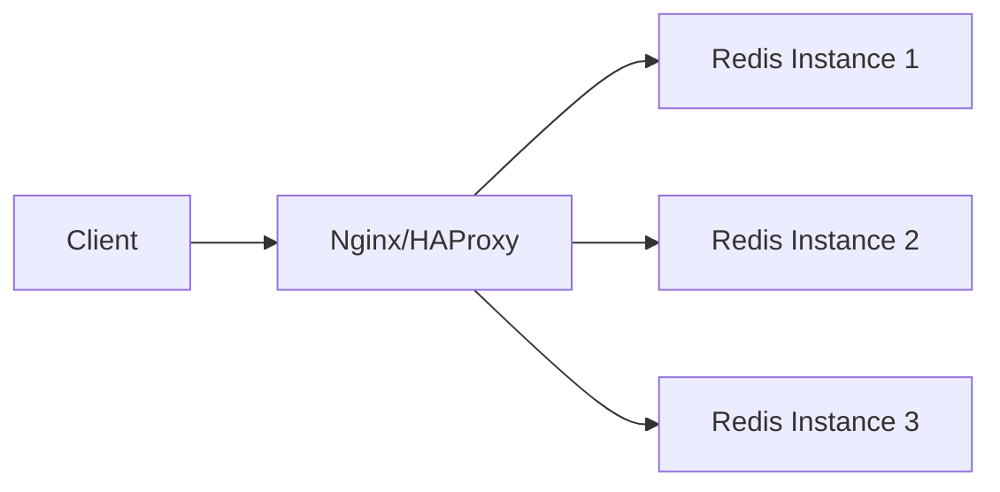

# Redis 代理模式

Redis代理模式是一种常见的设计模式，用于在客户端和Redis服务器之间引入一个中间层（代理），以简化客户端与Redis的交互、提高性能或实现额外的功能。本文将详细介绍Redis代理模式的概念、实现方式以及实际应用场景。

## 什么是Redis代理模式？

Redis代理模式的核心思想是在客户端和Redis服务器之间引入一个代理层。这个代理层可以处理以下任务：

1. **负载均衡**：将请求分发到多个Redis实例，以平衡负载。
2. **缓存**：在代理层缓存常用数据，减少对Redis的直接访问。
3. **安全性**：通过代理层限制对Redis的访问权限。
4. **协议转换**：将客户端的请求转换为Redis支持的协议。

通过引入代理层，客户端无需直接与Redis服务器通信，而是通过代理层间接访问Redis。这种方式可以简化客户端的逻辑，同时提供更高的灵活性和可扩展性。

## Redis 代理模式的实现

### 1. 使用Redis Sentinel

Redis Sentinel是Redis官方提供的高可用性解决方案，它也可以作为代理模式的一种实现方式。Sentinel可以监控Redis主从实例的状态，并在主节点故障时自动切换到从节点。

在上图中，客户端通过Sentinel与Redis实例通信。Sentinel负责将请求路由到正确的Redis实例。

### 2. 使用Redis Cluster

Redis Cluster是Redis的分布式解决方案，它通过分片（sharding）将数据分布在多个节点上。客户端可以通过集群中的任意节点访问数据，集群会自动将请求路由到正确的节点。

在上图中，客户端可以直接与Redis集群中的任意节点通信，集群会自动处理数据分片和路由。

### 3. 自定义代理

除了使用Redis官方提供的解决方案，你还可以自定义代理层。例如，使用Nginx或HAProxy作为代理服务器，将请求转发到后端的Redis实例。

在上图中，Nginx或HAProxy作为代理服务器，负责将客户端的请求分发到后端的Redis实例。

## 实际应用场景

### 1. 负载均衡

在高并发的场景下，单个Redis实例可能无法处理所有的请求。通过引入代理层，可以将请求分发到多个Redis实例，从而实现负载均衡。

:::tip
**示例**：假设你有三个Redis实例，代理层可以根据请求的负载情况，将请求分发到不同的实例上。
:::

### 2. 高可用性

在分布式系统中，Redis实例可能会发生故障。通过使用Redis Sentinel或Redis Cluster，代理层可以自动检测故障并进行故障转移，从而保证系统的高可用性。

:::caution
**注意**：在使用Redis Sentinel时，客户端需要支持Sentinel协议，否则无法正确进行故障转移。
:::

### 3. 缓存加速

代理层可以在本地缓存常用数据，减少对Redis的直接访问。例如，使用Nginx作为代理服务器时，可以通过配置缓存策略来加速数据访问。

:::note
**示例**：Nginx可以配置为缓存Redis中的热点数据，当客户端请求这些数据时，Nginx可以直接从缓存中返回，而不需要访问Redis。
:::

## 总结

Redis代理模式是一种强大的设计模式，通过在客户端和Redis服务器之间引入代理层，可以简化客户端的逻辑、提高系统的性能和可用性。无论是使用Redis Sentinel、Redis Cluster还是自定义代理，代理模式都能为你的系统带来显著的好处。

## 附加资源

- [Redis Sentinel 官方文档](https://redis.io/topics/sentinel)
- [Redis Cluster 官方文档](https://redis.io/topics/cluster-tutorial)
- [Nginx 代理配置指南](https://nginx.org/en/docs/http/ngx_http_proxy_module.html)

## 练习

1. 尝试使用Redis Sentinel搭建一个高可用的Redis集群，并测试故障转移功能。
2. 使用Nginx配置一个Redis代理服务器，并测试其负载均衡功能。
3. 研究Redis Cluster的分片机制，并尝试在本地环境中搭建一个Redis集群。

通过以上练习，你将更深入地理解Redis代理模式的实际应用。