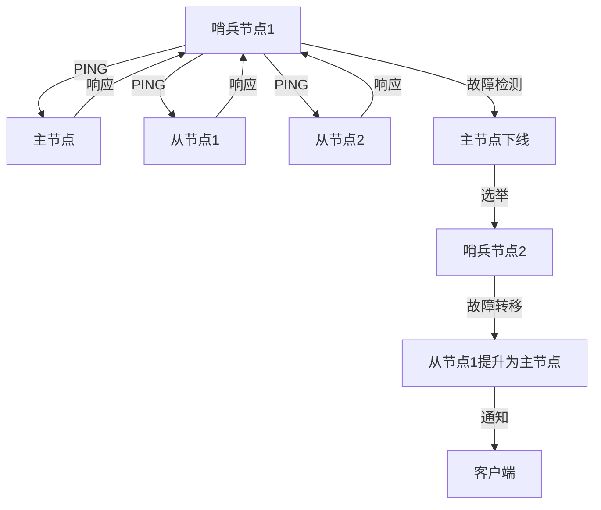

# Redis 哨兵模式详解

Redis哨兵模式（Sentinel Mode）是Redis提供的一种高可用性解决方案，用于在主从复制架构中自动监控、故障检测和故障转移。通过哨兵模式，Redis可以在主节点发生故障时，自动将一个从节点提升为新的主节点，从而保证服务的持续可用性。

## 什么是Redis哨兵模式？

Redis哨兵模式是一个分布式系统，由多个哨兵节点组成，用于监控Redis主从节点的健康状态。哨兵节点会定期检查主节点和从节点的运行状态，并在主节点发生故障时，自动执行故障转移操作，将一个从节点提升为新的主节点。

哨兵模式的主要功能包括：
- **监控**：持续监控Redis主从节点的健康状态。
- **通知**：当检测到节点故障时，向管理员发送通知。
- **自动故障转移**：在主节点故障时，自动将一个从节点提升为新的主节点。
- **配置提供者**：客户端可以通过哨兵节点获取当前的主节点地址。

## 哨兵模式的工作原理

哨兵模式的工作原理可以分为以下几个步骤：

1. **监控**：哨兵节点会定期向Redis主节点和从节点发送PING命令，检查它们的健康状态。
2. **故障检测**：如果哨兵节点在一定时间内没有收到主节点的响应，它会认为主节点已经下线。
3. **选举**：当主节点被标记为下线时，哨兵节点会通过选举机制选出一个哨兵节点来执行故障转移操作。
4. **故障转移**：选出的哨兵节点会将一个从节点提升为新的主节点，并通知其他从节点切换到新的主节点。
5. **通知**：哨兵节点会向客户端发送通知，告知新的主节点地址。



## 配置Redis哨兵模式

要配置Redis哨兵模式，首先需要启动多个哨兵节点，并配置它们监控同一个主节点。以下是一个简单的哨兵配置文件示例：

```bash
# sentinel.conf
sentinel monitor mymaster 127.0.0.1 6379 2
sentinel down-after-milliseconds mymaster 5000
sentinel failover-timeout mymaster 10000
sentinel parallel-syncs mymaster 1
```

- `sentinel monitor mymaster 127.0.0.1 6379 2`：监控名为`mymaster`的主节点，地址为`127.0.0.1:6379`，至少需要2个哨兵节点同意才能执行故障转移。
- `sentinel down-after-milliseconds mymaster 5000`：如果主节点在5000毫秒内没有响应，哨兵节点会认为主节点下线。
- `sentinel failover-timeout mymaster 10000`：故障转移的超时时间为10000毫秒。
- `sentinel parallel-syncs mymaster 1`：在故障转移时，同时只能有1个从节点进行数据同步。

启动哨兵节点时，可以使用以下命令：

```bash
redis-sentinel /path/to/sentinel.conf
```

## 实际应用场景

假设我们有一个电商网站，使用Redis作为缓存服务器。为了提高系统的可用性，我们配置了Redis哨兵模式。当主节点发生故障时，哨兵节点会自动将一个从节点提升为新的主节点，从而保证网站的缓存服务不会中断。

:::note
在实际生产环境中，建议至少部署3个哨兵节点，以确保系统的可靠性和容错能力。
:::

## 总结

Redis哨兵模式是Redis高可用性解决方案的核心组件之一。通过哨兵模式，Redis可以在主节点发生故障时，自动进行故障转移，从而保证服务的持续可用性。对于初学者来说，理解哨兵模式的工作原理和配置方法是非常重要的。

## 附加资源与练习

- **官方文档**：[Redis Sentinel Documentation](https://redis.io/topics/sentinel)
- **练习**：尝试在本地环境中配置一个Redis哨兵模式，并模拟主节点故障，观察哨兵节点如何进行故障转移。

通过本文的学习，你应该已经掌握了Redis哨兵模式的基本概念和配置方法。希望你能在实际项目中灵活运用这一技术，提升系统的可用性和稳定性。