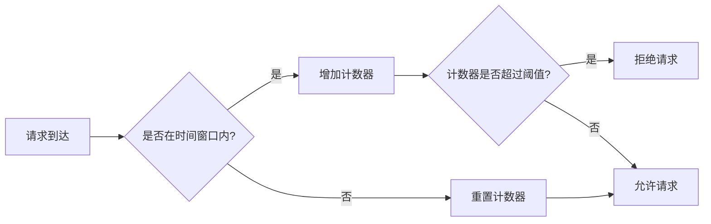

# Redis 限流模式

在现代分布式系统中，限流（Rate Limiting）是一种常见的技术，用于控制客户端对服务的请求速率。通过限流，我们可以防止系统被过多的请求压垮，从而保证服务的稳定性和可用性。Redis由于其高性能和丰富的数据结构，成为了实现限流模式的理想选择。

## 什么是限流？

限流是一种控制客户端请求速率的技术。它通过限制单位时间内允许的请求数量，防止系统被过多的请求压垮。限流通常用于保护后端服务，避免因突发流量导致的系统崩溃。

## 为什么使用Redis实现限流？

Redis是一个高性能的内存数据库，支持丰富的数据结构和原子操作。这些特性使得Redis非常适合用于实现限流模式。通过Redis，我们可以轻松地实现基于时间窗口的限流算法，并且能够高效地处理大量的请求。

## Redis 限流的基本原理

Redis限流的基本原理是通过记录每个客户端在特定时间窗口内的请求次数，来判断是否允许新的请求。如果请求次数超过了设定的阈值，则拒绝该请求。

### 基于计数器的限流

最简单的限流方法是使用计数器。我们可以为每个客户端维护一个计数器，记录其在特定时间窗口内的请求次数。当请求次数超过阈值时，拒绝新的请求。

```javascript
// 伪代码示例
const redis = require('redis');
const client = redis.createClient();

function isAllowed(userId, limit, windowSizeInSeconds) {
  const key = `rate_limit:${userId}`;
  const currentTime = Math.floor(Date.now() / 1000);

  // 获取当前时间窗口的开始时间
  const windowStart = currentTime - windowSizeInSeconds;

  // 使用Redis的ZREMRANGEBYSCORE命令移除过期的请求记录
  client.zremrangebyscore(key, 0, windowStart);

  // 获取当前时间窗口内的请求次数
  client.zcard(key, (err, count) => {
    if (count >= limit) {
      return false; // 超过限流阈值，拒绝请求
    } else {
      // 允许请求，并记录当前请求的时间戳
      client.zadd(key, currentTime, currentTime);
      return true;
    }
  });
}
```

### 基于滑动窗口的限流

滑动窗口限流是一种更精确的限流方法。它通过维护一个滑动时间窗口，记录窗口内的请求次数。当请求次数超过阈值时，拒绝新的请求。



## 实际应用场景

### API限流

在API网关中，限流是一种常见的保护机制。通过限流，我们可以防止恶意用户或脚本对API进行滥用，从而保护后端服务的稳定性。

### 用户行为限制

在某些应用中，我们需要限制用户的行为频率。例如，限制用户每分钟只能发送一次验证码，或者每小时只能发布一条评论。通过Redis限流，我们可以轻松实现这些限制。

## 总结

Redis限流模式是一种简单而有效的方法，用于控制客户端对服务的请求速率。通过Redis的高性能和丰富的数据结构，我们可以轻松实现基于计数器或滑动窗口的限流算法。限流模式在API网关、用户行为限制等场景中有着广泛的应用。

## 附加资源与练习

- **练习1**：尝试使用Redis实现一个基于滑动窗口的限流算法，并测试其在不同请求速率下的表现。
- **练习2**：研究其他限流算法，如令牌桶算法和漏桶算法，并比较它们与Redis限流模式的优缺点。
- **资源**：[Redis官方文档](https://redis.io/documentation) 提供了丰富的Redis使用指南和示例代码，适合进一步学习。

:::tip
在实际生产环境中，限流策略的选择应根据具体的业务需求和系统负载进行调整。建议在实施限流策略之前，进行充分的测试和评估。
:::