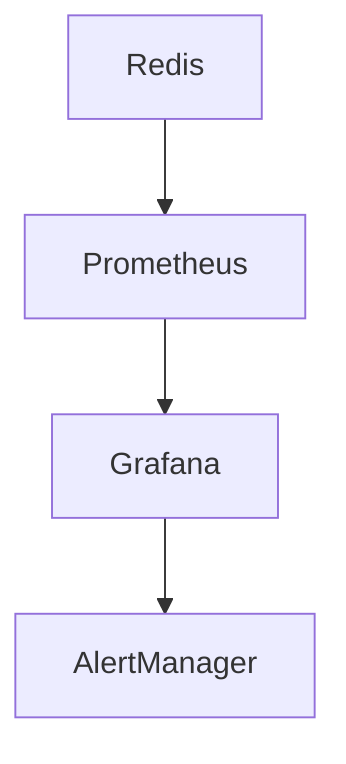

# Redis 运维最佳实践

Redis是一个高性能的键值存储系统，广泛应用于缓存、消息队列、会话存储等场景。为了确保Redis在生产环境中的稳定性和高效性，运维人员需要遵循一些最佳实践。本文将逐步讲解Redis运维的关键点，并提供实际案例和代码示例。

## 1. 配置优化

### 1.1 内存管理

Redis是一个基于内存的数据库，因此内存管理至关重要。以下是一些内存管理的建议：

- **设置最大内存限制**：通过配置`maxmemory`参数，可以防止Redis使用过多内存导致系统崩溃。
  
  ```bash
  maxmemory 2gb
  ```

- **选择合适的淘汰策略**：当内存达到上限时，Redis会根据配置的淘汰策略删除键。常见的策略有`volatile-lru`、`allkeys-lru`等。

  ```bash
  maxmemory-policy allkeys-lru
  ```

### 1.2 持久化配置

Redis提供了两种持久化方式：RDB和AOF。

- **RDB**：定期生成数据快照，适合备份和恢复。
  
  ```bash
  save 900 1
  save 300 10
  save 60 10000
  ```

- **AOF**：记录每个写操作，适合数据完整性要求高的场景。

  ```bash
  appendonly yes
  appendfsync everysec
  ```

:::tip
建议同时启用RDB和AOF，以兼顾备份效率和数据完整性。
:::

## 2. 监控与告警

### 2.1 使用Redis自带的监控工具

Redis提供了`INFO`命令，可以查看服务器的各种状态信息。

```bash
redis-cli info
```

### 2.2 使用外部监控工具

可以使用Prometheus、Grafana等工具对Redis进行监控，并设置告警规则。



## 3. 备份与恢复

### 3.1 定期备份

定期备份是确保数据安全的重要措施。可以通过以下命令手动备份：

```bash
redis-cli save
```

### 3.2 恢复数据

恢复数据时，只需将备份文件（通常是`dump.rdb`）放入Redis的工作目录，并重启Redis服务。

```bash
cp /path/to/backup/dump.rdb /var/lib/redis/dump.rdb
systemctl restart redis
```

## 4. 高可用性

### 4.1 主从复制

通过主从复制，可以实现数据的冗余和读写分离。

```bash
# 在从节点配置
slaveof <masterip> <masterport>
```

### 4.2 哨兵模式

哨兵模式可以自动监控主从节点的状态，并在主节点故障时进行故障转移。

```bash
# 哨兵配置文件
sentinel monitor mymaster 127.0.0.1 6379 2
sentinel down-after-milliseconds mymaster 5000
sentinel failover-timeout mymaster 10000
```

## 5. 实际案例

### 5.1 缓存雪崩

缓存雪崩是指大量缓存同时失效，导致数据库压力骤增。可以通过以下方法避免：

- **设置不同的过期时间**：为缓存设置随机的过期时间，避免同时失效。
  
  ```bash
  SET key value EX 3600
  ```

- **使用熔断机制**：在缓存失效时，限制对数据库的访问。

### 5.2 缓存穿透

缓存穿透是指查询不存在的数据，导致每次请求都直接访问数据库。可以通过以下方法避免：

- **布隆过滤器**：在查询缓存之前，先使用布隆过滤器判断数据是否存在。

  ```bash
  BF.ADD myfilter key
  BF.EXISTS myfilter key
  ```

## 总结

Redis运维的最佳实践涵盖了配置优化、监控、备份与恢复、高可用性等多个方面。通过遵循这些实践，可以确保Redis在生产环境中的稳定性和高效性。

## 附加资源

- [Redis官方文档](https://redis.io/documentation)
- [Redis命令参考](https://redis.io/commands)
- [Redis监控与告警指南](https://prometheus.io/docs/guides/redis/)

## 练习

1. 配置Redis的最大内存限制为4GB，并设置淘汰策略为`volatile-lru`。
2. 使用`INFO`命令查看Redis的状态信息，并记录关键指标。
3. 配置Redis的主从复制，并验证数据同步是否正常。
