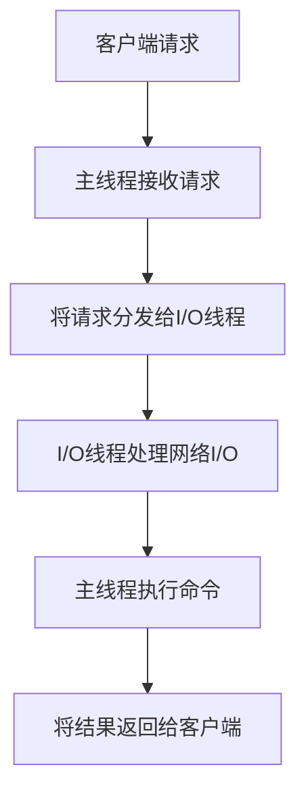

# Redis 多线程模型

Redis 是一个高性能的键值存储系统，以其单线程模型而闻名。然而，随着 Redis 6.0 的发布，Redis 引入了多线程支持，以进一步提升性能。本文将详细介绍 Redis 的多线程模型，帮助你理解其工作原理、优势以及实际应用场景。

## 1. 什么是Redis多线程模型？

Redis 的多线程模型是指在 Redis 6.0 及更高版本中，Redis 引入了多线程来处理某些任务，如网络 I/O 和后台任务。尽管 Redis 的核心命令执行仍然是单线程的，但多线程的引入使得 Redis 能够更高效地处理高并发请求。

:::note
Redis 的核心命令执行仍然是单线程的，这意味着 Redis 仍然保持了其简单性和一致性。
:::

## 2. Redis多线程模型的工作原理

Redis 的多线程模型主要涉及以下几个方面：

### 2.1 网络 I/O 多线程

在 Redis 6.0 之前，Redis 使用单线程来处理所有的网络 I/O 操作。这意味着 Redis 在处理大量并发连接时，可能会成为性能瓶颈。为了解决这个问题，Redis 6.0 引入了多线程来处理网络 I/O。



### 2.2 后台任务多线程

除了网络 I/O，Redis 还使用多线程来处理一些后台任务，如持久化（RDB 和 AOF）、键过期处理等。这些任务通常不会直接影响 Redis 的核心命令执行，但它们可以提高 Redis 的整体性能。

## 3. 如何启用Redis多线程

要启用 Redis 的多线程功能，你需要在 Redis 配置文件中进行相应的设置。以下是启用多线程的步骤：

1. 打开 Redis 配置文件 `redis.conf`。
2. 找到并修改以下配置项：

```bash
# 启用多线程
io-threads 4
io-threads-do-reads yes
```

:::caution
`io-threads` 的值应根据你的 CPU 核心数进行调整。通常建议设置为 CPU 核心数的 1/2 到 2/3。
:::

## 4. 实际应用场景

Redis 的多线程模型在以下场景中特别有用：

### 4.1 高并发环境

在高并发环境中，Redis 的多线程模型可以显著提高网络 I/O 的处理能力，从而减少请求的延迟。

### 4.2 大规模数据持久化

当 Redis 需要处理大规模数据持久化任务时，多线程可以加速 RDB 和 AOF 的生成过程，减少对主线程的影响。

## 5. 总结

Redis 的多线程模型通过引入多线程处理网络 I/O 和后台任务，显著提升了 Redis 的性能。尽管核心命令执行仍然是单线程的，但多线程的引入使得 Redis 能够更好地应对高并发和大规模数据处理的挑战。

:::tip
如果你对 Redis 的多线程模型感兴趣，可以尝试在自己的环境中启用多线程，并观察性能的变化。
:::

## 6. 附加资源与练习

- **官方文档**: [Redis 6.0 多线程模型](https://redis.io/topics/multithreading)
- **练习**: 在你的 Redis 环境中启用多线程，并使用 `redis-benchmark` 工具测试性能变化。

通过本文的学习，你应该对 Redis 的多线程模型有了更深入的理解。希望这些知识能够帮助你在实际项目中更好地应用 Redis。