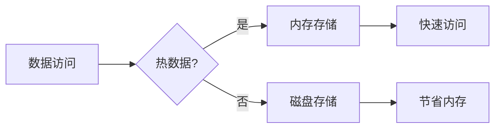

# Redis 混合存储

Redis是一个高性能的键值存储系统，广泛用于缓存、消息队列和实时数据处理等场景。随着数据量的增长，单一的内存存储模式可能无法满足需求。为了解决这个问题，Redis引入了**混合存储**的概念。本文将详细介绍Redis混合存储的工作原理、使用场景以及如何在实际项目中应用。

## 什么是Redis混合存储？

Redis混合存储是一种结合内存和磁盘存储的技术。它允许Redis在内存中存储热数据（频繁访问的数据），而将冷数据（不常访问的数据）存储在磁盘上。这种混合存储模式既保留了内存存储的高性能，又通过磁盘存储扩展了数据容量。

:::tip
混合存储的核心思想是**热数据在内存，冷数据在磁盘**，从而在性能和存储成本之间找到平衡。
:::

## 混合存储的工作原理

Redis混合存储通过以下步骤实现：

1. **数据分类**：Redis会根据数据的访问频率将数据分为热数据和冷数据。
2. **内存存储**：热数据存储在内存中，确保快速访问。
3. **磁盘存储**：冷数据存储在磁盘上，减少内存占用。
4. **数据迁移**：当数据从热变冷时，Redis会自动将其迁移到磁盘；反之，当冷数据被频繁访问时，Redis会将其加载回内存。



## 如何配置Redis混合存储

Redis混合存储的配置非常简单。以下是一个示例配置：

```bash
# 启用混合存储
maxmemory 1gb
maxmemory-policy allkeys-lru
maxmemory-samples 5
```

- `maxmemory`：设置Redis实例的最大内存使用量。
- `maxmemory-policy`：设置内存淘汰策略。`allkeys-lru`表示使用LRU算法淘汰最久未使用的键。
- `maxmemory-samples`：设置每次淘汰时检查的键数量。

:::caution
在配置混合存储时，请确保磁盘性能足够高，以避免冷数据访问时的性能瓶颈。
:::

## 实际应用场景

### 场景1：电商网站的商品缓存

在一个电商网站中，热门商品（如促销商品）会被频繁访问，而冷门商品（如过季商品）访问频率较低。通过Redis混合存储，可以将热门商品存储在内存中，而将冷门商品存储在磁盘上，从而优化内存使用。

### 场景2：社交媒体的用户动态

在社交媒体平台中，用户的最新动态（如最近发布的帖子）会被频繁访问，而旧动态（如一年前的帖子）访问频率较低。通过Redis混合存储，可以将最新动态存储在内存中，而将旧动态存储在磁盘上。

## 代码示例

以下是一个简单的Python示例，展示如何使用Redis混合存储：

```python
import redis

# 连接Redis
r = redis.Redis(host='localhost', port=6379, db=0)

# 存储热数据
r.set('hot_key', 'hot_value')

# 存储冷数据
r.set('cold_key', 'cold_value')

# 访问热数据
print(r.get('hot_key'))  # 输出: b'hot_value'

# 访问冷数据
print(r.get('cold_key'))  # 输出: b'cold_value'
```

:::note
在实际应用中，Redis会自动管理热数据和冷数据的迁移，开发者无需手动干预。
:::

## 总结

Redis混合存储是一种高效的数据存储方案，能够在性能和存储成本之间找到平衡。通过将热数据存储在内存中，冷数据存储在磁盘上，Redis混合存储能够显著降低内存使用量，同时保持较高的访问性能。

## 附加资源

- [Redis官方文档](https://redis.io/documentation)
- [Redis内存优化指南](https://redis.io/topics/memory-optimization)
- [Redis混合存储实战案例](https://redis.com/case-studies)

## 练习

1. 在你的本地环境中配置Redis混合存储，并观察内存和磁盘的使用情况。
2. 编写一个脚本，模拟热数据和冷数据的访问，并记录Redis的性能变化。
3. 尝试调整`maxmemory-policy`参数，观察不同淘汰策略对性能的影响。

希望本文能帮助你更好地理解Redis混合存储的概念和应用！如果有任何问题，欢迎在评论区留言讨论。