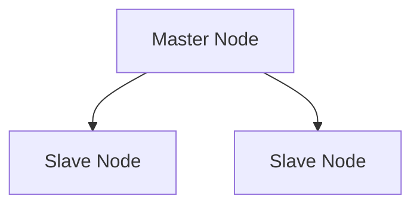
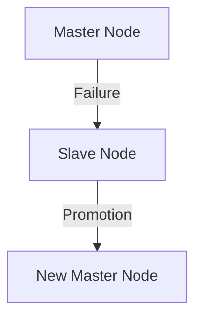

# Redis 大规模部署

Redis是一个高性能的键值存储系统，广泛应用于缓存、消息队列和实时数据处理等场景。然而，随着数据量和访问量的增加，单机Redis可能无法满足需求。因此，了解如何在大规模环境中部署和管理Redis变得至关重要。本文将逐步介绍Redis大规模部署的关键概念和技术。

## 1. 介绍

在大规模部署中，Redis需要处理大量的数据和并发请求。为了应对这些挑战，我们需要考虑以下几个方面：

- **集群配置**：将多个Redis实例组合成一个集群，以分散负载和提高可用性。
- **分片**：将数据分布到多个节点上，以扩展存储容量和处理能力。
- **高可用性**：通过主从复制和故障转移机制，确保系统在节点故障时仍能正常运行。
- **性能优化**：通过配置调优和硬件升级，提高Redis的性能和响应速度。

## 2. Redis集群配置

Redis集群是Redis官方提供的一种分布式解决方案，它通过分片和复制来实现数据的高可用性和扩展性。

### 2.1 创建Redis集群

要创建一个Redis集群，首先需要启动多个Redis实例，并将它们配置为集群模式。以下是一个简单的示例：

```bash
# 启动6个Redis实例，3个主节点，3个从节点
redis-server --port 7000 --cluster-enabled yes --cluster-config-file nodes-7000.conf --cluster-node-timeout 5000 &
redis-server --port 7001 --cluster-enabled yes --cluster-config-file nodes-7001.conf --cluster-node-timeout 5000 &
redis-server --port 7002 --cluster-enabled yes --cluster-config-file nodes-7002.conf --cluster-node-timeout 5000 &
redis-server --port 7003 --cluster-enabled yes --cluster-config-file nodes-7003.conf --cluster-node-timeout 5000 &
redis-server --port 7004 --cluster-enabled yes --cluster-config-file nodes-7004.conf --cluster-node-timeout 5000 &
redis-server --port 7005 --cluster-enabled yes --cluster-config-file nodes-7005.conf --cluster-node-timeout 5000 &
```

接下来，使用`redis-cli`工具将这些实例组合成一个集群：

```bash
redis-cli --cluster create 127.0.0.1:7000 127.0.0.1:7001 127.0.0.1:7002 127.0.0.1:7003 127.0.0.1:7004 127.0.0.1:7005 --cluster-replicas 1
```

### 2.2 集群分片

Redis集群使用哈希槽（hash slot）来分片数据。总共有16384个哈希槽，每个键通过CRC16算法计算出一个哈希值，然后映射到相应的哈希槽上。每个节点负责一部分哈希槽，从而实现数据的分布式存储。


## 3. 高可用性

为了提高Redis集群的可用性，我们可以配置主从复制和故障转移机制。

### 3.1 主从复制

在Redis集群中，每个主节点可以有一个或多个从节点。从节点会复制主节点的数据，并在主节点故障时接管其职责。



### 3.2 故障转移

当主节点发生故障时，Redis集群会自动将一个从节点提升为新的主节点，以确保系统的持续运行。



## 4. 性能优化

在大规模部署中，性能优化是至关重要的。以下是一些常见的优化策略：

- **内存优化**：使用适当的数据结构和配置参数，减少内存占用。
- **持久化策略**：根据业务需求选择合适的持久化方式（RDB或AOF）。
- **网络优化**：通过调整TCP参数和使用高性能网络设备，减少网络延迟。

## 5. 实际案例

假设我们有一个电商网站，需要处理大量的商品信息和用户请求。我们可以使用Redis集群来缓存商品数据和用户会话信息，以提高系统的响应速度和可用性。

```bash
# 缓存商品信息
SET product:12345 '{"name": "Laptop", "price": 999.99}'

# 缓存用户会话信息
SET session:abc123 '{"user_id": 1, "cart": [12345, 67890]}'
```

## 6. 总结

Redis大规模部署涉及多个方面的技术和策略，包括集群配置、分片、高可用性和性能优化。通过合理的设计和配置，我们可以构建一个高性能、高可用的Redis系统，满足大规模应用的需求。

## 7. 附加资源

- [Redis官方文档](https://redis.io/documentation)
- [Redis集群教程](https://redis.io/topics/cluster-tutorial)
- [Redis性能优化指南](https://redis.io/topics/benchmarks)

## 8. 练习

1. 尝试在本地环境中创建一个包含3个主节点和3个从节点的Redis集群。
2. 使用`redis-cli`工具向集群中添加和查询数据，观察数据分布情况。
3. 模拟主节点故障，观察集群的故障转移过程。

:::tip
在练习过程中，如果遇到问题，可以参考Redis官方文档或社区论坛获取帮助。
:::