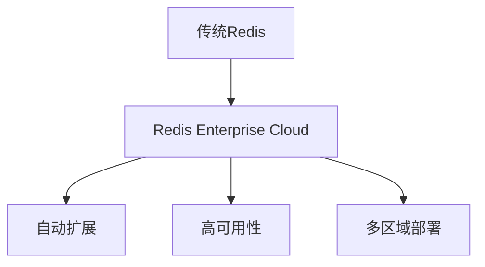
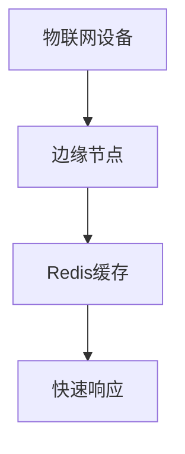
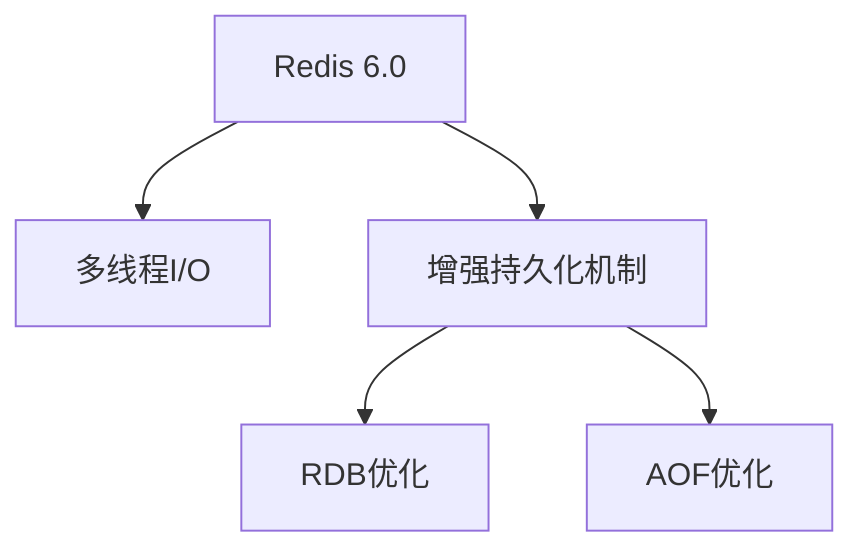

# Redis 未来发展趋势

Redis（Remote Dictionary Server）是一个开源的内存数据结构存储系统，广泛用于缓存、消息队列、实时分析等场景。随着技术的不断发展，Redis也在不断演进，以满足现代应用的需求。本文将探讨Redis的未来发展趋势，帮助初学者了解Redis在未来的发展方向。

## 1. 介绍

Redis自2009年发布以来，已经成为许多应用程序的核心组件。其高性能、灵活的数据结构和丰富的功能使其在缓存、会话存储、排行榜等场景中表现出色。然而，随着云计算、边缘计算和物联网等新兴技术的兴起，Redis也在不断适应新的需求。

## 2. Redis的未来发展方向

### 2.1 云原生支持

随着云计算的普及，越来越多的应用迁移到云环境中。Redis也在积极拥抱云原生技术，提供更好的云支持。例如，Redis Labs（现为Redis Inc.）推出了Redis Enterprise Cloud，提供完全托管的Redis服务，支持自动扩展、高可用性和多区域部署。



### 2.2 边缘计算

边缘计算将计算资源移到数据源附近，以减少延迟并提高响应速度。Redis在边缘计算中的应用前景广阔，特别是在需要快速响应的场景中，如物联网设备、实时分析和内容分发网络（CDN）。



### 2.3 人工智能和机器学习

Redis在人工智能和机器学习中的应用也在不断增加。Redis的快速数据访问能力使其成为机器学习模型的理想缓存层。例如，Redis可以用于存储和检索模型的特征数据，从而加速模型的训练和推理过程。

```python
import redis
import numpy as np

# 连接Redis
r = redis.Redis(host='localhost', port=6379, db=0)

# 存储特征数据
features = np.random.rand(1000).tobytes()
r.set('model_features', features)

# 检索特征数据
retrieved_features = np.frombuffer(r.get('model_features'))
```

### 2.4 数据持久化和高可用性

Redis的未来版本将继续增强数据持久化和高可用性功能。例如，Redis 6.0引入了多线程I/O，提高了并发性能。未来，Redis可能会进一步优化持久化机制，如RDB和AOF，以提供更高的数据可靠性。



## 3. 实际案例

### 3.1 实时推荐系统

在一个实时推荐系统中，Redis可以用于存储用户的行为数据和推荐结果。通过Redis的快速访问能力，系统可以实时更新推荐结果，提高用户体验。

```python
import redis

# 连接Redis
r = redis.Redis(host='localhost', port=6379, db=0)

# 存储用户行为数据
user_id = 'user123'
behavior_data = {'viewed': ['item1', 'item2'], 'purchased': ['item3']}
r.hmset(f'user:{user_id}:behavior', behavior_data)

# 获取推荐结果
recommendations = r.lrange(f'user:{user_id}:recommendations', 0, -1)
```

### 3.2 物联网设备监控

在物联网设备监控系统中，Redis可以用于存储设备的实时状态数据。通过Redis的发布/订阅功能，系统可以实时推送状态更新到监控面板。

```python
import redis

# 连接Redis
r = redis.Redis(host='localhost', port=6379, db=0)

# 发布设备状态更新
device_id = 'device001'
status = 'online'
r.publish(f'device:{device_id}:status', status)

# 订阅设备状态更新
pubsub = r.pubsub()
pubsub.subscribe(f'device:{device_id}:status')

for message in pubsub.listen():
    print(f"Received: {message['data']}")
```

## 4. 总结

Redis的未来发展趋势主要集中在云原生支持、边缘计算、人工智能和机器学习、以及数据持久化和高可用性等方面。随着技术的不断进步，Redis将继续在现代应用中发挥重要作用。

## 5. 附加资源

- [Redis官方文档](https://redis.io/documentation)
- [Redis Enterprise Cloud](https://redis.com/redis-enterprise-cloud/)
- [Redis与机器学习](https://redis.com/solutions/use-cases/machine-learning/)
