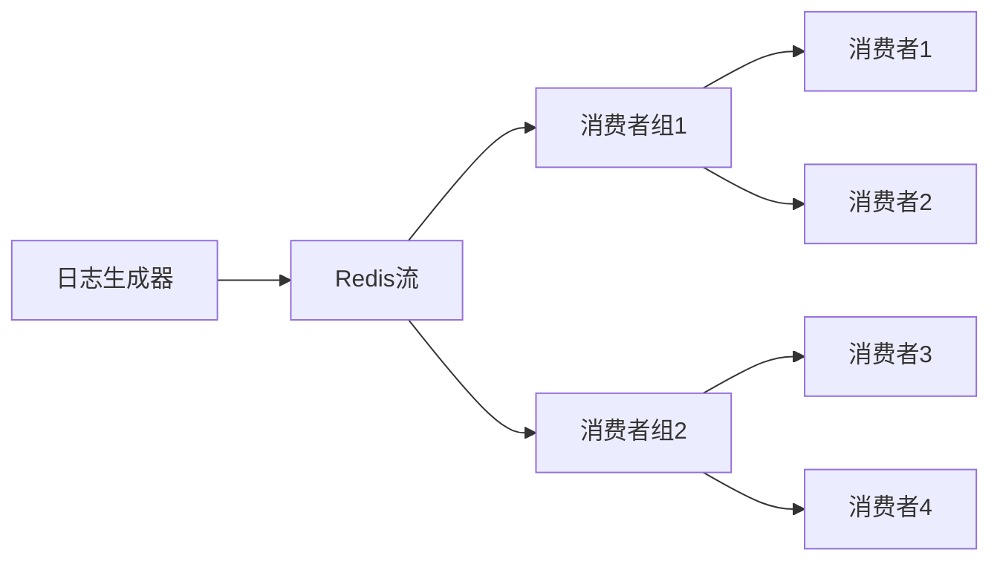
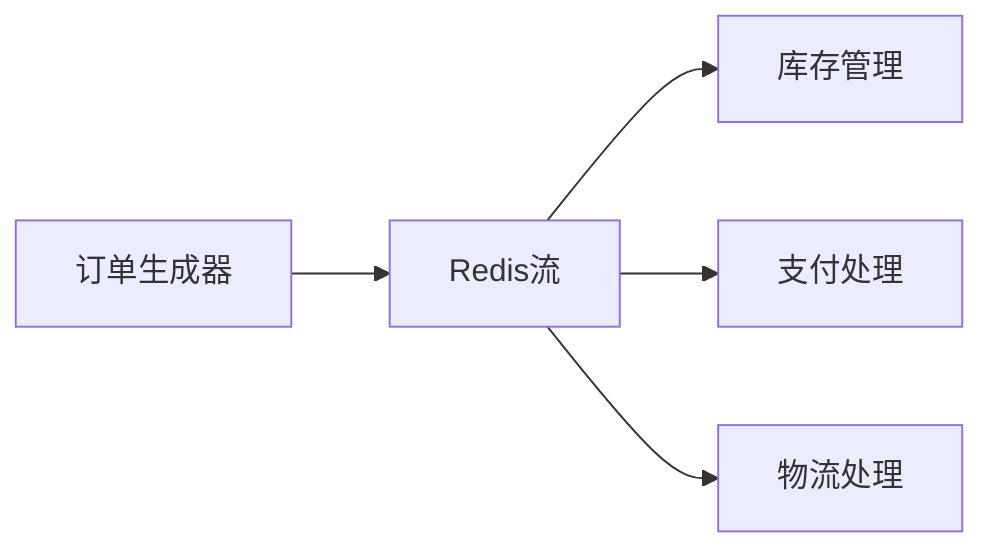

# Redis 流处理高级应用

Redis流（Stream）是Redis 5.0引入的一种数据结构，专门用于处理消息流。它类似于消息队列，但提供了更强大的功能，如消费者组、消息确认机制等。本文将深入探讨Redis流处理的高级应用，帮助初学者掌握这一强大的工具。

## 1. Redis流简介

Redis流是一个有序的、持久化的消息队列，每条消息都有一个唯一的ID。流中的消息可以按顺序读取，支持多个消费者组，每个消费者组可以独立消费消息。流的主要特点包括：

- **消息持久化**：消息存储在内存中，但可以通过持久化机制保存到磁盘。
- **消费者组**：多个消费者组可以独立消费消息，互不干扰。
- **消息确认机制**：消费者可以确认已处理的消息，确保消息不会丢失。

## 2. 流的基本操作

### 2.1 添加消息

使用 `XADD` 命令可以向流中添加消息。每条消息都有一个唯一的ID，通常由时间戳和序列号组成。

```bash
XADD mystream * name "Alice" age 30
```

- `mystream` 是流的名称。
- `*` 表示自动生成消息ID。
- `name "Alice" age 30` 是消息的内容。

### 2.2 读取消息

使用 `XREAD` 命令可以从流中读取消息。可以指定从某个ID开始读取，或者从最新的消息开始读取。

```bash
XREAD COUNT 2 STREAMS mystream 0
```

- `COUNT 2` 表示最多读取2条消息。
- `STREAMS mystream 0` 表示从ID为0的消息开始读取。

## 3. 消费者组

消费者组是Redis流处理的核心概念之一。它允许多个消费者独立消费消息，每个消费者组可以有自己的消费进度。

### 3.1 创建消费者组

使用 `XGROUP CREATE` 命令可以创建一个消费者组。

```bash
XGROUP CREATE mystream mygroup 0
```

- `mystream` 是流的名称。
- `mygroup` 是消费者组的名称。
- `0` 表示从ID为0的消息开始消费。

### 3.2 消费消息

使用 `XREADGROUP` 命令可以从消费者组中消费消息。

```bash
XREADGROUP GROUP mygroup consumer1 COUNT 1 STREAMS mystream >
```

- `GROUP mygroup consumer1` 表示使用消费者组 `mygroup` 中的消费者 `consumer1` 消费消息。
- `COUNT 1` 表示最多读取1条消息。
- `STREAMS mystream >` 表示从最新的消息开始读取。

### 3.3 确认消息

使用 `XACK` 命令可以确认已处理的消息。

```bash
XACK mystream mygroup 1526569495631-0
```

- `mystream` 是流的名称。
- `mygroup` 是消费者组的名称。
- `1526569495631-0` 是消息的ID。

## 4. 实际案例

### 4.1 实时日志处理

假设我们有一个实时日志系统，日志消息通过Redis流进行处理。我们可以创建一个消费者组，多个消费者可以并行处理日志消息。



### 4.2 订单处理系统

在电商系统中，订单消息可以通过Redis流进行处理。每个订单消息可以被多个消费者组处理，例如库存管理、支付处理、物流处理等。



## 5. 总结

Redis流处理提供了强大的消息队列功能，特别适合需要高吞吐量和低延迟的场景。通过消费者组和消息确认机制，可以确保消息的可靠处理。本文介绍了Redis流的基本操作、消费者组的使用以及实际应用案例，希望能帮助初学者掌握这一高级主题。

## 6. 附加资源

- [Redis官方文档](https://redis.io/docs/)
- [Redis流处理教程](https://redis.io/topics/streams-intro)
- [Redis消费者组详解](https://redis.io/topics/streams-consumer-groups)

## 7. 练习

1. 使用 `XADD` 命令向流中添加10条消息。
2. 创建一个消费者组，并使用 `XREADGROUP` 命令消费消息。
3. 使用 `XACK` 命令确认已处理的消息。
4. 设计一个实时日志处理系统，使用Redis流和消费者组处理日志消息。
