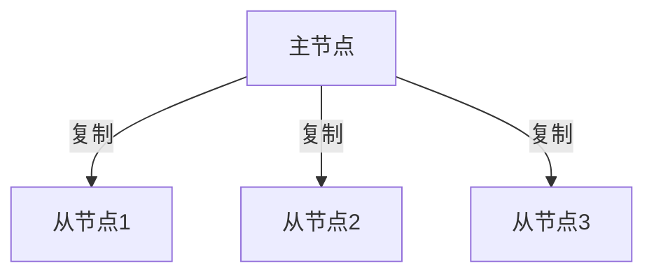
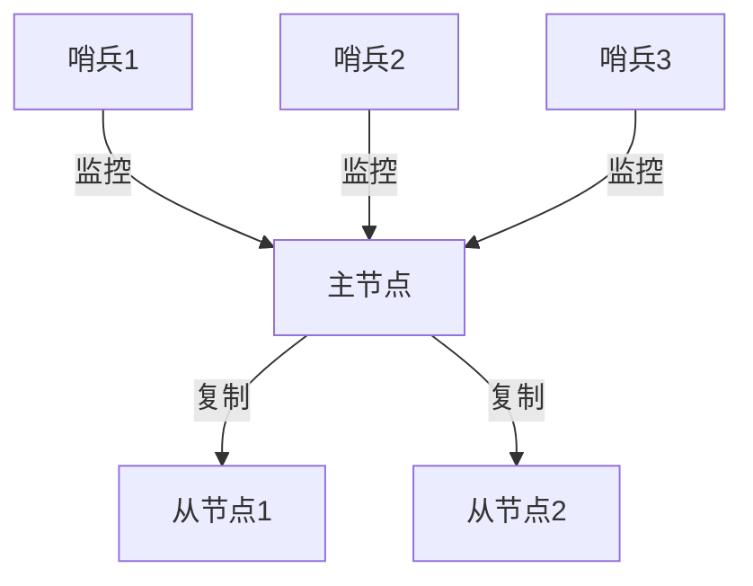

# Redis 数据一致性模型

Redis是一个高性能的键值存储系统，广泛应用于缓存、消息队列和实时数据处理等场景。然而，在高并发环境下，如何保证数据的一致性是一个关键问题。本文将深入探讨Redis的数据一致性模型，帮助初学者理解其工作原理和实际应用。

## 什么是数据一致性？

数据一致性是指在分布式系统中，多个节点之间的数据副本保持一致的状态。在Redis中，数据一致性主要涉及以下几个方面：

- **强一致性**：所有客户端在任何时刻都能看到相同的数据。
- **最终一致性**：系统保证在没有新的更新操作的情况下，最终所有客户端都能看到相同的数据。

## Redis 的数据一致性模型

Redis默认采用**单线程模型**，这意味着所有的操作都是串行执行的，从而避免了多线程环境下的竞争条件。然而，在分布式环境中，Redis通过**主从复制**和**哨兵模式**来实现高可用性和数据一致性。

### 主从复制

在Redis中，主从复制是一种常见的数据同步机制。主节点负责处理写操作，而从节点则复制主节点的数据。当主节点发生故障时，从节点可以接管主节点的角色，从而保证系统的高可用性。



### 哨兵模式

哨兵模式是Redis提供的一种高可用性解决方案。哨兵节点负责监控主节点和从节点的状态，当主节点发生故障时，哨兵节点会自动将一个从节点提升为新的主节点，从而保证系统的持续运行。



## 实际案例

假设我们有一个电商网站，使用Redis作为购物车的缓存。在高并发场景下，多个用户可能会同时修改购物车中的商品数量。为了保证数据的一致性，我们可以使用Redis的事务功能（`MULTI`和`EXEC`）来确保操作的原子性。

```redis
MULTI
INCR cart:user1:item1
EXEC
```

在这个例子中，`MULTI`命令开启一个事务，`INCR`命令增加购物车中商品的数量，`EXEC`命令提交事务。如果在事务执行期间有其他操作干扰，Redis会回滚事务，从而保证数据的一致性。

## 总结

Redis通过单线程模型、主从复制和哨兵模式等机制，在高并发环境下保证了数据的一致性和高可用性。理解这些机制对于设计和优化分布式系统至关重要。

## 附加资源

- [Redis官方文档](https://redis.io/documentation)
- [Redis主从复制详解](https://redis.io/topics/replication)
- [Redis哨兵模式详解](https://redis.io/topics/sentinel)

## 练习

1. 尝试在本地搭建一个Redis主从复制环境，并模拟主节点故障，观察从节点的行为。
2. 使用Redis的事务功能，编写一个简单的购物车应用，确保在高并发场景下数据的一致性。

:::tip
在实际应用中，除了Redis提供的一致性机制外，还可以结合其他分布式一致性算法（如Raft、Paxos）来进一步增强系统的可靠性。
:::