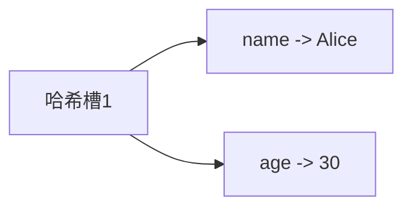
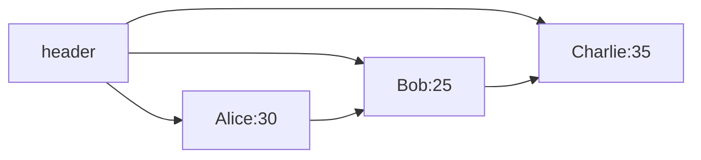
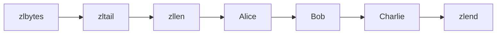

## 介绍

Redis（Remote Dictionary Server）是一个高性能的键值存储系统，广泛用于缓存、消息队列和实时数据处理等场景。Redis之所以如此高效，很大程度上得益于其精心设计的内部数据结构。这些数据结构不仅支持丰富的数据类型，还通过优化存储和访问方式，确保了Redis的高性能。

在本节中，我们将深入探讨Redis的内部数据结构，包括简单动态字符串（SDS）、字典、跳跃表、压缩列表等。我们将通过代码示例和实际案例，帮助你理解这些数据结构的工作原理及其在Redis中的应用。

## 简单动态字符串（SDS）

Redis中的字符串并不是直接使用C语言的原生字符串，而是使用了一种称为**简单动态字符串（Simple Dynamic String, SDS）**的数据结构。SDS具有以下优点：

1. **O(1)时间复杂度获取字符串长度**：SDS在结构体中存储了字符串的长度，因此获取字符串长度的时间复杂度为O(1)。
2. **二进制安全**：SDS可以存储任意二进制数据，而不仅仅是文本数据。
3. **自动扩容**：SDS会根据需要自动扩容，避免了频繁的内存分配操作。

### SDS结构

```c
struct sdshdr {
    int len;    // 字符串长度
    int free;   // 未使用的空间
    char buf[]; // 字符串数据
};
```

### 示例

假设我们有一个SDS字符串 `sds`，其内容为 `"hello"`，那么它的结构可能如下：

```mermaid
graph LR
    A[len:5] --> B[free:5] --> C[buf:"hello"]
```

## 字典（Dict）

字典是Redis中用于存储键值对的核心数据结构。Redis的字典实现基于哈希表，支持O(1)时间复杂度的查找、插入和删除操作。

### 字典结构

```c
typedef struct dict {
    dictType *type;  // 类型特定函数
    void *privdata;  // 私有数据
    dictht ht[2];    // 哈希表数组
    int rehashidx;   // rehash索引
} dict;
```

### 哈希冲突解决

Redis使用**链地址法**来解决哈希冲突。当多个键映射到同一个哈希槽时，这些键值对会以链表的形式存储。

### 示例

假设我们有一个字典 `dict`，其中包含以下键值对：

- `"name" -> "Alice"`
- `"age" -> "30"`

其结构可能如下：



## 跳跃表（Skip List）

跳跃表是一种有序数据结构，Redis使用跳跃表来实现有序集合（Sorted Set）。跳跃表通过多层链表来加速查找操作，平均时间复杂度为O(log n)。

### 跳跃表结构

```c
typedef struct zskiplistNode {
    robj *obj;  // 成员对象
    double score;  // 分值
    struct zskiplistNode *backward;  // 后退指针
    struct zskiplistLevel {
        struct zskiplistNode *forward;  // 前进指针
        unsigned int span;  // 跨度
    } level[];
} zskiplistNode;

typedef struct zskiplist {
    struct zskiplistNode *header, *tail;  // 头节点和尾节点
    unsigned long length;  // 节点数量
    int level;  // 层数
} zskiplist;
```

### 示例

假设我们有一个跳跃表 `zsl`，其中包含以下元素：

- `"Alice" -> 30`
- `"Bob" -> 25`
- `"Charlie" -> 35`

其结构可能如下：



## 压缩列表（Ziplist）

压缩列表是Redis为了节省内存而设计的一种紧凑型数据结构。它用于存储小型的列表或哈希表，通过连续的内存块来存储数据，减少了内存碎片。

### 压缩列表结构

```c
<zlbytes> <zltail> <zllen> <entry> <entry> ... <entry> <zlend>
```

- `zlbytes`：整个压缩列表占用的内存字节数。
- `zltail`：最后一个节点的偏移量。
- `zllen`：节点数量。
- `entry`：每个节点的数据。
- `zlend`：压缩列表的结束标志。

### 示例

假设我们有一个压缩列表 `zl`，其中包含以下元素：

- `"Alice"`
- `"Bob"`
- `"Charlie"`

其结构可能如下：



## 实际应用场景

### 缓存

Redis的字典和SDS结构使其非常适合作为缓存系统。例如，我们可以使用Redis缓存用户信息：

```bash
SET user:1:name "Alice"
SET user:1:age "30"
```

### 排行榜

Redis的有序集合（基于跳跃表）非常适合实现排行榜功能。例如，我们可以存储用户的分数并快速获取排名：

```bash
ZADD leaderboard 1000 "Alice"
ZADD leaderboard 800 "Bob"
ZADD leaderboard 1200 "Charlie"
ZRANGE leaderboard 0 -1 WITHSCORES
```

## 总结

Redis的内部数据结构是其高性能的关键。通过简单动态字符串、字典、跳跃表和压缩列表等数据结构，Redis能够高效地处理各种数据类型和操作。理解这些数据结构的工作原理，不仅有助于我们更好地使用Redis，还能为我们在设计高性能系统时提供灵感。

## 附加资源

- [Redis官方文档](https://redis.io/documentation)
- 《Redis设计与实现》——黄健宏

## 练习

1. 使用Redis的SDS结构存储一个字符串，并尝试获取其长度。
2. 实现一个简单的哈希表，并使用链地址法解决哈希冲突。
3. 使用Redis的有序集合实现一个简单的排行榜功能。
