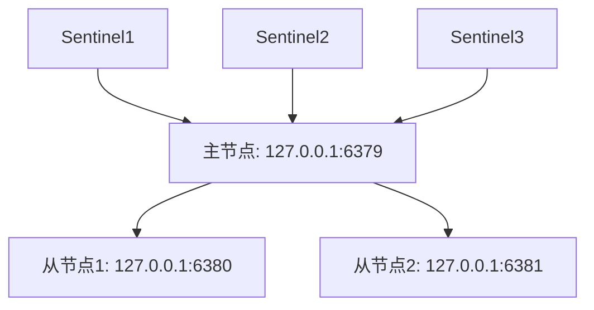
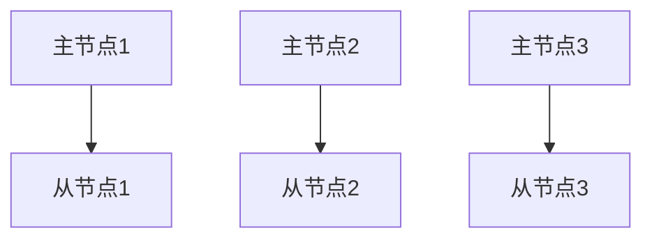

## 介绍

Redis是一个高性能的键值存储系统，广泛应用于缓存、消息队列和实时数据处理等场景。然而，单点故障是Redis面临的主要挑战之一。为了确保Redis服务的高可用性，我们需要采用一些最佳实践来避免单点故障，并在发生故障时快速恢复。

本文将介绍Redis高可用的两种主要实现方式：**Redis Sentinel**和**Redis Cluster**，并通过实际案例展示如何配置和使用这些工具。

---

## Redis Sentinel

Redis Sentinel是Redis官方提供的高可用解决方案，用于监控和管理Redis主从复制集群。Sentinel可以自动检测主节点的故障，并在故障发生时将从节点提升为新的主节点，从而保证服务的连续性。

### 工作原理

1. **监控**：Sentinel会持续监控主节点和从节点的状态。
2. **通知**：当检测到主节点故障时，Sentinel会通知管理员或自动执行故障转移。
3. **故障转移**：Sentinel会选择一个从节点作为新的主节点，并更新其他从节点的配置。

### 配置示例

以下是一个简单的Redis Sentinel配置示例：

```bash
# sentinel.conf
sentinel monitor mymaster 127.0.0.1 6379 2
sentinel down-after-milliseconds mymaster 5000
sentinel failover-timeout mymaster 10000
```

- `sentinel monitor mymaster 127.0.0.1 6379 2`：监控名为`mymaster`的主节点，地址为`127.0.0.1:6379`，并设置至少需要2个Sentinel同意才能执行故障转移。
- `sentinel down-after-milliseconds mymaster 5000`：如果主节点在5000毫秒内没有响应，则认为其已下线。
- `sentinel failover-timeout mymaster 10000`：故障转移的超时时间为10000毫秒。

### 实际案例

假设我们有一个主节点和两个从节点，Sentinel配置如下：



当主节点故障时，Sentinel会自动将从节点1提升为新的主节点，并更新从节点2的配置。

---

## Redis Cluster

Redis Cluster是Redis的分布式解决方案，通过分片（sharding）将数据分布在多个节点上，从而实现高可用性和横向扩展。

### 工作原理

1. **分片**：Redis Cluster将数据分为16384个槽（slot），每个节点负责一部分槽。
2. **主从复制**：每个主节点都有一个或多个从节点，用于数据备份和故障转移。
3. **故障检测与恢复**：当主节点故障时，其从节点会自动提升为新的主节点。

### 配置示例

以下是一个简单的Redis Cluster配置示例：

```bash
# redis.conf
cluster-enabled yes
cluster-config-file nodes.conf
cluster-node-timeout 5000
```

- `cluster-enabled yes`：启用集群模式。
- `cluster-config-file nodes.conf`：集群配置文件路径。
- `cluster-node-timeout 5000`：节点超时时间为5000毫秒。

### 实际案例

假设我们有一个包含3个主节点和3个从节点的Redis Cluster：



当主节点1故障时，从节点1会自动提升为新的主节点，并继续提供服务。

---

## 总结

Redis高可用性是通过Redis Sentinel和Redis Cluster实现的。Sentinel适用于主从复制架构，而Cluster适用于分布式架构。通过合理配置和使用这些工具，可以确保Redis服务在故障时仍能正常运行。

:::tip
在实际生产环境中，建议结合使用Sentinel和Cluster，以进一步提高系统的可用性和容错能力。
:::

---

## 附加资源

- [Redis Sentinel官方文档](https://redis.io/topics/sentinel)
- [Redis Cluster官方文档](https://redis.io/topics/cluster-tutorial)
- [Redis高可用性实践指南](https://redislabs.com/redis-enterprise/technology/high-availability/)

---

## 练习

1. 配置一个包含3个节点的Redis Sentinel集群，并模拟主节点故障，观察故障转移过程。
2. 配置一个包含6个节点的Redis Cluster，并模拟主节点故障，观察集群的恢复过程。

通过以上练习，你将更深入地理解Redis高可用性的实现原理和配置方法。