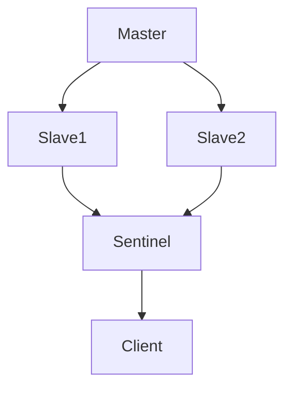

# Redis 测试策略

Redis是一个高性能的键值存储系统，广泛应用于缓存、消息队列和实时数据处理等场景。为了确保Redis在生产环境中的稳定性和性能，设计和实施有效的测试策略至关重要。本文将介绍Redis测试的基本概念、策略和实际应用场景，帮助初学者掌握Redis测试的核心要点。

## 1. 什么是Redis测试策略？

Redis测试策略是指在开发和部署Redis应用时，通过一系列测试手段来验证Redis的功能、性能和可靠性。测试策略的目标是确保Redis在各种场景下都能正常工作，并且能够应对高并发、大数据量等挑战。

## 2. 为什么需要Redis测试策略？

Redis通常用于关键业务场景，如缓存、会话存储和实时数据处理。如果Redis出现故障或性能问题，可能会导致整个系统崩溃或用户体验下降。因此，通过测试策略可以：

- 验证Redis的功能是否符合预期。
- 确保Redis在高并发和大数据量下的性能。
- 发现潜在的问题和瓶颈，提前进行优化。

## 3. Redis测试策略的核心组成部分

### 3.1 功能测试

功能测试是验证Redis的基本功能是否正常工作的测试。例如，验证Redis的键值存储、过期时间、事务等功能是否按预期工作。

```bash
# 示例：验证Redis的SET和GET命令
127.0.0.1:6379> SET mykey "Hello"
OK
127.0.0.1:6379> GET mykey
"Hello"
```

### 3.2 性能测试

性能测试是评估Redis在高并发和大数据量下的表现。常用的性能测试工具包括`redis-benchmark`和`JMeter`。

```bash
# 使用redis-benchmark进行性能测试
redis-benchmark -h 127.0.0.1 -p 6379 -c 100 -n 100000
```

### 3.3 压力测试

压力测试是模拟极端条件下的Redis表现，例如高并发、大数据量和长时间运行。通过压力测试可以发现Redis在高负载下的瓶颈和稳定性问题。

```bash
# 使用redis-benchmark进行压力测试
redis-benchmark -h 127.0.0.1 -p 6379 -c 1000 -n 1000000 -t set,get
```

### 3.4 持久化测试

Redis支持RDB和AOF两种持久化方式。持久化测试是验证Redis在崩溃或重启后是否能够正确恢复数据。

```bash
# 配置Redis使用AOF持久化
appendonly yes
appendfilename "appendonly.aof"
```

### 3.5 高可用性测试

Redis Sentinel和Redis Cluster是高可用性的解决方案。高可用性测试是验证Redis在主从切换、故障恢复等场景下的表现。



## 4. 实际应用场景

### 4.1 缓存场景

在缓存场景中，Redis通常用于存储热点数据，减少数据库的压力。通过功能测试和性能测试，可以确保Redis在缓存场景下的稳定性和性能。

```bash
# 示例：缓存用户信息
127.0.0.1:6379> SET user:1 "{name: 'Alice', age: 30}"
OK
127.0.0.1:6379> GET user:1
"{name: 'Alice', age: 30}"
```

### 4.2 消息队列场景

Redis的List数据结构可以用作简单的消息队列。通过功能测试和压力测试，可以验证Redis在消息队列场景下的表现。

```bash
# 示例：使用LPUSH和RPOP实现消息队列
127.0.0.1:6379> LPUSH myqueue "message1"
(integer) 1
127.0.0.1:6379> RPOP myqueue
"message1"
```

## 5. 总结

Redis测试策略是确保Redis在生产环境中稳定运行的关键。通过功能测试、性能测试、压力测试、持久化测试和高可用性测试，可以全面验证Redis的功能和性能。在实际应用中，根据具体场景选择合适的测试策略，可以有效提升Redis的可靠性和性能。

## 6. 附加资源与练习

- **练习1**：使用`redis-benchmark`工具对本地Redis实例进行性能测试，记录测试结果并分析瓶颈。
- **练习2**：配置Redis的AOF持久化，模拟Redis崩溃并验证数据恢复情况。
- **附加资源**：
  - [Redis官方文档](https://redis.io/documentation)
  - [Redis性能优化指南](https://redis.io/topics/benchmarks)
