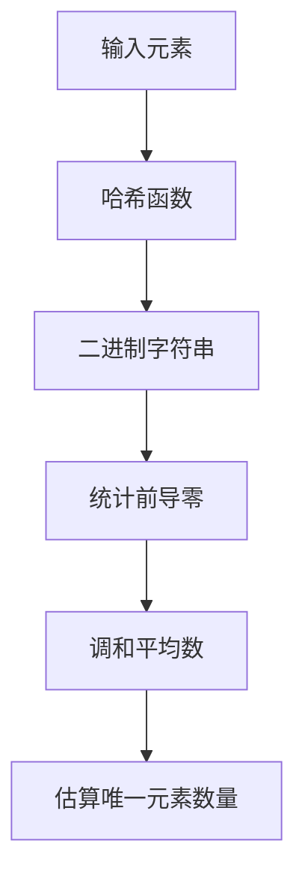

# Redis 超级日志详解

Redis超级日志（HyperLogLog，简称HLL）是一种用于估算集合中唯一元素数量的数据结构。它通过极小的内存占用（通常只需12KB）来高效地处理大规模数据集，非常适合用于统计独立访客数（UV）、独立IP数等场景。

## 什么是Redis超级日志？

Redis超级日志是一种概率性数据结构，用于估算一个集合中不同元素的数量。它的核心思想是通过哈希函数将元素映射到一个固定长度的二进制字符串，然后利用这些字符串的分布特性来估算唯一元素的数量。

:::note
超级日志的估算结果并非精确值，但误差率通常可以控制在1%以内，这对于大多数应用场景来说已经足够。
:::

## 超级日志的工作原理

超级日志的核心算法基于以下原理：

1. **哈希函数**：将每个元素通过哈希函数映射到一个固定长度的二进制字符串。
2. **统计前导零**：统计这些二进制字符串中前导零的数量。
3. **调和平均数**：利用调和平均数来估算唯一元素的数量。



## 超级日志的基本操作

Redis提供了以下命令来操作超级日志：

- `PFADD key element [element ...]`：向超级日志中添加元素。
- `PFCOUNT key [key ...]`：获取超级日志中估算的唯一元素数量。
- `PFMERGE destkey sourcekey [sourcekey ...]`：将多个超级日志合并为一个。

### 示例：使用超级日志统计独立访客数

假设我们有一个网站，每天有大量用户访问，我们希望统计每天的独立访客数。

```redis
# 添加用户ID到超级日志
PFADD daily_visitors "user1" "user2" "user3" "user4" "user5"

# 获取估算的独立访客数
PFCOUNT daily_visitors
```

**输出：**
```
(integer) 5
```

### 示例：合并多个超级日志

如果我们有多个超级日志，分别记录了不同时间段的独立访客数，我们可以将它们合并为一个超级日志。

```redis
# 添加用户ID到不同的超级日志
PFADD week1_visitors "user1" "user2" "user3"
PFADD week2_visitors "user4" "user5" "user6"

# 合并两个超级日志
PFMERGE total_visitors week1_visitors week2_visitors

# 获取合并后的独立访客数
PFCOUNT total_visitors
```

**输出：**
```
(integer) 6
```

## 超级日志的实际应用场景

超级日志在以下场景中非常有用：

1. **独立访客统计**：统计网站或应用的独立访客数。
2. **广告点击统计**：统计广告的独立点击次数。
3. **社交网络分析**：统计社交网络中独立用户的行为。

:::tip
超级日志的内存占用非常小，适合处理大规模数据集。如果你需要精确的唯一元素数量，可以考虑使用Redis的集合（Set）数据结构。
:::

## 总结

Redis超级日志是一种高效的概率性数据结构，适用于估算大规模数据集中的唯一元素数量。虽然它的结果并非精确值，但在大多数应用场景中，其误差率是可以接受的。通过合理使用超级日志，你可以在极小的内存占用下完成复杂的统计任务。

## 附加资源与练习

- **练习**：尝试使用超级日志统计你所在城市的独立IP访问数。
- **进一步学习**：阅读Redis官方文档中关于超级日志的更多细节。

:::caution
超级日志的估算结果可能会受到哈希函数的影响，因此在极端情况下，误差率可能会有所增加。
:::