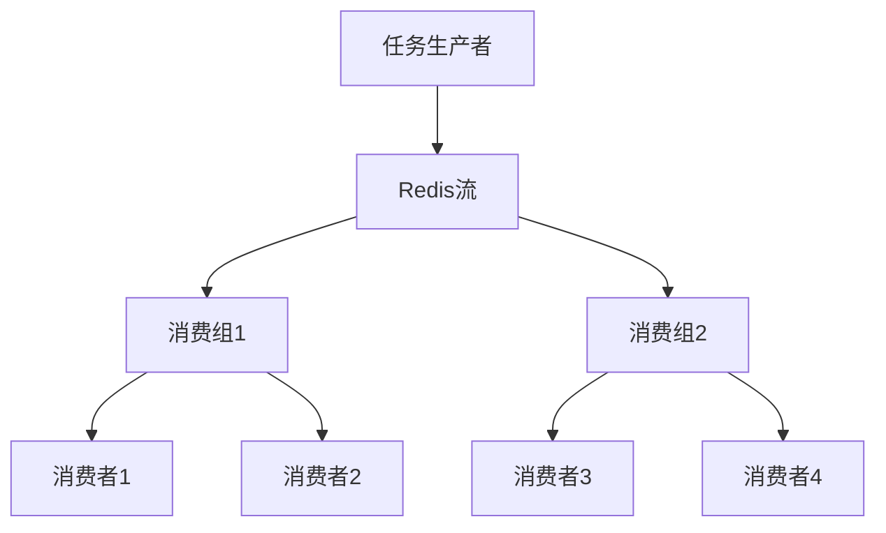

# Redis 流消费组

Redis流（Stream）是Redis 5.0引入的一种高级数据类型，用于处理消息流。它类似于消息队列，但提供了更强大的功能，如消息持久化、消费者组（Consumer Group）等。本文将重点介绍Redis流消费组的概念、使用方法和实际应用场景。

## 什么是Redis流消费组？

Redis流消费组是一种机制，允许多个消费者以协作的方式处理同一个流中的消息。每个消费组可以包含多个消费者，每个消费者可以独立处理流中的消息。消费组确保每条消息只会被组内的一个消费者处理，从而避免重复消费。

### 消费组的核心概念

- **消费者组（Consumer Group）**：一组消费者，共同处理同一个流中的消息。
- **消费者（Consumer）**：消费组中的一个成员，负责处理消息。
- **消息确认（ACK）**：消费者处理完消息后，向Redis发送确认，表示该消息已被成功处理。
- **未确认消息（Pending Messages）**：已被分配给消费者但尚未被确认的消息。

## 创建消费组

在Redis中，可以使用 `XGROUP CREATE` 命令创建一个消费组。以下是创建一个名为 `mygroup` 的消费组的示例：

```bash
XGROUP CREATE mystream mygroup $ MKSTREAM
```

- `mystream` 是流的名称。
- `mygroup` 是消费组的名称。
- `$` 表示从流的末尾开始消费。
- `MKSTREAM` 表示如果流不存在，则创建它。

## 消费消息

消费者可以使用 `XREADGROUP` 命令从消费组中读取消息。以下是一个消费者从 `mygroup` 中读取消息的示例：

```bash
XREADGROUP GROUP mygroup consumer1 COUNT 1 STREAMS mystream >
```

- `GROUP mygroup consumer1` 表示消费者 `consumer1` 属于消费组 `mygroup`。
- `COUNT 1` 表示每次读取一条消息。
- `STREAMS mystream >` 表示从 `mystream` 流中读取消息，`>` 表示读取未分配给任何消费者的新消息。

### 示例输出

```bash
1) 1) "mystream"
   2) 1) 1) "1633024800000-0"
         2) 1) "message"
            2) "Hello, Redis!"
```

## 消息确认

消费者处理完消息后，需要向Redis发送确认，以确保该消息不会被再次分配给其他消费者。可以使用 `XACK` 命令来确认消息：

```bash
XACK mystream mygroup 1633024800000-0
```

- `mystream` 是流的名称。
- `mygroup` 是消费组的名称。
- `1633024800000-0` 是消息的ID。

## 实际应用场景

### 分布式任务处理

假设你有一个分布式系统，需要处理大量的任务。你可以使用Redis流和消费组来实现任务的分配和处理。每个消费者可以独立处理任务，并且通过消息确认机制确保任务不会被重复处理。



### 实时日志处理

在实时日志处理系统中，你可以使用Redis流和消费组来处理日志数据。每个消费者可以处理一部分日志，并且通过消息确认机制确保日志数据被正确处理。

## 总结

Redis流消费组提供了一种高效的方式来处理消息流，特别适用于分布式系统和实时数据处理场景。通过消费组，你可以确保每条消息只会被一个消费者处理，从而避免重复消费。

### 附加资源

- [Redis官方文档 - Streams](https://redis.io/docs/data-types/streams/)
- [Redis流与消费组实战](https://example.com/redis-streams-tutorial)

### 练习

1. 创建一个Redis流，并向其中添加几条消息。
2. 创建一个消费组，并使用消费者从流中读取消息。
3. 实现一个简单的分布式任务处理系统，使用Redis流和消费组来分配和处理任务。
