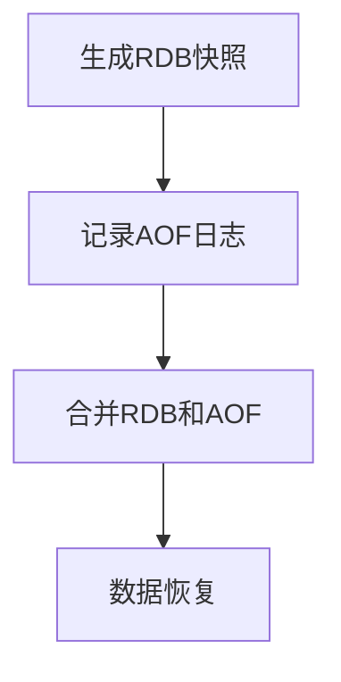

## 介绍

Redis是一个高性能的键值存储系统，广泛用于缓存、消息队列和实时数据处理等场景。为了确保数据在服务器重启后不会丢失，Redis提供了多种持久化机制。其中，**混合持久化**是一种结合了RDB（Redis Database）和AOF（Append-Only File）两种持久化方式的策略，旨在兼顾数据安全性和恢复速度。

## Redis 持久化机制概述

在深入探讨混合持久化之前，我们先简要回顾一下Redis的两种主要持久化方式：

1. **RDB（Redis Database）**：RDB是一种快照持久化方式，它会在指定的时间间隔内将内存中的数据保存到磁盘上的一个二进制文件中。RDB文件紧凑且加载速度快，适合用于备份和灾难恢复。然而，RDB的缺点是可能会丢失最后一次快照之后的数据。

2. **AOF（Append-Only File）**：AOF持久化方式通过记录每个写操作来保存数据。AOF文件是一个追加日志文件，记录了所有对Redis的写操作。AOF的优点是数据安全性高，缺点是文件体积较大且恢复速度较慢。

## 混合持久化的概念

混合持久化结合了RDB和AOF的优点。具体来说，Redis在生成RDB快照的同时，会将AOF日志文件中的增量数据追加到RDB文件中。这样，在恢复数据时，Redis可以先加载RDB文件中的快照数据，然后再应用AOF文件中的增量数据，从而实现快速恢复并保证数据的完整性。

## 混合持久化的工作原理

混合持久化的工作流程可以分为以下几个步骤：

1. **生成RDB快照**：Redis按照配置的时间间隔生成RDB快照文件。
2. **记录AOF日志**：在生成RDB快照的同时，Redis继续记录AOF日志。
3. **合并RDB和AOF**：在生成RDB快照后，Redis会将AOF日志中的增量数据追加到RDB文件中，形成一个新的混合持久化文件。
4. **数据恢复**：在Redis重启时，首先加载RDB文件中的快照数据，然后应用AOF文件中的增量数据，完成数据的完整恢复。



## 配置混合持久化

要启用混合持久化，需要在Redis配置文件中进行相应的设置。以下是一个示例配置：

```bash
# 启用AOF持久化
appendonly yes

# 设置AOF文件的名称
appendfilename "appendonly.aof"

# 启用混合持久化
aof-use-rdb-preamble yes
```

:::note
在Redis 4.0及以上版本中，混合持久化功能默认启用。如果你使用的是较旧的版本，请确保升级到支持混合持久化的版本。
:::

## 实际应用场景

混合持久化在实际应用中具有广泛的用途，特别是在需要兼顾数据安全性和恢复速度的场景中。以下是一些典型的应用场景：

1. **缓存系统**：在缓存系统中，数据的实时性要求较高，但同时也需要保证数据的安全性。混合持久化可以在保证数据安全的同时，提供快速的恢复能力。

2. **消息队列**：在消息队列中，消息的持久化至关重要。混合持久化可以确保即使在服务器重启后，消息也不会丢失。

3. **实时数据处理**：在实时数据处理系统中，数据的完整性和恢复速度都非常重要。混合持久化可以在保证数据完整性的同时，提供快速的恢复能力。

## 总结

Redis混合持久化是一种结合了RDB和AOF两种持久化方式的策略，旨在兼顾数据安全性和恢复速度。通过生成RDB快照并记录AOF日志，Redis可以在恢复数据时先加载RDB文件中的快照数据，然后再应用AOF文件中的增量数据，从而实现快速恢复并保证数据的完整性。

## 附加资源与练习

为了进一步巩固你对Redis混合持久化的理解，建议你尝试以下练习：

1. **配置混合持久化**：在你的本地Redis实例中启用混合持久化，并观察RDB和AOF文件的生成过程。
2. **模拟数据恢复**：手动删除Redis的持久化文件，然后重启Redis，观察数据恢复的过程。
3. **性能测试**：对比启用和禁用混合持久化时Redis的性能差异，特别是在高并发场景下的表现。

通过以上练习，你将更深入地理解Redis混合持久化的工作原理及其在实际应用中的优势。