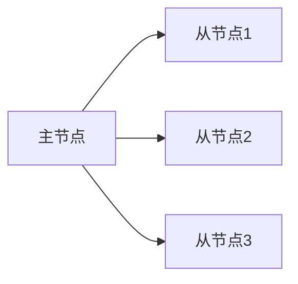

## 介绍

Redis复制是一种允许数据从一个Redis服务器（主节点）复制到一个或多个Redis服务器（从节点）的机制。通过复制，你可以实现数据的高可用性、负载均衡以及灾难恢复。当主节点发生故障时，从节点可以接管服务，从而保证系统的持续运行。

在本教程中，我们将逐步讲解如何配置Redis复制，并通过实际案例展示其应用场景。

## Redis 复制的基本概念

在Redis复制中，主节点负责处理写操作，而从节点则复制主节点的数据。从节点可以处理读操作，从而分担主节点的负载。复制是异步的，这意味着从节点的数据可能会有轻微的延迟。

### 主从复制的工作原理

1. **主节点**：负责处理所有的写操作，并将写操作记录到内存中。
2. **从节点**：连接到主节点，并请求复制主节点的数据。从节点会定期从主节点获取数据更新。



## 配置Redis复制

### 1. 配置主节点

默认情况下，Redis服务器启动时是作为主节点的。你只需要确保主节点的配置文件（`redis.conf`）中没有禁用复制功能。

```bash
# redis.conf
# 确保以下配置项没有被注释掉
replicaof no one
```

### 2. 配置从节点

要将一个Redis服务器配置为从节点，你需要在从节点的配置文件中指定主节点的IP地址和端口。

```bash
# redis.conf
# 指定主节点的IP和端口
replicaof <master-ip> <master-port>
```

例如，如果主节点的IP地址是`192.168.1.100`，端口是`6379`，则配置如下：

```bash
replicaof 192.168.1.100 6379
```

### 3. 启动Redis服务器

配置完成后，启动主节点和从节点的Redis服务器。从节点会自动连接到主节点并开始复制数据。

```bash
# 启动主节点
redis-server /path/to/master/redis.conf

# 启动从节点
redis-server /path/to/slave/redis.conf
```

### 4. 验证复制状态

你可以使用`INFO replication`命令来查看主节点和从节点的复制状态。

```bash
# 在主节点上执行
redis-cli
127.0.0.1:6379> INFO replication
```

输出示例：

```plaintext
# Replication
role:master
connected_slaves:1
slave0:ip=192.168.1.101,port=6379,state=online,offset=12345,lag=0
```

在从节点上执行相同的命令：

```bash
# 在从节点上执行
redis-cli
127.0.0.1:6379> INFO replication
```

输出示例：

```plaintext
# Replication
role:slave
master_host:192.168.1.100
master_port:6379
master_link_status:up
```

## 实际案例

假设你有一个电商网站，使用Redis来存储用户的购物车数据。为了提高系统的可用性，你决定配置Redis复制。

1. **主节点**：处理所有的写操作，如用户添加商品到购物车。
2. **从节点**：处理所有的读操作，如用户查看购物车内容。

当主节点发生故障时，从节点可以接管服务，确保用户仍然可以查看和修改购物车。

## 总结

通过配置Redis复制，你可以实现数据的高可用性和灾难恢复。复制不仅提高了系统的可靠性，还可以通过从节点分担读操作的负载，从而提高系统的性能。

## 附加资源

- [Redis官方文档 - 复制](https://redis.io/topics/replication)
- [Redis复制与高可用性指南](https://redislabs.com/redis-enterprise/technology/high-availability/)

## 练习

1. 在一台机器上启动两个Redis实例，一个作为主节点，另一个作为从节点，并验证复制是否成功。
2. 尝试在主节点上写入数据，然后在从节点上读取数据，观察数据是否一致。
3. 模拟主节点故障，将从节点提升为新的主节点，并验证系统是否仍然可用。
